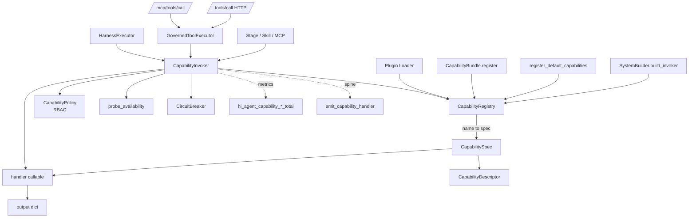
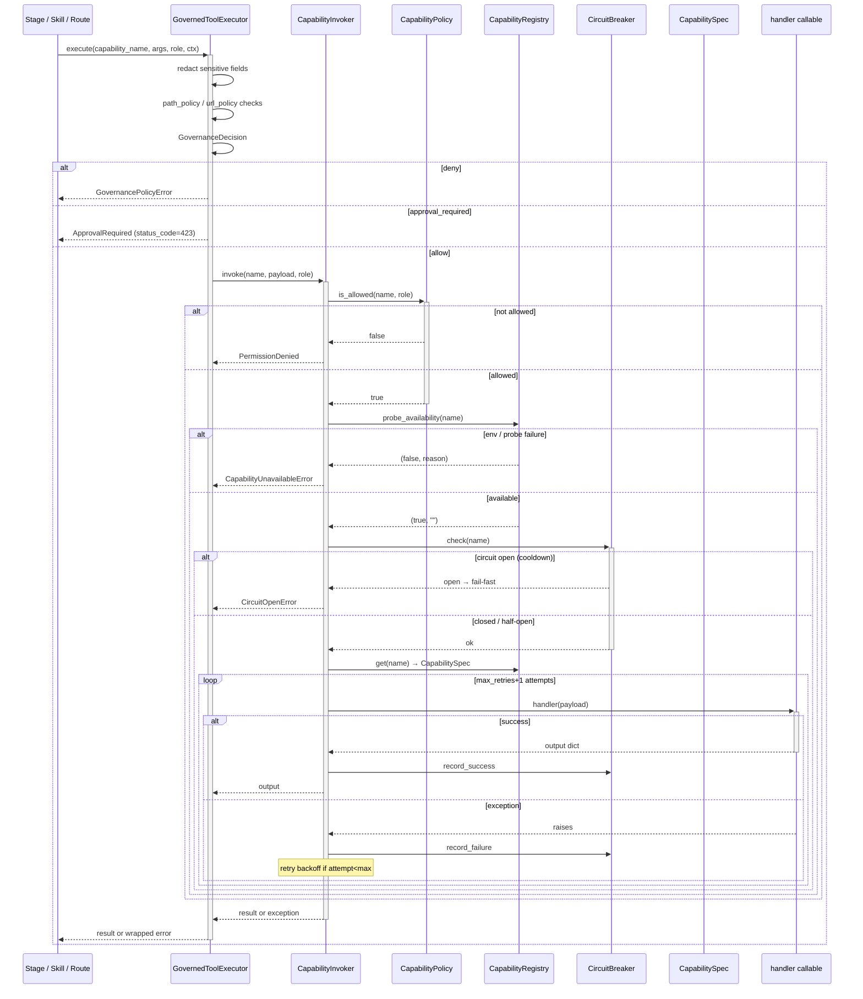

# Capability Architecture

## 1. Purpose & Position in System

`hi_agent/capability/` owns the **platform-level capability registry** — the directory of named, callable, schema-described tools (e.g. `read_file`, `write_file`, `http_request`, `llm_completion`, `git_status`) that hi_agent runs make available to skills and stages. The registry is **process-internal**: a single `CapabilityRegistry` instance is shared across all tenants in the worker process. Per-tenant capability assignment is enforced **above** this layer — by `CapabilityPolicy` (RBAC), the harness `PermissionGate`, and HTTP-route-level authorization.

The package is annotated with `# scope: process-internal` markers (`hi_agent/capability/__init__.py:1`) and the W31 T-6' decision documented in the package docstring: *"CapabilitySpec describes a platform-level capability that any tenant can invoke; ownership and per-tenant overrides live above this layer (route / policy gates), not on the registry row."*

The package owns:
1. **`CapabilityRegistry`** — the in-memory name → spec map.
2. **`CapabilitySpec`** — name + handler callable + description + JSON Schema parameters + `CapabilityDescriptor`.
3. **`CapabilityDescriptor`** — risk metadata (`risk_class`, `effect_class`, `requires_auth`, `requires_approval`, `available_in_dev/research/prod`, `availability_probe`, …).
4. **`CapabilityInvoker`** / **`AsyncCapabilityInvoker`** — safe invocation with policy + circuit breaker + retry + timeout.
5. **`CircuitBreaker`** — per-capability failure-count breaker.
6. **`CapabilityPolicy`** — minimal RBAC: `role → allowed capability names`; `role → allowed (stage_id, action_kind)`.
7. **`GovernedToolExecutor`** (`governance.py`) — central governance gate for all tool calls (P0-1b).
8. **`adapters/`** — `CoreToolAdapter`, `CapabilityDescriptorFactory` (descriptor builders).
9. **`bundles/`** — capability bundles (groups of related capabilities registered together).
10. **`tools/`** — built-in tool implementations.
11. **`defaults.py`** — `register_default_capabilities(registry, llm_gateway, ...)` registers the standard capability set.

It does **not** own: action-level orchestration (delegated to `hi_agent/runtime/harness/`), tool dispatch from MCP protocol (delegated to `hi_agent/server/mcp.py`), or skill resolution (delegated to `hi_agent/skill/`).

## 2. External Interfaces

**Public exports** (`hi_agent/capability/__init__.py:36`):

Registry:
- `CapabilityRegistry()` (`registry.py:138`)
- `CapabilitySpec(name, handler, description, parameters, descriptor)` (`registry.py:127`) — `# scope: process-internal`
- `CapabilityDescriptor(name, risk_class, effect_class, side_effect_class, remote_callable, prod_enabled_default, requires_auth, requires_approval, required_env, output_budget_chars, availability_probe, source_reference_policy, artifact_output_schema, provenance_required, reproducibility_level, license_policy, tags, sandbox_level, description, parameters, extra, toolset_id, output_budget_tokens, maturity_level, available_in_dev, available_in_research, available_in_prod)` (`registry.py:78`)
- `CapabilityNotAvailableError(capability_name, posture, reason)` (`registry.py:17`) — raised under posture-policy denial; carries `to_envelope()` for HTTP 400.

Invocation:
- `CapabilityInvoker(registry, breaker, policy, max_retries, retry_exceptions, call_timeout_seconds, timeout_call, allow_unguarded)` (`invoker.py:58`)
- `AsyncCapabilityInvoker(registry, breaker, policy, max_retries, retry_exceptions, call_timeout_seconds, ...)` (`async_invoker.py:20`)
- `CapabilityUnavailableError(capability_name, reason)` (`invoker.py:35`) — env-var / probe failure (distinct from posture-policy denial).

Circuit breaker:
- `CircuitBreaker(failure_threshold, cooldown_seconds, clock, db_path)` (`circuit_breaker.py:31`)
- `CircuitState(failures, status, opened_at)` (`circuit_breaker.py:17`) — `# scope: process-internal`
- `CircuitStatus` Literal `"closed" | "open" | "half_open"`

Policy:
- `CapabilityPolicy(role_permissions, action_permissions)` (`policy.py:6`)

Governance:
- `GovernedToolExecutor` (`governance.py`)
- `GovernanceDecision(decision, reason)` (`governance.py:36`) — `# scope: process-internal`
- `RiskClass` Literal `"read_only" | "filesystem_read" | "filesystem_write" | "network" | "shell" | "credential"` (`registry.py:68`)

Adapters and bundles:
- `CoreToolAdapter`, `CapabilityDescriptorFactory` (`adapters/__init__.py`)
- `register_default_capabilities(registry, ...)` (`defaults.py`)

## 3. Internal Components

| Component | File | Responsibility |
|---|---|---|
| `CapabilityRegistry` | `registry.py:138` | In-memory `dict[str, CapabilitySpec]`; `register`, `get`, `list_names`, `register_bundle`, `probe_availability`. |
| `CapabilitySpec` | `registry.py:127` | Frozen dataclass: name + handler + description + params + descriptor. |
| `CapabilityDescriptor` | `registry.py:78` | Risk + effect + posture availability + probe + license + reproducibility. |
| `CapabilityInvoker` | `invoker.py:58` | Sync invocation with policy, breaker, retry, timeout. |
| `AsyncCapabilityInvoker` | `async_invoker.py:20` | Async equivalent with `asyncio` retry + backoff. |
| `CircuitBreaker` | `circuit_breaker.py:31` | Per-capability failure counter; closed → open → half-open. |
| `CapabilityPolicy` | `policy.py:6` | `role → set[capability_name]` + `role → set[(stage_id, action_kind)]`. |
| `GovernedToolExecutor` | `governance.py` | Central gate for all tool calls (path policy, URL policy, sensitive-field redaction). |
| `defaults.py` | `defaults.py` | `register_default_capabilities` populates the standard set. |
| `adapters/descriptor_factory.py` | `adapters/descriptor_factory.py` | Builds `CapabilityDescriptor` from declarative metadata. |
| `bundles/` | `bundles/` | Capability bundles (e.g. filesystem bundle, http bundle). |
| `tools/` | `tools/` | Built-in tool implementations. |

## 4. Data Flow

`probe_availability` (`registry.py:178`) checks `descriptor.required_env` (env vars present) and `descriptor.availability_probe()` (custom callable). Probe failure wraps as `CapabilityUnavailableError`. Posture-availability denial (`available_in_<posture>=False`) wraps as `CapabilityNotAvailableError` with structured 400 envelope.

## 5. State & Persistence

| State | Location | Lifetime |
|---|---|---|
| `CapabilityRegistry._capabilities` | In-memory dict in process | Process |
| `CircuitBreaker._states` | In-memory dict + optional SQLite | Process or persistent (when `db_path` set) |
| `CapabilityPolicy._role_permissions` | In-memory dict | Process |
| `CapabilityPolicy._action_permissions` | In-memory dict | Process |

The registry is **process-shared, never tenant-partitioned**. Persisting capability registrations is not required because `register_default_capabilities` and bundles run at every process start. `CircuitBreaker` optionally persists state to SQLite (`db_path` kwarg) so circuit transitions survive restarts.

## 6. Concurrency & Lifecycle

`CapabilityRegistry` is constructed once per `SystemBuilder` (`SystemBuilder.build_capability_registry`). The instance is registered onto `AgentServer._builder` and shared by:
- `MCPServer(registry, invoker)` — for `/mcp/tools/list` and `/mcp/tools/call`
- `RunExecutor(invoker=…)` — for stage and skill execution
- `GovernedToolExecutor(registry, invoker)` — for HTTP `/tools/call`

**Registration phase** (lifespan startup): `register_default_capabilities` + `register_bundle` for each declared bundle + `_wire_plugin_contributions` for plugin-supplied capabilities. After lifespan startup, the registry is treated as immutable in practice (no lock around `_capabilities` dict — registrations during runtime are not supported).

**Invocation concurrency**: `CapabilityInvoker.invoke` is fully reentrant — no per-invoker state; per-capability state lives in `CircuitBreaker._states` (locked).

**Async path**: `AsyncCapabilityInvoker` uses `asyncio.iscoroutinefunction(handler)` to dispatch async handlers natively; sync handlers are off-loaded to `runtime.async_bridge.AsyncBridgeService.get_executor()` per Rule 5.

**Process-internal**: explicitly annotated (`__init__.py:1`). The registry is shared across tenants in the worker process; per-tenant capability assignment happens in `CapabilityPolicy.is_allowed(name, role)` and in route-level / harness-level permission gates.

**Locks**:
- `CircuitBreaker` — `threading.Lock` around state mutation.
- `CapabilityRegistry` — implicit (assumed startup-only).
- `CapabilityPolicy` — implicit (assumed startup-only).

## 7. Error Handling & Observability

**Error taxonomy**:
- `CapabilityNotAvailableError` — posture-policy denial (registered + probe-clean but `available_in_<posture>=False`). HTTP 400 envelope: `error_category=invalid_request`, `retryable=False`.
- `CapabilityUnavailableError` — env / probe failure. HTTP 503 (operator can fix env).
- `KeyError` — unknown capability name. HTTP 404.
- `CircuitOpenError` — fail-fast during cooldown. HTTP 503.
- Handler exceptions — re-raised; retries per `RetryPolicy.max_retries`; final failure surfaces as the underlying exception.

**Counters** (`# scope: process-internal`):
- `hi_agent_capability_registry_errors_total` — registry-level errors (`registry.py:13`)
- `hi_agent_capability_posture_denied_total` — posture-policy denials (`registry.py:14`)
- `hi_agent_capability_invoker_errors_total` — invocation-level errors (`invoker.py:17`)
- `hi_agent_async_invoker_errors_total` — async-invoker errors (`async_invoker.py:17`)
- `hi_agent_capability_governance_errors_total` — governance gate errors (`governance.py:29`)

**Logs**:
- WARNING on probe failure (`registry.py:213`).
- WARNING on circuit open (in CircuitBreaker).
- INFO on every invocation (with `run_id`, `capability_name`, `latency_ms`).

**Spine emitter**: `emit_capability_handler(tool_name, tenant_id, profile_id)` (`hi_agent/observability/spine_events.py:154`) is called by the harness on every dispatch.

**Audit trail**: invocations from HTTP routes are audited via `record_tenant_scoped_access(tenant_id, resource="tools", op="call")` so cross-tenant invocations are inspectable.

## 8. Security Boundary — Governance Gate

**Layered enforcement, every layer is fail-closed**:

1. **Route layer**: HTTP route handler enforces auth (Bearer token via AuthMiddleware) and `record_tenant_scoped_access` audit.
2. **`GovernedToolExecutor`** (`governance.py`):
   - Path policy: `safe_resolve(path)` — rejects paths outside the workspace root (path traversal).
   - URL policy: `URLPolicy.check(url)` — rejects intranet / metadata service URLs.
   - Sensitive field redaction: `_SENSITIVE_ARG_FIELDS = {"password", "secret", "token", "key"}` — redacted in logs and audit (`governance.py:31`).
   - Posture check: `descriptor.available_in_<posture>` — false → `CapabilityNotAvailableError`.
   - Approval required: `descriptor.requires_approval=True` → returns `GovernanceDecision(decision="approval_required")`.
3. **`CapabilityPolicy.is_allowed(name, role)`** — RBAC: caller's role must have the capability in its allowed set.
4. **`CapabilityRegistry.probe_availability`** — env var presence + custom probe.
5. **`CircuitBreaker`** — fails fast during cooldown so a hammering caller cannot overwhelm a struggling capability.
6. **Handler-level checks** — individual handlers may add their own validation (file size limits, URL whitelists, etc.).

**Tenant scoping**:
- `CapabilityRegistry` itself is **process-shared** (W31 T-6' decision). The platform owner controls the capability surface; per-tenant overrides are layered above.
- Per-tenant capability assignment happens at the **policy layer** (`CapabilityPolicy.is_allowed(name, role)`) and at the **harness permission gate** (`hi_agent/runtime/harness/permission_rules.py`).
- Future: per-tenant capability overlay (W31 future enhancement) would be a separate `TenantCapabilityOverlay` table layered on top of the platform registry — **not** adding `tenant_id` to `CapabilitySpec`.

**Process-internal markers** (CLAUDE.md Rule 12 marker discipline):
- `CapabilitySpec` (`registry.py:127`): `# scope: process-internal`
- `CapabilityDescriptor` (`registry.py:78`): `# scope: process-internal`
- `CircuitState` (`circuit_breaker.py:17`): `# scope: process-internal`
- `CircuitBreaker` (`circuit_breaker.py:31`): `# scope: process-internal`
- `GovernanceDecision` (`governance.py:36`): `# scope: process-internal`

## 9. Extension Points

- **New capability**: implement `handler(payload: dict) -> dict`; build `CapabilityDescriptor`; register `CapabilitySpec(name, handler, description, parameters, descriptor)` in `register_default_capabilities` or a custom bundle.
- **New capability bundle**: subclass / implement `CapabilityBundle.register(registry) -> int`; call `registry.register_bundle(bundle)`.
- **New risk class**: extend `RiskClass` Literal (`registry.py:68`); update governance gate's risk-vs-posture matrix.
- **Custom availability probe**: pass `availability_probe=lambda: (True, "")` on `CapabilityDescriptor`.
- **Custom RBAC**: pass `CapabilityPolicy(role_permissions=…)` to `CapabilityInvoker`.
- **Custom circuit policy**: subclass `CircuitBreaker`; override `record_failure`/`is_open`.
- **Plugin capabilities**: declare under `plugins/<plugin_name>/capabilities/`; loaded via `_wire_plugin_contributions`.

## 10. Constraints & Trade-offs

- **Registry is process-shared, not tenant-partitioned**: a malicious tenant cannot register a new capability (no API), but every tenant sees the same set. Tenant-specific gating happens at the policy and permission layer. Operators wanting per-tenant capability overrides need the future `TenantCapabilityOverlay` (not yet implemented).
- **No durable registration**: `register_default_capabilities` runs every startup. Boot time is dominated by descriptor probe execution if probes are slow.
- **`CircuitBreaker` is per-capability, not per-tenant**: a tenant whose calls happen to fail repeatedly opens the breaker for everyone. This is a known trade-off — per-tenant breakers would multiply state by tenant count. Operators concerned about noisy-tenant DoS should rate-limit at the route layer.
- **`CapabilityPolicy` is RBAC, not ABAC**: a role either has access to a capability or not. Attribute-based policy (e.g. only allow `write_file` for paths under `/data/<tenant_id>/`) is enforced at the **handler** level, not the policy level.
- **Posture-availability is a static descriptor field**: changing posture mid-process does not refresh availability. Operators must restart after `HI_AGENT_POSTURE` change. Rule 11 enforces fail-closed defaults under research/prod.
- **No timeout default**: `call_timeout_seconds=None` means handlers run unbounded. Production deployments should set this; the default exists for tests that need to step through long handlers.

## 11. References

**Files**:
- `hi_agent/capability/__init__.py` — public surface + W31 T-6' decision documentation
- `hi_agent/capability/registry.py` — `CapabilityRegistry`, `CapabilitySpec`, `CapabilityDescriptor`, `CapabilityNotAvailableError`
- `hi_agent/capability/invoker.py` — `CapabilityInvoker`, `CapabilityUnavailableError`
- `hi_agent/capability/async_invoker.py` — `AsyncCapabilityInvoker`
- `hi_agent/capability/circuit_breaker.py` — `CircuitBreaker`, `CircuitState`
- `hi_agent/capability/policy.py` — `CapabilityPolicy`
- `hi_agent/capability/governance.py` — `GovernedToolExecutor`, `GovernanceDecision`
- `hi_agent/capability/defaults.py` — `register_default_capabilities`
- `hi_agent/capability/adapters/` — `CoreToolAdapter`, `CapabilityDescriptorFactory`
- `hi_agent/capability/bundles/`, `hi_agent/capability/tools/` — bundles + built-in tool impls

**Related**:
- `hi_agent/runtime/harness/executor.py` — `HarnessExecutor` invokes via `CapabilityInvoker`
- `hi_agent/server/mcp.py` — MCP protocol bridges `/mcp/tools/*` to invoker
- `hi_agent/server/routes_tools_mcp.py` — `/tools/call` HTTP route
- `hi_agent/auth/operation_policy.py` — `@require_operation` decorators
- `hi_agent/security/path_policy.py`, `url_policy.py` — governance-gate sub-policies

**Rules and gates**:
- CLAUDE.md Rule 11 (Posture-Aware Defaults — `available_in_<posture>` matrix)
- CLAUDE.md Rule 12 (Contract Spine + `# scope: process-internal` marker discipline)
- W31 T-6' decision: capabilities are platform-level, tenant-agnostic (documented in `__init__.py`)
- `scripts/check_contract_spine_completeness.py` — validates `# scope: process-internal` markers and absence of `tenant_id` field where intentional
