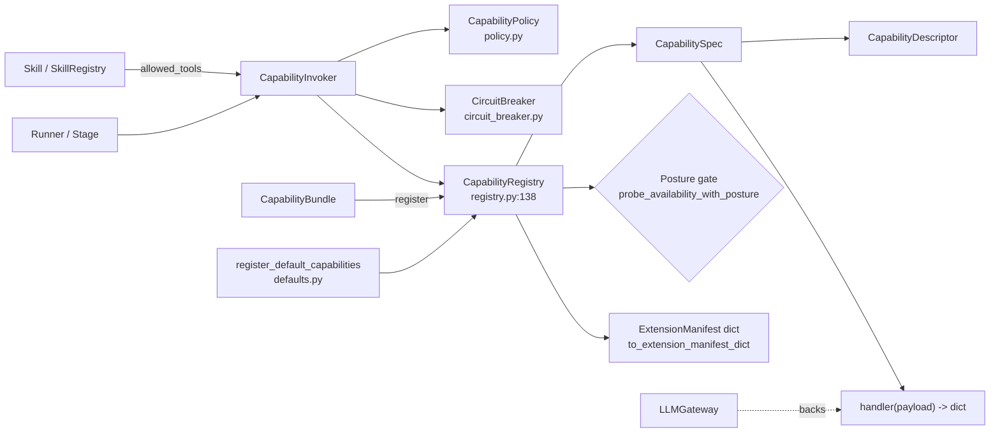
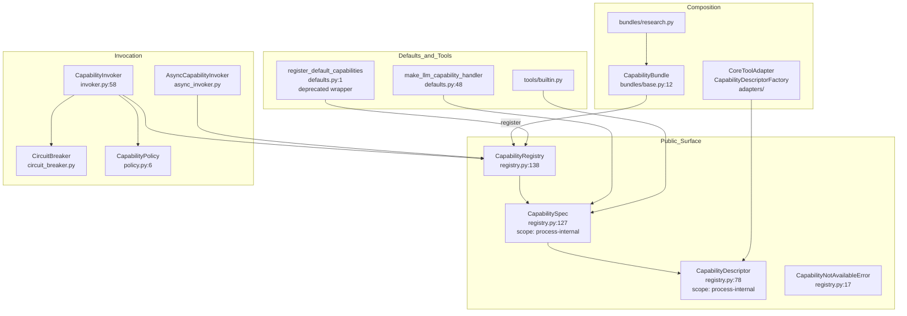
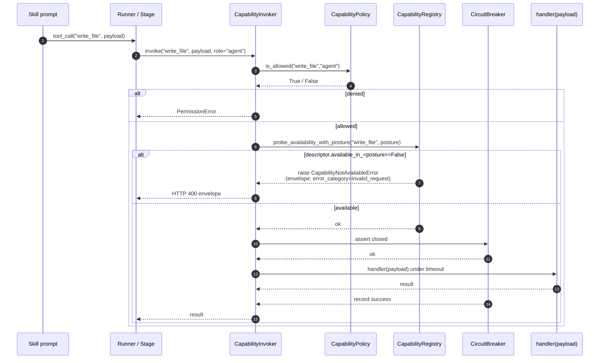
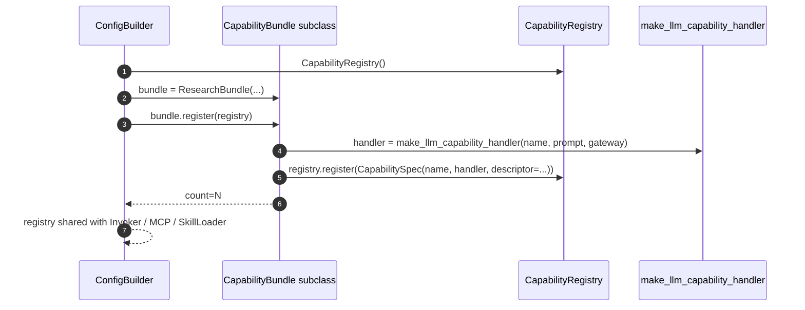

# Capability — Architecture

> **Last refreshed:** 2026-05-06 (W35 corrective close + W36 plans). HEAD `276917d8`.
> **Audience:** platform engineers + capability owners.
> **Status:** authoritative.

## 1. Purpose & Responsibilities

`hi_agent/capability/` owns the **platform-level capability registry** — the directory of named, callable, schema-described tools (e.g. `read_file`, `write_file`, `http_request`, `llm_completion`) that skills, runners, and stages invoke. The registry is **process-internal**: a single `CapabilityRegistry` instance is shared across all tenants in the worker process. Per-tenant assignment, denial, and override are enforced **above** this layer — by `CapabilityPolicy` (RBAC), HTTP-route auth, and posture gates.

The package docstring records this decision explicitly (`__init__.py:1`):

> CapabilitySpec and CapabilityDescriptor are platform-level metadata for tools that are available to every tenant equally. They do not carry tenant_id because the platform operator owns the capability surface; tenant-specific override or denial lives above this layer (in route handlers / policy gates / posture flags), not on the registry row.

Concrete responsibilities:

1. Maintain the `name → CapabilitySpec` map (`CapabilityRegistry`, `registry.py:138`).
2. Carry risk metadata per capability via `CapabilityDescriptor` (`registry.py:78`): `risk_class`, `effect_class`, `requires_auth`, `requires_approval`, `available_in_{dev,research,prod}`, `availability_probe`, license/provenance policy, output budgets, maturity L-level.
3. Provide safe invocation: `CapabilityInvoker` / `AsyncCapabilityInvoker` add policy enforcement, circuit breaker, retry, timeout (`invoker.py:58`, `async_invoker.py`).
4. Enforce **posture gating** at dispatch time: `probe_availability_with_posture(name, posture)` raises `CapabilityNotAvailableError` when the descriptor flag for the active posture is `False` (`registry.py:221`).
5. Surface a unified extension-manifest dict per capability (`to_extension_manifest_dict`, `registry.py:282`) so the manifest layer renders posture support, effect class, and risk class faithfully — not as a hardcoded triple.
6. Provide capability bundles (`bundles/`) — coherent groups registered together — and core tool adapters (`adapters/`).

The package does **not** own:

- Action-level orchestration (delegated to `hi_agent/runtime/harness/`).
- MCP-protocol tool dispatch (delegated to `hi_agent/server/mcp.py`).
- Skill resolution (delegated to `hi_agent/skill/`).
- The LLM gateway itself (delegated to `hi_agent/llm/`).

## 2. Context & Scope

```mermaid
flowchart LR
    SK[Skill / SkillRegistry] -->|allowed_tools| INV[CapabilityInvoker]
    RUN[Runner / Stage] --> INV
    INV --> POL[CapabilityPolicy<br/>policy.py]
    INV --> CB[CircuitBreaker<br/>circuit_breaker.py]
    INV --> REG[CapabilityRegistry<br/>registry.py:138]
    REG --> SPEC[CapabilitySpec]
    SPEC --> DESC[CapabilityDescriptor]
    SPEC --> H["handler(payload) -> dict"]
    REG --> POSTURE{Posture gate<br/>probe_availability_with_posture}
    REG --> EXT[ExtensionManifest dict<br/>to_extension_manifest_dict]
    BUN[CapabilityBundle] -->|register| REG
    DEF[register_default_capabilities<br/>defaults.py] --> REG
    LLM[LLMGateway] -.backs.-> H
```

**In scope:** registry, policy, circuit breaker, descriptors, posture gate, manifest dict generation, default-capability factories.

**Out of scope:** business-domain capability bundles (e.g. research-team-specific tools live in their repo and register against this layer's Protocol), per-tenant capability sets (planned via a future `TenantCapabilityOverlay` table layered on top of this registry — explicitly noted in `__init__.py:13`).

## 3. Module Boundary & Dependencies

| Inbound (callers) | Reason |
|---|---|
| `hi_agent/runner.py`, `hi_agent/runner_stage.py` | Tool dispatch from a stage |
| `hi_agent/skill/loader.py` | Cross-check `SkillDefinition.allowed_tools` against registered capabilities |
| `hi_agent/server/routes_runs.py` and friends | Policy / posture pre-checks before hitting a handler |
| `hi_agent/server/mcp.py` | MCP request → registry lookup |
| `hi_agent/runtime/harness/governed_executor.py` | Delegates to `GovernedToolExecutor` (`governance.py`) |

| Outbound (dependencies) | Reason |
|---|---|
| `hi_agent/observability/metric_counter.py` | `_registry_errors_total`, `_capability_posture_denied_total` counters |
| `hi_agent/observability/silent_degradation.py` | Heuristic-fallback alarm in `defaults.py` |
| `hi_agent/runtime/async_bridge.py` | Shared executor for `_default_timeout_call` |
| `hi_agent/config/posture.py` | `Posture.from_env`, `resolve_runtime_mode` for default-fallback decisions |
| `hi_agent/llm/protocol.py` (TYPE_CHECKING) | `LLMGateway` is the dependency for LLM-backed handlers |

**Not allowed:** importing `hi_agent/server/` from inside this package — capabilities are leaf modules consumed by the orchestration layer.

## 4. Building Blocks

```mermaid
flowchart TB
    subgraph Public_Surface
        REG[CapabilityRegistry<br/>registry.py:138]
        SPEC[CapabilitySpec<br/>registry.py:127<br/>scope: process-internal]
        DESC[CapabilityDescriptor<br/>registry.py:78<br/>scope: process-internal]
        ERR[CapabilityNotAvailableError<br/>registry.py:17]
    end
    subgraph Invocation
        INV[CapabilityInvoker<br/>invoker.py:58]
        AINV[AsyncCapabilityInvoker<br/>async_invoker.py]
        CB[CircuitBreaker<br/>circuit_breaker.py]
        POL[CapabilityPolicy<br/>policy.py:6]
    end
    subgraph Composition
        BUN[CapabilityBundle<br/>bundles/base.py:12]
        BUN_RESEARCH[bundles/research.py]
        ADAPT[CoreToolAdapter<br/>CapabilityDescriptorFactory<br/>adapters/]
    end
    subgraph Defaults_and_Tools
        DEF[register_default_capabilities<br/>defaults.py:1<br/>deprecated wrapper]
        MK[make_llm_capability_handler<br/>defaults.py:48]
        TOOLS[tools/builtin.py]
    end
    REG --> SPEC
    SPEC --> DESC
    INV --> REG
    INV --> POL
    INV --> CB
    AINV --> REG
    BUN -->|register| REG
    BUN_RESEARCH --> BUN
    ADAPT --> DESC
    DEF --> REG
    MK --> SPEC
    TOOLS --> SPEC
```

Key types and citations:

- `CapabilityRegistry()` — `registry.py:138`. Methods: `register`, `get`, `list_names`, `register_bundle`, `get_descriptor`, `probe_availability` (`registry.py:178`), `probe_availability_with_posture` (`registry.py:221`), `to_extension_manifest_dict` (`registry.py:282`), `list_with_views` (`registry.py:315`).
- `CapabilitySpec(name, handler, description, parameters, descriptor)` — `registry.py:127`. Frozen dataclass; `# scope: process-internal`.
- `CapabilityDescriptor(name, risk_class, effect_class, requires_auth, available_in_{dev,research,prod}, availability_probe, source_reference_policy, artifact_output_schema, provenance_required, reproducibility_level, license_policy, sandbox_level, parameters, output_budget_tokens, maturity_level, …)` — `registry.py:78`. Frozen dataclass; `# scope: process-internal`. `maturity_level` is the per-capability L0–L4 record (Rule 13).
- `CapabilityNotAvailableError(capability_name, posture, reason)` — `registry.py:17`. `to_envelope()` returns the structured 400 envelope used by HTTP routes.
- `CapabilityInvoker(registry, breaker, policy, max_retries, retry_exceptions, call_timeout_seconds, timeout_call, allow_unguarded)` — `invoker.py:58`. Wraps a handler with policy → breaker → timeout → retry. The dangerous-effect guard (`_DANGEROUS_ALLOWED_ROLES = {"approver","admin"}`, `invoker.py:19`) refuses irreversible-write capabilities for non-admin roles.
- `CapabilityPolicy(role_permissions, action_permissions)` — `policy.py:6`. RBAC: `role → set[capability_name]` and `role → set[(stage_id, action_kind)]`.
- `CapabilityBundle` — `bundles/base.py:12`. Abstract; `register(registry) -> int` returns the count of registered capabilities.
- `make_llm_capability_handler(capability_name, system_prompt, gateway)` — `defaults.py:48`. Generic factory: any name + prompt + gateway → handler. Heuristic fallback gated by `_allow_heuristic_fallback()` which routes through `resolve_runtime_mode()` (`defaults.py:33`) so HI_AGENT_POSTURE and HI_AGENT_ENV agree.

## 5. Runtime View — Key Scenarios

### 5.1 Capability lookup + invocation under posture

```mermaid
sequenceDiagram
    autonumber
    participant Skill as Skill prompt
    participant Run as Runner / Stage
    participant Inv as CapabilityInvoker
    participant Pol as CapabilityPolicy
    participant Reg as CapabilityRegistry
    participant CB as CircuitBreaker
    participant H as handler(payload)
    Skill->>Run: tool_call("write_file", payload)
    Run->>Inv: invoke("write_file", payload, role="agent")
    Inv->>Pol: is_allowed("write_file","agent")
    Pol-->>Inv: True / False
    alt denied
        Inv-->>Run: PermissionError
    else allowed
        Inv->>Reg: probe_availability_with_posture("write_file", posture)
        alt descriptor.available_in_<posture>=False
            Reg-->>Inv: raise CapabilityNotAvailableError<br/>(envelope: error_category=invalid_request)
            Inv-->>Run: HTTP 400 envelope
        else available
            Reg-->>Inv: ok
            Inv->>CB: assert closed
            CB-->>Inv: ok
            Inv->>H: handler(payload) under timeout
            H-->>Inv: result
            CB-->>Inv: record success
            Inv-->>Run: result
        end
    end
```

### 5.2 Bundle registration at boot

```mermaid
sequenceDiagram
    autonumber
    participant CB as ConfigBuilder
    participant BUN as CapabilityBundle subclass
    participant Reg as CapabilityRegistry
    participant DEF as make_llm_capability_handler
    CB->>Reg: CapabilityRegistry()
    CB->>BUN: bundle = ResearchBundle(...)
    CB->>BUN: bundle.register(registry)
    BUN->>DEF: handler = make_llm_capability_handler(name, prompt, gateway)
    BUN->>Reg: registry.register(CapabilitySpec(name, handler, descriptor=...))
    BUN-->>CB: count=N
    CB-->>CB: registry shared with Invoker / MCP / SkillLoader
```

### 5.3 Manifest rendering (extension layer)

`registry.to_extension_manifest_dict("read_file")` (`registry.py:282`) reads the live descriptor's `available_in_{dev,research,prod}` directly into `posture_support`, plus `effect_class`, `risk_class`, `description`. Rationale: pre-W24 the manifest hardcoded `{dev:true, research:true, prod:true}`; W24 Track D made the manifest faithful to the registry — there is a regression test pinning this.

## 6. Cross-cutting Concerns

| Concern | Mechanism |
|---|---|
| **Rule 6 — single construction path** | Bundles register against the same `CapabilityRegistry` instance built by `ConfigBuilder`; no inline `registry or CapabilityRegistry()` fallbacks. |
| **Rule 11 — posture-aware defaults** | `CapabilityDescriptor.available_in_{dev,research,prod}` flags + `probe_availability_with_posture` (`registry.py:221`); heuristic fallback in `defaults.py:33` routes through `resolve_runtime_mode()` so posture+env agree. |
| **Rule 12 — contract spine** | `capability_name` is a contract-spine field on every persistent record across `hi_agent/contracts/` and `agent_server/`. The registry rows themselves are platform-level (`# scope: process-internal`), per W31 T-6'. |
| **Rule 13 — capability maturity (L0–L4)** | Per-capability `CapabilityDescriptor.maturity_level: Literal["L0","L1","L2","L3","L4"]` (`registry.py:115`). |
| **Rule 7 — alarm signals** | Counters: `hi_agent_capability_registry_errors_total`, `hi_agent_capability_posture_denied_total`, `hi_agent_capability_invoker_errors_total`, `hi_agent_capability_defaults_errors_total`. WARNING logs at every denial site. Heuristic fallback in non-prod mode emits a silent-degradation event. |
| **Dangerous-effect guard** | `_DANGEROUS_ALLOWED_ROLES = {"approver","admin"}` in `invoker.py:19`; `irreversible_write` effect class is refused for any other role. |
| **G2 — abstraction gate** | New capability requests must first show that composition from existing capabilities cannot meet the need (CLAUDE.md three-gate intake). |
| **Circuit breaker** | Per-capability `CircuitBreaker` in `circuit_breaker.py`; states OPEN / HALF_OPEN / CLOSED; failure-count threshold + cool-down window. |
| **Timeout** | `_default_timeout_call` uses the shared `AsyncBridgeService` executor (`invoker.py:45`); `Future.cancel()` on `FutureTimeoutError`. |

## 7. Architecture Decisions

### ADR-C-1: Platform-level (not per-tenant) registry rows

W31 T-6': capabilities are tenant-agnostic platform metadata. Per-tenant override is the responsibility of the **route / policy gate**, not a row on `CapabilitySpec`. The `__init__.py:1` docstring records this; the contract-spine completeness gate (`scripts/check_contract_spine_completeness.py`) recognises the `# scope: process-internal` marker and exempts these classes from the `tenant_id` requirement. A future `TenantCapabilityOverlay` table is the right model if per-tenant uploads land — adding `tenant_id` to `CapabilitySpec` is **not** the right model.

### ADR-C-2: `CapabilityDescriptor` is the single canonical metadata type (CO-6)

Two historical sources — platform-governance fields (`risk_class`, `requires_auth`) and adapter/factory fields (`effect_class`, `tags`, `sandbox_level`) — are unified on `CapabilityDescriptor`. The adapter-side dict shape lives in `build_capability_view()` in `descriptor_factory.py` (a view, not a separate dataclass).

### ADR-C-3: Posture gate is a hard fail, not a notification

Calling `probe_availability_with_posture(name, posture)` raises `CapabilityNotAvailableError` (with a structured 400 envelope) when the descriptor's posture flag is `False`. This is the strongest interpretation of "available_in_prod=False" — Rule 1 — and it lets HTTP routes return a typed error without string-matching on log lines.

### ADR-C-4: Manifest dict reads descriptor flags directly (W24 Track D)

`to_extension_manifest_dict` reads `available_in_{dev,research,prod}` from each descriptor, never from a hardcoded triple. Rationale: drift between the manifest and the registry was the highest-incidence platform-defect class through Wave 24. Pinned by a regression test.

### ADR-C-5: Dangerous capabilities surface to the skill load gate

The dangerous-capability list lives on `ExtensionManifest.dangerous_capabilities` (`hi_agent/plugins/manifest.py:60`). The W35 corrective close H1 added the dev-side test that fires the gate at skill load time. From the capability registry's side, all that changes is that `CapabilityDescriptor.risk_class` plus `effect_class` plus the manifest gate combine into the dangerous-capability decision; the registry stays the single source of truth for capability metadata.

## 8. Quality Attributes

| Attribute | Target | Mechanism |
|---|---|---|
| Lookup latency | O(1) | Plain dict; no I/O on the hot path. |
| Boot-time registration | <50ms for ~30 capabilities | Bundles register synchronously; no async initialisation. |
| Concurrency safety | Per-handler timeout via shared executor | `AsyncBridgeService.get_executor()` guarantees one durable thread for sync-bridge calls (Rule 5). |
| Posture isolation | Hard fail on prod-disabled capability | `CapabilityNotAvailableError` carries 400 envelope; structured downstream. |
| Auditability | Every denial logs at WARNING + counter | `_capability_posture_denied_total` increments at every denial branch (`registry.py:245-278`). |

## 9. Risks & Technical Debt

| Risk | Severity | Mitigation / Plan |
|---|---|---|
| Capability namespace collision | Medium | `register_bundle` returns the count; a colliding name silently overwrites today (`registry.register` does upsert). A future bundle-registration validator could refuse colliding names; tracked as backlog. |
| Registration ordering during boot | Low | Bundles run synchronously in the order `ConfigBuilder` calls them; deterministic. Any reorder must keep `register_default_capabilities` before tenant-specific bundles so descriptors land first. |
| Heuristic fallback when LLM gateway is `None` | Medium | Allowed in non-prod via `_allow_heuristic_fallback()` (`defaults.py:33`); under prod returns a structured failure response rather than fabricating output (Rule 7). |
| Per-tenant overlay missing | Medium | Documented in `__init__.py:13` as a future enhancement; route handlers and policy gates currently carry the per-tenant decision. |
| Circuit breaker state is in-process only | Low | Per-process `CircuitBreaker` is the design today; multi-process platforms would need a shared state store, deferred. |

## 10. References

- Source: `hi_agent/capability/registry.py`, `hi_agent/capability/invoker.py`, `hi_agent/capability/async_invoker.py`, `hi_agent/capability/policy.py`, `hi_agent/capability/circuit_breaker.py`, `hi_agent/capability/defaults.py`, `hi_agent/capability/governance.py`, `hi_agent/capability/bundles/base.py`, `hi_agent/capability/adapters/descriptor_factory.py`, `hi_agent/plugins/manifest.py`.
- Rules: `CLAUDE.md` Rule 1 (strongest interpretation), Rule 6 (single construction path), Rule 7 (resilience signals), Rule 11 (posture-aware defaults), Rule 12 (contract spine), Rule 13 (capability maturity), G2 abstraction gate.
- Sibling docs: `hi_agent/skill/ARCHITECTURE.md` (consumer of `allowed_tools`), `hi_agent/runtime/ARCHITECTURE.md` (to-confirm — owns harness dispatch), `hi_agent/server/ARCHITECTURE.md` (to-confirm — HTTP route layer).
