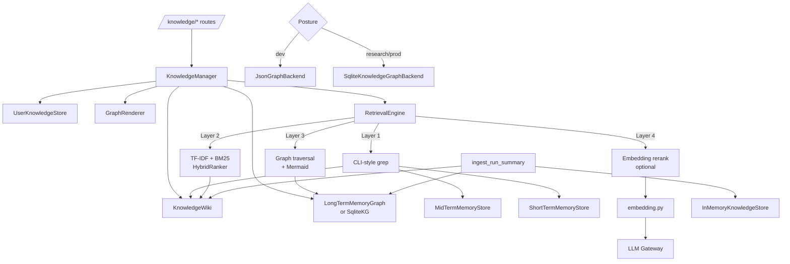
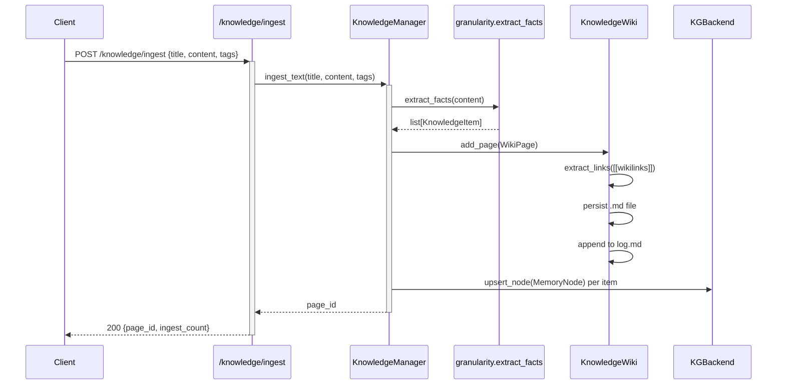
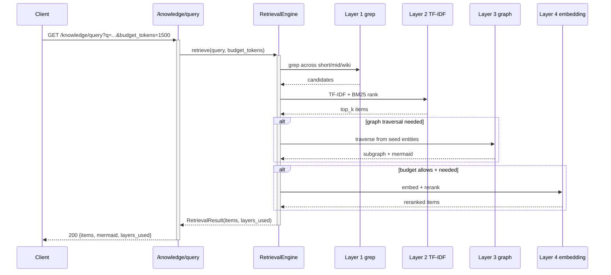

# Knowledge Architecture

## 1. Purpose & Position in System

`hi_agent/knowledge/` is the platform's first-class long-term memory **surface** — the wiki, knowledge graph, retrieval engine, and structured-fact ingestion that downstream code consumes for grounding, citation, and provenance. While `hi_agent/memory/` owns the L0–L3 layered pipeline of run-internal memory, `hi_agent/knowledge/` owns the user-facing knowledge artifacts: wiki pages, knowledge entries, user preferences, the retrieval engine that joins them, and the SQLite-backed knowledge graph that is the production default in research/prod.

The package owns:
1. **`KnowledgeManager`** — the unified ingest + query coordinator (Rule 6 / DF-11 hardened: all four constructor dependencies must be injected).
2. **Wiki** — `KnowledgeWiki` + `WikiPage` (markdown pages with YAML frontmatter, wikilinks, log).
3. **Entries** — `KnowledgeEntry`, `InMemoryKnowledgeStore`, `KnowledgeRecord` (typed item store).
4. **Retrieval** — `RetrievalEngine` (4-layer: grep → TF-IDF/BM25 → graph traversal → embedding rerank), `RetrievalResult`.
5. **Graph rendering** — `GraphRenderer` (mermaid + subgraph serialization).
6. **Ingest policy** — `IngestPolicy`, `ingest_run_summary`, `should_ingest`.
7. **User knowledge** — `UserKnowledgeStore`, `UserProfile` (per-user preferences and feedback).
8. **Knowledge graph backend** — `SqliteKnowledgeGraphBackend` (production default under research/prod) implementing the `KnowledgeGraphBackend` Protocol from `hi_agent/memory/graph_backend.py`.

It does **not** own: the layered run memory pipeline (delegated to `hi_agent/memory/`), the embedding model (delegated to `hi_agent/knowledge/embedding.py` which calls `hi_agent/llm/`), or the dream consolidation scheduler (delegated to `hi_agent/server/dream_scheduler.py`).

## 2. External Interfaces

**Public exports** (`hi_agent/knowledge/__init__.py`):

Manager:
- `KnowledgeManager(wiki, user_store, graph, renderer, storage_dir)` (`knowledge_manager.py:69`)
- `KnowledgeResult(wiki_pages, graph_nodes, user_context, total_results)` (`knowledge_manager.py:24`)

Wiki:
- `KnowledgeWiki(wiki_dir)` (`wiki.py:42`)
- `WikiPage(page_id, title, content, page_type, tags, sources, outgoing_links, confidence, created_at, updated_at)` (`wiki.py:27`)

Entries:
- `KnowledgeEntry(entry_id, content, entry_type, tags, source, confidence, created_at)` (`entry.py:11`)
- `InMemoryKnowledgeStore`, `KnowledgeRecord` (`store.py`)

Granularity helpers:
- `KnowledgeItem`, `estimate_tokens`, `extract_facts`, `to_chunk` (`granularity.py`)

Retrieval:
- `RetrievalEngine(wiki, graph, short_term, mid_term, …)` (`retrieval_engine.py`)
- `RetrievalResult(items, total_candidates, total_tokens, budget_tokens, layers_used, graph_mermaid)` (`retrieval_engine.py:43`)
- `cosine_similarity`
- `HybridRanker`, `TFIDFIndex` (`tfidf.py`)

Ingest:
- `IngestPolicy` StrEnum (`ON_SUCCESS`, `ON_LABELED`, `NEVER`) (`ingest.py:10`)
- `should_ingest(policy, run_status, labeled)` (`ingest.py:18`)
- `ingest_run_summary(store, run_id, source, summary, policy, run_status, labeled, tags, vector)` (`ingest.py:32`)

User knowledge:
- `UserKnowledgeStore`, `UserProfile` (`user_knowledge.py`)

Graph:
- `GraphRenderer` (`graph_renderer.py`)
- `SqliteKnowledgeGraphBackend` — production default; implements `KnowledgeGraphBackend` Protocol from `hi_agent/memory/graph_backend.py:48`
- `query_knowledge(...)` (`query.py`)

Filters and manifest:
- `filters.py` — query filters
- `manifest.py` — KG manifest export
- `factory.py` — factory helpers

## 3. Internal Components

| Component | File | Responsibility |
|---|---|---|
| `KnowledgeManager` | `knowledge_manager.py:69` | Unified ingest + query; injects wiki + user_store + graph + renderer (Rule 6 enforced). |
| `KnowledgeWiki` | `wiki.py:42` | File-based wiki: index.md + log.md + pages/. CRUD on `WikiPage`. |
| `WikiPage` | `wiki.py:27` | Single page (page_id slug, markdown content, wikilinks, sources). |
| `KnowledgeEntry` | `entry.py:11` | Typed knowledge item value object. |
| `InMemoryKnowledgeStore` / `KnowledgeRecord` | `store.py` | Vector-aware key-value store for ingested records. |
| `RetrievalEngine` | `retrieval_engine.py` | 4-layer retrieval pipeline. |
| `HybridRanker`, `TFIDFIndex` | `tfidf.py` | Layer 2 ranker. |
| `GraphRenderer` | `graph_renderer.py` | Mermaid serialization of subgraphs. |
| `UserKnowledgeStore`, `UserProfile` | `user_knowledge.py` | Per-user preferences + feedback. |
| `IngestPolicy`, `ingest_run_summary`, `should_ingest` | `ingest.py` | Policy-driven run-result ingestion. |
| `SqliteKnowledgeGraphBackend` | `../memory/sqlite_kg_backend.py:30` | Production KG backend (tenant-scoped, SQLite WAL). |
| `query_knowledge` | `query.py` | High-level query helper across stores. |
| `KnowledgeItem` | `granularity.py` | Chunked knowledge unit with token estimates. |
| `embedding.py` | `embedding.py` | Embedding generation via LLM gateway. |
| `filters.py` | `filters.py` | Query filter builders (date / tag / confidence). |

## 4. Data Flow

### Ingest pipeline

### Query pipeline (4-layer retrieval)

The chunk-and-promote ingest path (text → chunks → entries → KG nodes) is implemented as `KnowledgeManager.ingest_text` → `granularity.extract_facts` → `WikiPage` + `MemoryNode` upserts. Bulk structured ingestion uses `ingest_structured(facts)`.

## 5. State & Persistence

| State | Backend | Path | Tenant scoping |
|---|---|---|---|
| Wiki pages | Markdown files | `<wiki_dir>/pages/<page_id>.md` | At wiki_dir level (per-profile); `WikiPage.sources` carries provenance |
| Wiki index/log | `<wiki_dir>/index.md`, `log.md` | per-profile | n/a |
| `InMemoryKnowledgeStore` | RAM | n/a | per-instance |
| User profile | JSON file | `<storage_dir>/users/<user_id>.json` | tenant-scoped |
| `LongTermMemoryGraph` (JSON, dev) | JSON file | `<storage_dir>/long_term.json` | nodes/edges carry `tenant_id` |
| `SqliteKnowledgeGraphBackend` (research/prod) | SQLite WAL | `<data_dir>/L3/<profile_id>/knowledge_graph.sqlite` | `tenant_id` column on every row; PK includes `tenant_id` |
| `RetrievalEngine` index | In-memory `TFIDFIndex` | warmed on lifespan startup | tenant-scoped at warm time |
| Embeddings cache | Optional in-memory dict | per-instance | tenant-scoped |

The KG backend is constructed via `make_knowledge_graph_backend` (`hi_agent/memory/kg_factory.py:45`) — Rule 6 single construction path. Posture-driven default:
- `dev` → `JsonGraphBackend` (LongTermMemoryGraph)
- `research`/`prod` → `SqliteKnowledgeGraphBackend`
- Override: `HI_AGENT_KG_BACKEND={json,sqlite}`

## 6. Concurrency & Lifecycle

**Ingest pipeline** runs synchronously in the route handler thread; SQLite writes are serialized via `threading.Lock` inside the backend. Wiki file writes use atomic-rename pattern (write to `<file>.tmp`, then `os.replace`).

**Retrieval pipeline** is mostly synchronous. Layer 4 embedding rerank is the only path that calls `LLM Gateway` — it routes through the `runtime/sync_bridge.py` for async resource lifetime safety (Rule 5). The TFIDF index is warmed at lifespan startup via `RetrievalEngine.warm_index_async()` invoked from `hi_agent/server/app.py:1456`.

**Lifecycle hooks**:
- `KnowledgeManager` is constructed by `SystemBuilder.build_knowledge_manager(profile_id)` per profile — every dependency (wiki, user_store, graph, renderer) is profile-scoped.
- `RetrievalEngine` is constructed by `SystemBuilder.build_retrieval_engine(profile_id)`; warm-up is async (`warm_index_async`) invoked once during server lifespan.
- `SqliteKnowledgeGraphBackend` opens its connection in `__init__` with `check_same_thread=False`; closes when the system builder is torn down.

**Locks**:
- `KnowledgeWiki._pages` — implicit dict (caller holds responsibility); file writes serialized.
- `LongTermMemoryGraph` (JSON backend) — `threading.RLock`.
- `SqliteKnowledgeGraphBackend` — `threading.Lock`.
- `TFIDFIndex` — `threading.Lock` around document add / query.

## 7. Error Handling & Observability

**Rule 7 fallback paths**: when KG queries fall back to local heuristics (e.g. SQLite read fails → in-memory cache), the path emits:
- `record_fallback("knowledge", reason, run_id, extra)` (via `hi_agent/observability/fallback.py`)
- counter `hi_agent_knowledge_fallback_total{reason}`
- WARNING log

**KG backend override observability** (`hi_agent/memory/kg_factory.py:29`):
- `_inc_kg_override_counter` increments `hi_agent_kg_backend_override_total` whenever `HI_AGENT_KG_BACKEND` overrides the posture default.

**Retrieval observability**:
- `RetrievalResult.layers_used` is returned in every response — operators can see which retrieval layers fired.
- `record_silent_degradation` (in `retrieval_engine.py`) logs Layer 4 embedding failures without breaking the request — Layer 3 result is returned instead.

**Health surface**: `/health.subsystems.knowledge` (in app.py) reports configured/not_configured + LTM graph size. `/knowledge/lint` runs the wiki lint check (orphan pages, contradictions).

## 8. Security Boundary

**Tenant scoping at every read/write boundary**:
- `KnowledgeManager.ingest_text(title, content, tags)` and `ingest_structured(facts)` — caller passes through profile-scoped manager built per profile.
- `WikiPage` and `KnowledgeEntry` are **value objects** (no `tenant_id` field — `# scope: process-internal` on `KnowledgeEntry`); the tenant lives on the row in the underlying KG store and on the wiki directory path. Every read/write passes `tenant_id` explicitly to the backend.
- `SqliteKnowledgeGraphBackend` queries always include `WHERE tenant_id = ?` and the PK is `(id, tenant_id)` so two tenants can have the same node_id without collision.
- `UserKnowledgeStore` is scoped by `user_id` (which is itself scoped by `tenant_id` upstream).

**Process-internal markers** (Rule 12 marker discipline):
- `KnowledgeEntry` (`entry.py:9`): `# scope: process-internal` — tenant lives on KG row.
- `KnowledgeResult` (`knowledge_manager.py:21`): `# scope: process-internal` — query response wrapper.
- `RetrievalResult` (`retrieval_engine.py:42`): `# scope: process-internal`.

**Posture interaction**:
- Under research/prod, `make_knowledge_graph_backend` returns `SqliteKnowledgeGraphBackend`; under dev it returns the JSON file backend. The two backends both implement the same Protocol so callers do not branch.
- Endpoint authorisation: `/knowledge/ingest`, `/knowledge/query`, `/knowledge/sync` require an authenticated `TenantContext` (set by `AuthMiddleware`); `record_tenant_scoped_access` is called for audit (`hi_agent/observability/audit.py`).

**No cross-tenant retrieval**: `RetrievalEngine.retrieve(query, tenant_id, …)` filters every layer by `tenant_id`. A tenant cannot retrieve another tenant's facts even by exact node_id.

## 9. Extension Points

- **Custom retrieval ranker**: subclass `HybridRanker` (`tfidf.py`); pass to `RetrievalEngine(ranker=…)`.
- **New ingest policy**: extend `IngestPolicy` enum (`ingest.py:10`); update `should_ingest`.
- **Custom KG backend**: implement `KnowledgeGraphBackend` Protocol (`hi_agent/memory/graph_backend.py:48`); register in `make_knowledge_graph_backend`.
- **Custom embedding provider**: replace `embedding.py` callable; respect Rule 5 lifetime by passing through the LLM gateway (which routes via sync bridge).
- **New wiki page type**: extend `WikiPage.page_type` taxonomy; update `KnowledgeWiki.lint` rules.
- **Subgraph rendering format**: subclass `GraphRenderer`; override `render(subgraph) -> str`.

## 10. Constraints & Trade-offs

- **Wiki pages are filesystem files** — works locally but multi-pod deployments need shared storage (NFS / S3-fuse). KG SQLite has the same constraint; production deployments use a single hi-agent process per data directory.
- **Embedding rerank is opt-in** because it costs an LLM call per query batch. Most production deployments rely on Layer 1+2+3 (zero-cost) and reserve Layer 4 for high-stakes queries.
- **No vector index in JSON KG backend** — similarity is keyword/tag-based. SQLite KG also lacks ANN indexing; the `embedding.py` cache provides flat-cosine fallback.
- **Wiki lint is heuristic** — `KnowledgeWiki.lint` finds orphan pages and obvious contradictions but does not validate fact correctness. Higher-fidelity validation lives in `hi_agent/evolve/`.
- **`KnowledgeManager` requires four constructor args injected** (`knowledge_manager.py:80-114`): `wiki`, `user_store`, `graph`, `renderer`. Inline fallback construction was rejected per Rule 6 / DF-11 / J7-1 because it created unscoped instances that diverged from the builder's profile-scoped objects.
- **Per-profile partitioning vs. per-tenant**: knowledge graphs are partitioned at the **profile** level (`<data_dir>/L3/<profile_id>/`); within a profile, rows are filtered by `tenant_id`. This means a profile is shared across tenants, but tenant data is isolated. Operators choosing strict per-tenant isolation must use distinct profiles per tenant.
- **No transactional ingest**: ingesting one wiki page + N graph nodes is not atomic. A crash mid-ingest leaves the wiki page without graph backing (or vice versa). Reconciliation runs as part of the dream/lint cycles.

## 11. References

**Files**:
- `hi_agent/knowledge/__init__.py` — public surface
- `hi_agent/knowledge/knowledge_manager.py` — `KnowledgeManager`, `KnowledgeResult`
- `hi_agent/knowledge/wiki.py` — `KnowledgeWiki`, `WikiPage`
- `hi_agent/knowledge/entry.py` — `KnowledgeEntry`
- `hi_agent/knowledge/store.py` — `InMemoryKnowledgeStore`, `KnowledgeRecord`
- `hi_agent/knowledge/retrieval_engine.py` — 4-layer `RetrievalEngine`
- `hi_agent/knowledge/tfidf.py` — `HybridRanker`, `TFIDFIndex`
- `hi_agent/knowledge/graph_renderer.py` — `GraphRenderer`
- `hi_agent/knowledge/granularity.py` — `KnowledgeItem`, `extract_facts`, `to_chunk`
- `hi_agent/knowledge/ingest.py` — `IngestPolicy`, `ingest_run_summary`
- `hi_agent/knowledge/user_knowledge.py` — user preferences
- `hi_agent/knowledge/query.py`, `filters.py`, `manifest.py`, `factory.py`, `embedding.py` — query helpers
- `hi_agent/knowledge/sqlite_backend.py` — alternate SQLite stores
- `hi_agent/memory/sqlite_kg_backend.py` — `SqliteKnowledgeGraphBackend`
- `hi_agent/memory/graph_backend.py` — `KnowledgeGraphBackend` Protocol
- `hi_agent/memory/kg_factory.py` — Rule 6 KG construction
- `hi_agent/server/routes_knowledge.py` — HTTP route handlers
- `hi_agent/memory/ARCHITECTURE.md` — layered memory pipeline (companion doc)

**Rules**:
- CLAUDE.md Rule 6 (Single Construction Path), Rule 7 (Resilience), Rule 11 (Posture-Aware Defaults), Rule 12 (Contract Spine + scope markers)
- Rules-incident-log: J7-1 (`KnowledgeManager` injection requirement), DF-11 (Capability Maturity)
- `scripts/check_contract_spine_completeness.py` — validates `# scope:` markers
