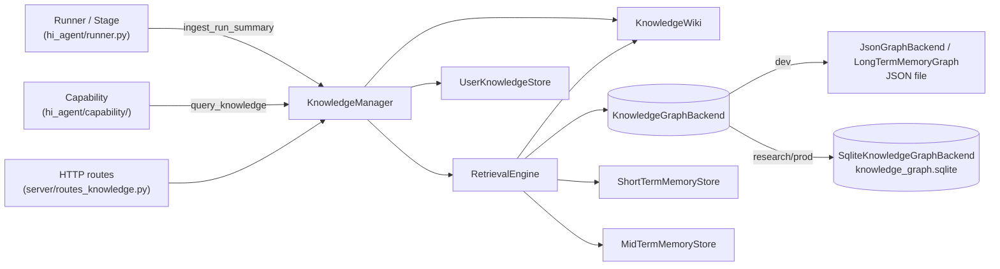
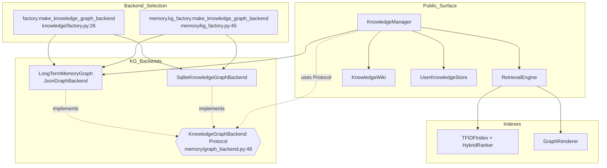
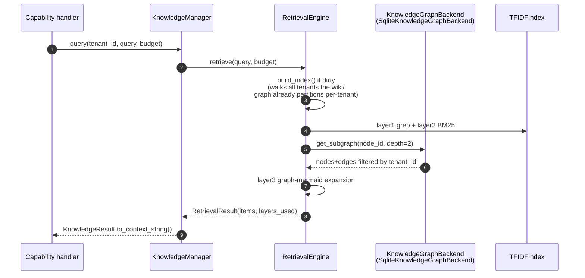

# Knowledge — Architecture

> **Last refreshed:** 2026-05-06 (W35 corrective close + W36 plans). HEAD `276917d8`.
> **Audience:** platform engineers + capability owners.
> **Status:** authoritative.

## 1. Purpose & Responsibilities

`hi_agent/knowledge/` is the platform's user-facing knowledge surface — the wiki, knowledge graph, and four-layer retrieval engine that runs and capabilities consume for grounding, citation, and provenance. Where `hi_agent/memory/` owns the L0–L3 layered pipeline of run-internal memory (raw events → compressed stage summaries → episodic records), `hi_agent/knowledge/` owns the long-lived, cross-run knowledge artifacts: wiki pages, structured user knowledge, the unified retrieval pipeline, and the **posture-aware knowledge-graph backend**.

Concrete responsibilities:

1. Provide a single `KnowledgeManager` ingest + query coordinator (`knowledge_manager.py:69`) — Rule 6 / DF-11 hardened: every shared dependency (`wiki`, `user_store`, `graph`, `renderer`) must be injected by the builder; no inline `x or DefaultX()` fallbacks.
2. Own the wiki surface — `KnowledgeWiki`, `WikiPage` (`wiki.py`).
3. Own the four-layer `RetrievalEngine` (`retrieval_engine.py:68`): grep → TF-IDF/BM25 → graph-traversal → optional embedding rerank.
4. Provide a posture-aware `KnowledgeGraphBackend` Protocol (`hi_agent/memory/graph_backend.py:48`) and two implementations:
   - `LongTermMemoryGraph` / `JsonGraphBackend` (default L3; dev posture default).
   - `SqliteKnowledgeGraphBackend` (`sqlite_backend.py:30` + `hi_agent/memory/sqlite_kg_backend.py:33`) — durable, tenant-scoped; research/prod default.
5. Enforce Rule 12 contract spine on every persistent record: `tenant_id` is a required column on all `kg_nodes` and `kg_edges` rows; every read filters by tenant.
6. Surface knowledge-graph render output as Mermaid/Cytoscape (`graph_renderer.py`, `KnowledgeGraphBackend.export_visualization`).

The package does **not** own:

- Run-internal layered memory (delegated to `hi_agent/memory/`).
- The embedding model itself (delegated to `hi_agent/knowledge/embedding.py` which calls `hi_agent/llm/`).
- Dream consolidation scheduling (`hi_agent/server/dream_scheduler.py`).
- HTTP routes that surface knowledge ingest/query (delegated to `hi_agent/server/routes_knowledge.py`).

## 2. Context & Scope

```mermaid
flowchart LR
    R["Runner / Stage<br/>(hi_agent/runner.py)"] -->|ingest_run_summary| KM[KnowledgeManager]
    C["Capability<br/>(hi_agent/capability/)"] -->|query_knowledge| KM
    HR["HTTP routes<br/>(server/routes_knowledge.py)"] --> KM
    KM --> RE[RetrievalEngine]
    KM --> WK[KnowledgeWiki]
    KM --> US[UserKnowledgeStore]
    RE --> KG[(KnowledgeGraphBackend)]
    KG -->|dev| JSON[JsonGraphBackend / LongTermMemoryGraph<br/>JSON file]
    KG -->|research/prod| SQ[(SqliteKnowledgeGraphBackend<br/>knowledge_graph.sqlite)]
    RE --> WK
    RE --> ST[ShortTermMemoryStore]
    RE --> MT[MidTermMemoryStore]
```

**In scope:** ingest, query, retrieval pipeline, graph backend selection, tenant scoping on KG reads/writes, mermaid export.

**Out of scope:** business-layer knowledge (declined to research team per Rule 10), Neo4j backend (permanently declined; see ADR-K-2).

## 3. Module Boundary & Dependencies

| Inbound (callers) | Reason |
|---|---|
| `hi_agent/runner.py`, `hi_agent/runner_stage.py` | Post-stage knowledge ingest |
| `hi_agent/capability/*` | Knowledge-grounded handlers (e.g. retrieval-augmented capabilities) |
| `hi_agent/server/routes_knowledge.py` | HTTP ingest/query endpoints |
| `hi_agent/server/app.py` | Builder wires the per-tenant `KnowledgeManager` |

| Outbound (dependencies) | Reason |
|---|---|
| `hi_agent/memory/long_term.py` | `LongTermMemoryGraph` is the JSON KG backend implementation |
| `hi_agent/memory/graph_backend.py` | Defines `KnowledgeGraphBackend` Protocol, `Edge`, `Path`, `ConflictReport` |
| `hi_agent/memory/short_term.py`, `mid_term.py` | RetrievalEngine indexes session + daily summaries |
| `hi_agent/llm/*` | Embedding function, structured ingest |
| `hi_agent/observability/*` | Silent-degradation alarms, metric counters |
| `hi_agent/security/injection_scanner.py` | Pre-ingest content scanning (Fix-9 in `RetrievalEngine._scan_content`, `retrieval_engine.py:202`) |

**Not allowed:** importing `hi_agent/server/`, `hi_agent/runtime/`, or any business module from inside this package — knowledge is a leaf module consumed by orchestration layers.

## 4. Building Blocks

```mermaid
flowchart TB
    subgraph Public_Surface
        KM[KnowledgeManager]
        RE[RetrievalEngine]
        KW[KnowledgeWiki]
        UKS[UserKnowledgeStore]
    end
    subgraph Backend_Selection
        FAC[factory.make_knowledge_graph_backend<br/>knowledge/factory.py:26]
        FAC2[memory.kg_factory.make_knowledge_graph_backend<br/>memory/kg_factory.py:45]
    end
    subgraph KG_Backends
        JGB[LongTermMemoryGraph<br/>JsonGraphBackend]
        SQB[SqliteKnowledgeGraphBackend]
        PROTO{{KnowledgeGraphBackend Protocol<br/>memory/graph_backend.py:48}}
    end
    subgraph Indexes
        TF[TFIDFIndex + HybridRanker]
        GR[GraphRenderer]
    end
    KM --> KW
    KM --> UKS
    KM --> JGB
    KM --> RE
    RE --> TF
    RE --> GR
    FAC --> JGB
    FAC --> SQB
    FAC2 --> JGB
    FAC2 --> SQB
    JGB -.implements.-> PROTO
    SQB -.implements.-> PROTO
    KM -.uses Protocol.-> PROTO
```

Key types and citations:

- `KnowledgeManager(wiki, user_store, graph, renderer, storage_dir)` — `knowledge_manager.py:69`. Constructor raises `ValueError` if `user_store` or `graph` is `None` (Rule 6 / DF-11).
- `KnowledgeResult` — `knowledge_manager.py:24` (`# scope: process-internal`).
- `RetrievalEngine(wiki, graph, short_term, mid_term, graph_renderer, embedding_fn, tfidf, storage_dir)` — `retrieval_engine.py:68`. `RetrievalResult` is `# scope: process-internal` (`retrieval_engine.py:43`).
- `make_knowledge_graph_backend(posture, data_dir)` — `factory.py:26`. Posture-aware: dev → JSON, research/prod → SQLite. Override via `HI_AGENT_KG_BACKEND={json,sqlite}`.
- `make_knowledge_graph_backend(posture, data_dir, profile_id, project_id, tenant_id)` — `hi_agent/memory/kg_factory.py:45` (Rule 6/12 hardened: rejects empty `profile_id`; under prod posture rejects `HI_AGENT_KG_BACKEND=json`).
- `SqliteKnowledgeGraphBackend(data_dir, profile_id, project_id, tenant_id)` — `hi_agent/memory/sqlite_kg_backend.py:33`. Every read filters by `(profile_id, project_id, tenant_id)`. Pre-W31 unscoped rows auto-mapped to `__pre_w31_legacy__` bucket on construction.
- `KnowledgeGraphBackend` Protocol — `hi_agent/memory/graph_backend.py:48`. Methods: `upsert_node`, `upsert_edge`, `query_relation`, `transitive_query`, `detect_conflict`, `export_visualization`.

## 5. Runtime View — Key Scenarios

### 5.1 Tenant-scoped knowledge query (research/prod)

```mermaid
sequenceDiagram
    autonumber
    participant Cap as Capability handler
    participant KM as KnowledgeManager
    participant RE as RetrievalEngine
    participant KG as KnowledgeGraphBackend<br/>(SqliteKnowledgeGraphBackend)
    participant TF as TFIDFIndex
    Cap->>KM: query(tenant_id, query, budget)
    KM->>RE: retrieve(query, budget)
    RE->>RE: build_index() if dirty<br/>(walks all tenants the wiki/<br/>graph already partitions per-tenant)
    RE->>TF: layer1 grep + layer2 BM25
    RE->>KG: get_subgraph(node_id, depth=2)
    KG-->>RE: nodes+edges filtered by tenant_id
    RE->>RE: layer3 graph-mermaid expansion
    RE-->>KM: RetrievalResult(items, layers_used)
    KM-->>Cap: KnowledgeResult.to_context_string()
```

### 5.2 Ingest with injection scan

`RetrievalEngine.ingest_document(doc_id, text, source)` (`retrieval_engine.py:300`):

1. `_scan_content(text, source)` invokes `InjectionScanner.scan_and_raise()` (`security/injection_scanner.py`) — `InjectionDetectedError` propagates to caller.
2. Under index lock: `TFIDFIndex.add(doc_id, text)`.
3. Persist to `.index_cache.json` (sha256 fingerprint, schema_version 1).

If `hi_agent.security.injection_scanner` is missing, the scanner is treated as an optional dependency and a silent-degradation event is recorded (`record_silent_degradation(component=…, reason="injection_scanner_import_failed")` — `retrieval_engine.py:218`).

### 5.3 Posture-aware backend selection

`make_knowledge_graph_backend` (memory variant, `kg_factory.py:45`) decision table:

| `HI_AGENT_KG_BACKEND` | Posture | Result |
|---|---|---|
| (unset) | dev | `JsonGraphBackend` |
| (unset) | research / prod | `SqliteKnowledgeGraphBackend` |
| `json` | dev | `JsonGraphBackend` |
| `json` | research | `JsonGraphBackend` (Rule 7 alarm + counter `hi_agent_kg_backend_override_total`) |
| `json` | prod | `ValueError` raised (Rule 11 — prod requires durable backend) |
| `sqlite` | any | `SqliteKnowledgeGraphBackend` |

## 6. Cross-cutting Concerns

| Concern | Mechanism |
|---|---|
| **Rule 6 — single construction path** | `factory.make_knowledge_graph_backend` and `kg_factory.make_knowledge_graph_backend`; `KnowledgeManager.__init__` raises `ValueError` when builder shortcuts dependencies (`knowledge_manager.py:88`). |
| **Rule 11 — posture-aware defaults** | `factory.py:50` selects backend by `Posture.from_env().is_strict`; prod hard-rejects JSON override. |
| **Rule 12 — contract spine** | `MemoryNode.tenant_id`, `MemoryEdge.tenant_id` (`memory/long_term.py:44, 67`) are fail-closed under strict posture; SQLite rows carry `(node_id, profile_id, project_id, tenant_id, payload, created_at)` (`memory/sqlite_kg_backend.py:54`). |
| **Rule 7 — alarm signals** | `record_silent_degradation` for missing injection scanner; `hi_agent_kg_backend_override_total` counter for non-default backend selection; `RetrievalEngine` cache load/save failures logged at WARNING. |
| **Tenant scope on reads** | `KnowledgeWiki.list_pages(tenant_id=…)`; `RetrievalEngine.build_index` walks `wiki._all_tenants()` only as a process-internal indexer — every public read still goes through tenant-scoped wiki APIs (`retrieval_engine.py:251`). |
| **Index durability** | `.index_cache.json` (schema_version 1, sha256 fingerprint) — corrupt/wrong-version caches are rebuilt on next `build_index()` (`retrieval_engine.py:153`). |

## 7. Architecture Decisions

### ADR-K-1: KnowledgeGraphBackend Protocol over a single class

We define a runtime-checkable Protocol (`memory/graph_backend.py:48`) and ship two implementations rather than a single concrete class. Reason: research/prod needs durability that JSON cannot give, but dev needs the speed and inspectability of a flat JSON file. The Protocol decouples consumers (`KnowledgeManager`, `RetrievalEngine`) from backend choice and lets the posture-aware factory inject the right one.

### ADR-K-2: Neo4j permanently declined (Rule 10 alignment)

Per `docs/platform-gaps.md` row P-5 and the user-memory record `feedback_neo4j_decline.md`, JSON-backed L3 + SQLite-backed L3 cover **all** required graph operations — `upsert_node`, `upsert_edge`, `query_relation`, `transitive_query`, `detect_conflict`, `export_visualization` — at our scale. Neo4j adds an external service dependency with no functional gain; downstream may implement `KnowledgeGraphBackend` themselves with Neo4j if their own scale demands it (the Protocol is the public seam). Decision is final; the gap row is closed at L2 (per W30 notice).

### ADR-K-3: Per-tenant scoping of every persistent KG row

Every node and edge in the SQLite backend carries `(profile_id, project_id, tenant_id)`. Reads filter on all three. Pre-W31 unscoped rows are auto-mapped to a legacy bucket so existing repos keep working without a manual migration step (`memory/sqlite_kg_backend.py:30`). Rationale: Rule 12 contract-spine completeness — a record that cannot answer "which tenant does this belong to" must not enter research/prod default path.

### ADR-K-4: Index cache is JSON, not pickle

`.index_cache.json` (schema_version + sha256 fingerprint of doc set) replaces an earlier `.index_cache.pkl`. JSON is auditable, version-portable, and cannot execute code on load. The legacy pkl file is best-effort removed on first save (`retrieval_engine.py:135`).

## 8. Quality Attributes

| Attribute | Target | Mechanism |
|---|---|---|
| Cold-start latency | <200ms for `KnowledgeManager.__init__` | Inject already-built dependencies; only the index defers (lazy `build_index`). |
| Index rebuild | Background-safe via `RetrievalEngine.warm_index_async` (`retrieval_engine.py:284`) | `loop.run_in_executor(None, build_index)` so the event loop stays responsive. |
| Cross-tenant isolation | Hard fail under strict posture | `MemoryNode.__post_init__` raises `ValueError` when `tenant_id` empty (`memory/long_term.py:48`); SQLite WHERE filters on every read. |
| Durability | Restart-survives under research/prod | SQLite WAL mode (`hi_agent/_sqlite_init.py` via `configure_sqlite_connection`). |
| Auditability | Every fallback emits a metric + WARN log | `_inc_kg_override_counter` + `record_silent_degradation`. |

## 9. Risks & Technical Debt

| Risk | Severity | Mitigation / Plan |
|---|---|---|
| Read perf at scale (large KGs) | Medium | Today bounded by per-stage budgets and TFIDF top-K. W37+ may add a streaming index or a cached subgraph view; tracked in roadmap. |
| Embedding rerank cost is unbounded | Low–Medium | `RetrievalEngine.layer4` only fires if `embedding_fn` is provided; budget trim is independent of layer 4 (`_score_and_trim`, `retrieval_engine.py:532`). |
| Cache fingerprint = sha256 of `(doc_id, content)` | Low | A `# scope: process-internal` `_docs` change that does not affect rendered text would still bust the cache — by design (we want any drift to trigger rebuild). |
| `KnowledgeGraphBackend.detect_conflict` is heuristic | Medium | Lives in `LongTermMemoryGraph` and `SqliteKnowledgeGraphBackend`; W36 plan (`docs/governance/boot-time-assertions-roadmap.md`) tightens posture-aware initialization but conflict semantics are domain-dependent. |
| Pre-W31 unscoped rows in legacy SQLite files | Low | Auto-mapped to `__pre_w31_legacy__` bucket; documented as expected for migration window — to be retired after one wave of clean rebuilds. |

## 10. References

- Source: `hi_agent/knowledge/factory.py`, `hi_agent/knowledge/retrieval_engine.py`, `hi_agent/knowledge/knowledge_manager.py`, `hi_agent/knowledge/sqlite_backend.py`, `hi_agent/memory/long_term.py`, `hi_agent/memory/graph_backend.py`, `hi_agent/memory/sqlite_kg_backend.py`, `hi_agent/memory/kg_factory.py`.
- Rules: `CLAUDE.md` Rule 6 (single construction path), Rule 7 (resilience signals), Rule 11 (posture-aware defaults), Rule 12 (contract spine).
- Gap row: `docs/platform-gaps.md` P-5 (KG abstraction; Phase 3 closed; Neo4j permanently declined).
- Memory: `feedback_neo4j_decline.md` (decline rationale).
- Sibling docs: `hi_agent/memory/ARCHITECTURE.md`, `hi_agent/skill/ARCHITECTURE.md`, `hi_agent/capability/ARCHITECTURE.md`.
