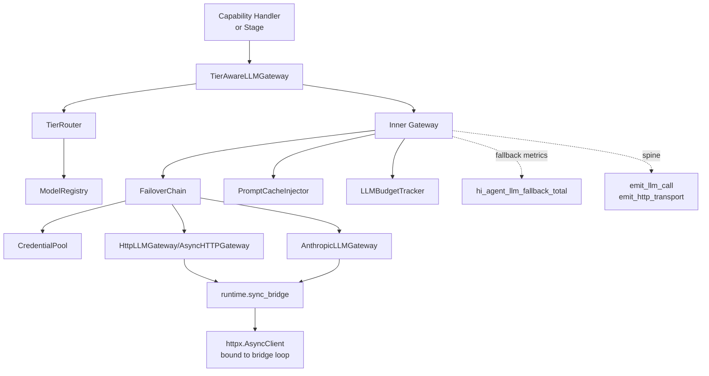

# LLM Architecture

## 1. Purpose & Position in System

`hi_agent/llm/` is the LLM access layer. **All real-LLM traffic in hi_agent flows through this package** — gateways, tier router, failover chain, prompt cache, budget tracker. Outside of test paths, no other module in `hi_agent` constructs raw `httpx.AsyncClient` or hand-rolls model RPC. Mock mode (`hi_agent/llm/mock_provider.py`) exists for tests; the Rule 8 operator-shape gate refuses delivery if mock gateways appear in the live shape.

The package owns:
1. **Provider-decoupled gateways**: `HttpLLMGateway` (sync/urllib for OpenAI-compatible), `AsyncHTTPGateway` (httpx async), `AnthropicLLMGateway` (Anthropic-specific endpoint quirks: `/v1/messages`, `x-api-key`, thinking blocks).
2. **Routing**: `TierRouter` mapping purpose × complexity × budget × skill confidence → `strong`/`medium`/`light` tier; `ModelRouter` for label-based selection; `ModelSelector` returning explicit `SelectionResult`.
3. **Failover**: `FailoverChain` over a `CredentialPool`; HTTP-error-aware classification (`auth`, `auth_permanent`, `billing`, `rate_limit`, `overloaded`, `server_error`, `timeout`, `context_overflow`, `model_not_found`).
4. **Caching**: `PromptCacheInjector` with `PromptCacheConfig`, `PromptCacheStats`, `CacheAwareTokenUsage` for Anthropic prompt caching; `parse_cache_usage` for Bedrock-shape responses.
5. **Streaming**: `AsyncStreamingLLMGateway`, `HTTPStreamingGateway`, `SseParser`, `StreamDelta`.
6. **Budget**: `LLMBudgetTracker` (call count + token cap) raising `LLMBudgetExhaustedError`.
7. **Registry**: `ModelRegistry` + `RegisteredModel` for tier metadata, cost-per-mtok, capabilities, posture availability.

It does **not** own: capability invocation (delegated to `hi_agent/capability/`), action governance (delegated to `hi_agent/runtime/harness/`), or persisted run state (delegated to `hi_agent/server/`).

## 2. External Interfaces

**Core types** (`hi_agent/llm/protocol.py`):
- `LLMRequest(messages, model="default", temperature=0.7, max_tokens=4096, stop_sequences, metadata, thinking_budget)` (line 24)
- `LLMResponse(content, model, usage, finish_reason="stop", thinking="", raw)` (line 56)
- `LLMStreamChunk(delta, thinking_delta, finish_reason, usage, model)` (line 81)
- `TokenUsage(prompt_tokens, completion_tokens, total_tokens)` (line 13)
- `LLMGateway` Protocol: `complete(request) -> LLMResponse`
- `AsyncLLMGateway` Protocol: `async complete(request) -> LLMResponse`

**Gateways** (`__init__.py:43-88` `__all__`):
- `HttpLLMGateway(base_url, api_key_env, default_model, timeout_seconds, max_retries, retry_base_seconds, failover_chain, cache_injector, budget_tracker, runtime_mode)` (`http_gateway.py:34`)
- `AsyncHTTPGateway(base_url, api_key_env, …)` (`async_http_gateway.py:21`)
- `AnthropicLLMGateway(api_key_env, default_model, …)` (`anthropic_gateway.py`)
- Streaming: `AsyncStreamingLLMGateway`, `HTTPStreamingGateway` (`streaming.py`)
- `TierAwareLLMGateway` — wraps any gateway with tier-aware model selection (`tier_router.py`)

**Routing**:
- `TierRouter(registry)` (`tier_router.py:50`) — `set_tier(purpose, tier)`, `_resolve_tier(...)`, `record_quality(tier, score)` for calibration
- `TierMapping(purpose, default_tier, allow_upgrade, allow_downgrade)` (`tier_router.py:41`)
- `ModelRouter`, `ModelSelector(registry)`, `SelectionResult` (`router.py`, `model_selector.py`)

**Failover**:
- `FailoverChain(pool, retry_policy, classifier)` (`failover.py`)
- `CredentialPool(entries)` (`failover.py`); `CredentialEntry(api_key_env, base_url, model_id, …)`
- `make_credential_pool_from_env()` — reads `HI_AGENT_LLM_CREDENTIALS_*`
- `RetryPolicy(max_retries, base_delay, jitter)`; `classify_http_error(exc)` returns `FailoverReason`
- `FailoverError(reason, message, status_code, provider, retry_after_seconds)` (`failover.py:70`)

**Budget**: `LLMBudgetTracker(max_calls, max_tokens)` (`budget_tracker.py:11`); `LLMBudgetExhaustedError`.

**Cache**: `PromptCacheConfig(cache_control_blocks, ttl_seconds)`; `PromptCacheInjector(config)`; `PromptCacheStats(cache_hits, cache_writes, cache_reads_tokens)`; `parse_cache_usage(usage_dict)`.

**Errors**: `LLMError`, `LLMProviderError`, `LLMTimeoutError`, `LLMBudgetExhaustedError` (`errors.py`).

**Registry**: `ModelRegistry()` (`registry.py:49`); `RegisteredModel(model_id, provider, tier, cost_input_per_mtok, cost_output_per_mtok, context_window, capabilities, …)` (`registry.py:25`); `ModelTier` constants `STRONG`/`MEDIUM`/`LIGHT`.

## 3. Internal Components



| Component | File | Responsibility |
|---|---|---|
| `HttpLLMGateway` | `http_gateway.py:34` | OpenAI-compatible HTTP gateway (sync); urllib + httpx for streaming. |
| `AsyncHTTPGateway` | `async_http_gateway.py:21` | Async wrapper over httpx with shared event loop semantics. |
| `AnthropicLLMGateway` | `anthropic_gateway.py` | Anthropic-specific (`/v1/messages`, `x-api-key`, thinking blocks, multimodal). |
| `TierRouter` | `tier_router.py:50` | Resolves tier from purpose × complexity × budget × confidence; maintains rolling quality EMA per tier. |
| `TierAwareLLMGateway` | `tier_router.py` | Wraps a base gateway with tier-aware selection. |
| `ModelRegistry` | `registry.py:49` | `RegisteredModel` map; `cheapest_in_tier`, `list_by_capability`. |
| `FailoverChain` | `failover.py` | Tries each `CredentialEntry` in pool; classifies error; rotates / backs off / fails permanently. |
| `LLMBudgetTracker` | `budget_tracker.py:11` | Locked counters; raises `LLMBudgetExhaustedError` when limits hit. |
| `PromptCacheInjector` | `cache.py` | Injects `cache_control` blocks; tracks hit/miss stats. |
| `AsyncStreamingLLMGateway` | `streaming.py` | SSE stream over httpx; emits `StreamDelta` per chunk. |
| `MockProvider` | `mock_provider.py` | Test-only deterministic gateway; rejected by the Rule 8 gate. |

## 4. Data Flow

```mermaid
sequenceDiagram
    participant Stage as RunExecutor / Stage
    participant TG as TierAwareLLMGateway
    participant TR as TierRouter
    participant FC as FailoverChain
    participant HG as HttpLLMGateway
    participant SB as SyncBridge
    participant Provider as Provider HTTPS

    Stage->>+TG: complete(LLMRequest)
    TG->>+TR: resolve_model(purpose, complexity, budget)
    TR-->>-TG: model_id (e.g. claude-opus-4)
    TG->>+FC: complete(LLMRequest{model: resolved})
    loop for each credential in pool
        FC->>+HG: complete(LLMRequest, credential)
        HG->>HG: cache_injector.inject(messages)
        HG->>HG: budget_tracker.check
        HG->>+SB: call_sync(_async_post(...))
        SB->>+Provider: POST /v1/chat/completions or /v1/messages
        alt 200 OK
            Provider-->>-SB: response
            SB-->>-HG: dict
            HG->>HG: parse_cache_usage; budget_tracker.record
            HG-->>FC: LLMResponse
            FC-->>-TG: LLMResponse
            TG-->>Stage: LLMResponse
        else 4xx/5xx
            Provider-->>SB: HTTPStatusError
            SB-->>HG: raise
            HG-->>FC: LLMProviderError
            FC->>FC: classify_http_error → FailoverReason
            alt retryable (rate_limit/overloaded/server_error/timeout)
                Note over FC: backoff and rotate credential
            else permanent (auth_permanent/billing/context_overflow)
                FC->>FC: mark credential disabled
                Note over FC: emit fallback event
                FC-->>TG: FailoverError
                TG->>TG: record_fallback("llm", reason, run_id)
                TG-->>Stage: FailoverError
            end
        end
    end
```

The `metadata` field on `LLMRequest` carries `run_id`, `stage_id`, `purpose`, `budget_remaining`, `complexity` — read by the tier router and by `record_fallback` calls to attribute events to the right run.

## 5. State & Persistence

| State | Location | Lifetime |
|---|---|---|
| `ModelRegistry._models` | In-memory dict | Process; populated at startup by `register_default_models` and by gateway `register` calls |
| `TierRouter._tier_map` | In-memory dict | Process |
| `TierRouter._calibration_log`, `_calibration_stats` | In-memory; rolling window | Process; sliding 10-sample EMA |
| `LLMBudgetTracker._total_calls`, `_total_tokens` | Locked ints | Per-tracker instance (typically per-run) |
| `CredentialPool._entries`, `_disabled` | In-memory | Process |
| `PromptCacheStats` | In-memory | Process or per-call (caller's choice) |
| HTTP connection pool | `httpx.AsyncClient` | Bound to the `SyncBridge` event loop for life of the bridge thread |

No SQLite or filesystem state inside `hi_agent/llm/` itself. Credentials come from environment variables read at gateway construction.

## 6. Concurrency & Lifecycle

**Async-native, sync-bridged.** The async gateways (`AsyncHTTPGateway`, `AsyncStreamingLLMGateway`) own `httpx.AsyncClient` instances whose lifetime is bound to **one** event loop. The sync gateways (`HttpLLMGateway`) route through `runtime.sync_bridge.get_bridge()` so the underlying client lives on the bridge's persistent loop:

```python
# http_gateway.py imports get_bridge and calls bridge.call_sync(_async_post(...))
from hi_agent.runtime.sync_bridge import get_bridge
```

This is the canonical Rule 5 fix for the 04-22 prod incident: every `httpx.AsyncClient` is constructed on the bridge loop, every call uses the same loop, and the connection pool is reused across calls.

**Locks**: `LLMBudgetTracker` (`threading.Lock`), `TierRouter` (`threading.Lock`), `ModelRegistry` (no lock — assumed register-once-at-startup).

**Shutdown**: gateways do not own teardown; the bridge's `atexit` handler closes the loop and any pending tasks.

**Streaming**: `AsyncStreamingLLMGateway.stream(request)` returns an `AsyncIterator[StreamDelta]`. The caller must drive the iterator on the same loop that owns the gateway — typically the bridge.

## 7. Error Handling & Observability

**Rule 7 instrumentation** (Resilience Must Not Mask Signals):

1. **Countable**: `hi_agent_llm_fallback_total` counter incremented on every fallback path; per-mode counters `hi_agent_llm_fallback_total{kind="llm",reason="..."}`. Other counters: `hi_agent_http_gateway_errors_total` (`http_gateway.py:24`), `hi_agent_llm_budget_exhausted_total`, `event_bus_publish_errors_total`, `fallback_recording_errors_total` (`observability/fallback.py:74`).
2. **Attributable**: every fallback emits `WARNING+` log with `run_id`, `kind`, `reason`, `extra={model, provider}`.
3. **Inspectable**: `record_fallback("llm", reason, run_id, extra)` appends a dict to the run's `fallback_events` list; surfaced on `RunResult.fallback_events` and on `GET /runs/{id}` JSON.
4. **Gate-asserted**: Rule 8's operator-shape gate asserts `llm_fallback_count == 0`. `scripts/run_t3_gate.py` (the T3 / Rule 15 gate) requires three sequential real-LLM runs each with zero fallbacks.

**Spine emitters**: `emit_llm_call(tenant_id, profile_id)` (in `observability/spine_events.py`) is fired before every gateway HTTP send; `emit_http_transport` is fired by the underlying transport layer.

**FailoverError taxonomy** (`failover.py:40`):
- `auth` / `auth_permanent` / `billing` — credential-level failure
- `rate_limit` / `overloaded` / `server_error` — retryable transient
- `timeout` — network-level retryable
- `context_overflow` / `model_not_found` — request-level permanent
- `unknown` — catch-all (still recorded; flagged for taxonomy expansion)

**Budget exhaustion** raises `LLMBudgetExhaustedError` synchronously; never a fallback.

## 8. Security Boundary

- **Credentials are environment-only**: gateways read `api_key_env`, never accept raw API keys in constructor args (constructor parameter is the env var name).
- **CredentialPool rotation** is process-internal — no credential is persisted to disk or shared across tenants.
- **No tenant_id on `LLMRequest`** — the spine flows via `metadata["run_id"]`. Tenant scoping is enforced upstream (in route handlers / `RunExecutionContext`).
- **`scope: process-internal`** annotations on `RegisteredModel`, `LLMRequest`, `LLMResponse`, `LLMStreamChunk`, `TokenUsage`, `TierMapping` (`registry.py:23`, `protocol.py:11/22/53/78`, `tier_router.py:39`) — these are platform-level metadata applying equally to every tenant.
- **`runtime_mode`** kwarg on gateways (`http_gateway.py:60`) gates real-LLM activation; mock mode disqualifies the operator-shape gate.

## 9. Extension Points

- **New provider**: implement `LLMGateway` Protocol (`complete(request) -> LLMResponse`); register in `ModelRegistry`; add to `CredentialPool` via env vars.
- **New tier**: extend `ModelTier` constants; add `TierMapping`s for purposes; register matching `RegisteredModel` rows.
- **Custom failover classifier**: pass `classifier=` kwarg to `FailoverChain`; must return `FailoverReason`.
- **Custom cache strategy**: subclass `PromptCacheInjector`; pass to gateway constructor.
- **Streaming-only model**: implement `AsyncStreamingLLMGateway` Protocol (yields `StreamDelta`).
- **Pre-request hook (e.g. PII redaction)**: wrap a base gateway with a decorator class; mutate `LLMRequest.messages` before `complete()`.

## 10. Constraints & Trade-offs

- **One `httpx.AsyncClient` per gateway, one loop per process**: Rule 5 enforced. A second `asyncio.run` will fail with `Event loop is closed` after the first call. This is by design — adding multi-loop support would require connection-pool federation that the workload does not need.
- **`TierRouter` calibration is rolling EMA, not multi-armed bandit**: `_QUALITY_UPGRADE_THRESHOLD=0.60`, `_QUALITY_DOWNGRADE_THRESHOLD=0.88`. Acceptable for routing simple/moderate/complex tasks; insufficient for fine-grained model selection. Future work tracked under skill_confidence + per-task feedback.
- **`FailoverChain` is sequential, not parallel**: each credential is tried in order. Total wait time is bounded but worst-case = sum of all credential timeouts.
- **No on-disk credential cache**: every gateway re-reads env on construction; rotation requires restart.
- **No retry on streaming**: a stream that fails mid-flight returns the partial output and a `FailoverError`; the caller must restart the request explicitly.
- **Mock provider exists but is rejected by Rule 8 gate**: tests use `mock_provider`; production deployment must use a real-LLM gateway. CI's offline default profile (`tests/profiles.toml::default-offline`) forbids real network calls; the operator-shape gate (`scripts/run_t3_gate.py`) requires real calls.

## 11. References

- `hi_agent/llm/__init__.py` — `__all__` of public surface
- `hi_agent/llm/protocol.py` — `LLMRequest`, `LLMResponse`, `LLMGateway` Protocol
- `hi_agent/llm/http_gateway.py`, `async_http_gateway.py`, `anthropic_gateway.py` — gateways
- `hi_agent/llm/streaming.py` — streaming gateways
- `hi_agent/llm/tier_router.py` — `TierRouter`, `TierAwareLLMGateway`
- `hi_agent/llm/registry.py` — `ModelRegistry`, `RegisteredModel`
- `hi_agent/llm/failover.py` — `FailoverChain`, `CredentialPool`, `FailoverReason`
- `hi_agent/llm/budget_tracker.py` — `LLMBudgetTracker`
- `hi_agent/llm/cache.py` — `PromptCacheInjector`
- `hi_agent/llm/errors.py` — typed errors
- `hi_agent/runtime/sync_bridge.py` — Rule 5 event-loop bridge
- `hi_agent/observability/fallback.py` — `record_fallback`, fallback taxonomy
- `hi_agent/observability/spine_events.py` — `emit_llm_call`, `emit_http_transport`
- CLAUDE.md Rule 5 (Async/Sync Lifetime), Rule 7 (Resilience Must Not Mask), Rule 8 (Operator-Shape Gate)
- `scripts/run_t3_gate.py`, `scripts/rule15_volces_gate.py` — T3 / live-LLM gates
- `docs/delivery/<date>-<sha>.md` — gate run records
