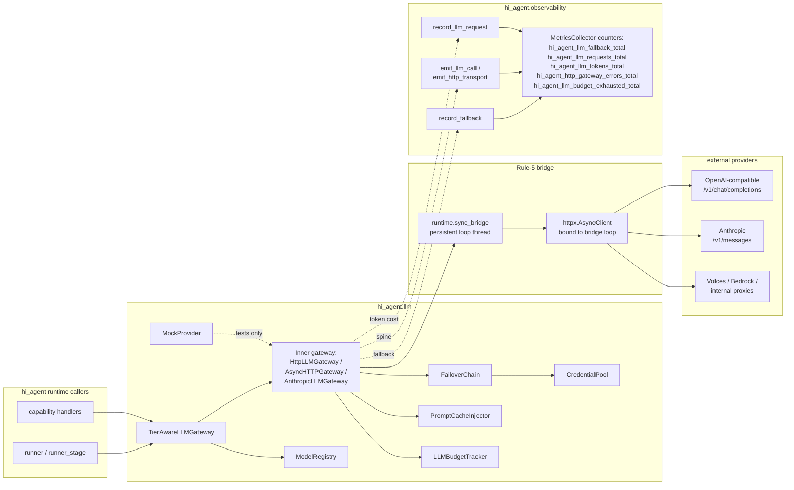
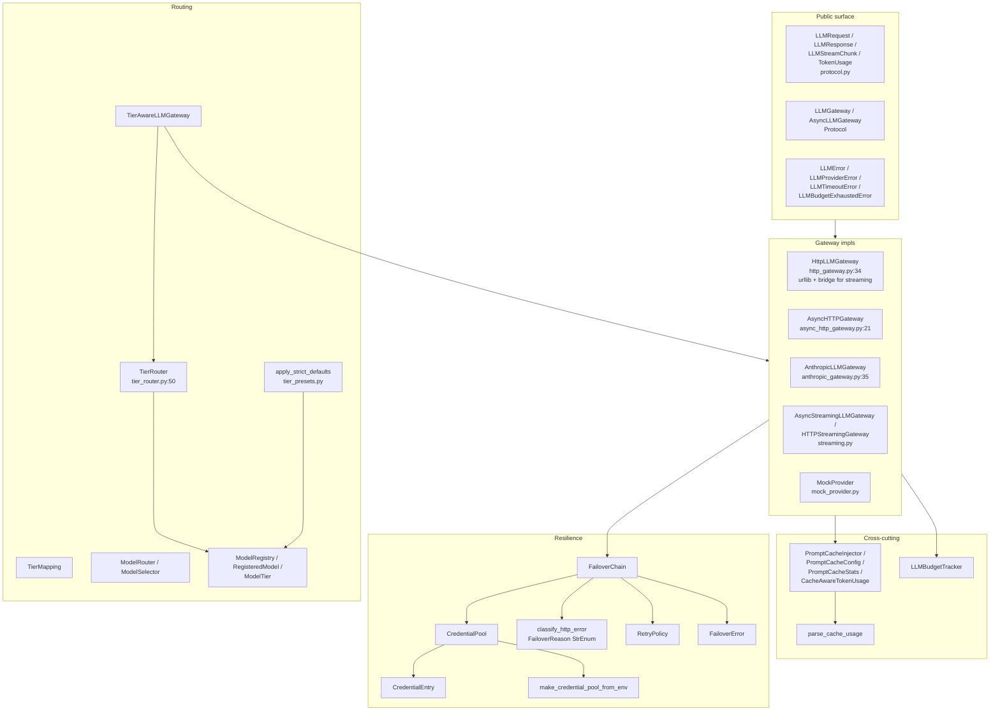

# LLM Gateway — Architecture

> **Last refreshed:** 2026-05-06 (W35 corrective close + W36 plans). HEAD `276917d8`.
> **Audience:** platform engineers + observability operators.
> **Status:** authoritative.

## 1. Purpose & Responsibilities

`hi_agent/llm/` is the LLM access layer. **All real-LLM traffic in hi_agent flows through this package** — gateways, tier router, failover chain, prompt cache, budget tracker. Outside test paths, no other module in `hi_agent` constructs raw `httpx.AsyncClient` or hand-rolls model RPC. Mock mode (`hi_agent/llm/mock_provider.py`) exists for tests; the Rule 8 operator-shape gate refuses delivery if mock gateways appear in the live shape.

The package owns:

1. **Provider-decoupled gateways**: `HttpLLMGateway` (sync via stdlib `urllib`, OpenAI-compatible), `AsyncHTTPGateway` (httpx async wrapper for `api_key_env` parity), `AnthropicLLMGateway` (Anthropic-specific endpoint quirks: `/v1/messages`, `x-api-key`, thinking blocks, multimodal content blocks).
2. **Routing**: `TierRouter` mapping purpose × complexity × budget × skill confidence → `strong`/`medium`/`light` tier; `ModelRouter` for label-based selection; `ModelSelector` returning explicit `SelectionResult`.
3. **Failover**: `FailoverChain` over a `CredentialPool`; HTTP-error-aware classification (`auth`, `auth_permanent`, `billing`, `rate_limit`, `overloaded`, `server_error`, `timeout`, `context_overflow`, `model_not_found`, `unknown`).
4. **Caching**: `PromptCacheInjector` with `PromptCacheConfig`, `PromptCacheStats`, `CacheAwareTokenUsage` for Anthropic prompt caching; `parse_cache_usage` for Bedrock-shape responses.
5. **Streaming**: `AsyncStreamingLLMGateway`, `HTTPStreamingGateway`, `SseParser`, `StreamDelta`, `StreamDeltaType`.
6. **Budget**: `LLMBudgetTracker` (call count + token cap) raising `LLMBudgetExhaustedError`.
7. **Registry**: `ModelRegistry` + `RegisteredModel` for tier metadata, cost-per-mtok, capabilities, posture availability.

It does **not** own: capability invocation (delegated to `hi_agent/capability/`), action governance (delegated to `hi_agent/runtime/harness/`), or persisted run state (delegated to `hi_agent/server/`).

## 2. Context & Scope

```mermaid
flowchart LR
    subgraph Caller["hi_agent runtime callers"]
        Runner[runner / runner_stage]
        Cap[capability handlers]
    end

    subgraph LLM["hi_agent.llm"]
        TG[TierAwareLLMGateway]
        Inner[Inner gateway:<br/>HttpLLMGateway /<br/>AsyncHTTPGateway /<br/>AnthropicLLMGateway]
        FC[FailoverChain]
        Pool[CredentialPool]
        PC[PromptCacheInjector]
        BT[LLMBudgetTracker]
        Reg[ModelRegistry]
        Mock[MockProvider]
    end

    subgraph Bridge["Rule-5 bridge"]
        SB[runtime.sync_bridge<br/>persistent loop thread]
        Httpx[httpx.AsyncClient<br/>bound to bridge loop]
    end

    subgraph Provider["external providers"]
        OAI[OpenAI-compatible<br/>/v1/chat/completions]
        Ant[Anthropic<br/>/v1/messages]
        Vol[Volces / Bedrock /<br/>internal proxies]
    end

    subgraph Obs["hi_agent.observability"]
        FB[record_fallback]
        Spine[emit_llm_call /<br/>emit_http_transport]
        Tok[record_llm_request]
        Counter["MetricsCollector counters:<br/>hi_agent_llm_fallback_total<br/>hi_agent_llm_requests_total<br/>hi_agent_llm_tokens_total<br/>hi_agent_http_gateway_errors_total<br/>hi_agent_llm_budget_exhausted_total"]
    end

    Runner --> TG
    Cap --> TG
    TG --> Inner
    Inner --> FC
    FC --> Pool
    Inner --> PC
    Inner --> BT
    TG --> Reg

    Inner --> SB
    SB --> Httpx
    Httpx --> OAI
    Httpx --> Ant
    Httpx --> Vol

    Inner -.fallback.-> FB
    Inner -.spine.-> Spine
    Inner -.token cost.-> Tok
    FB --> Counter
    Spine --> Counter
    Tok --> Counter

    Mock -.tests only.-> Inner
```

Boundaries:

- **Inbound**: `gateway.complete(LLMRequest)` and `streaming.stream(LLMRequest)` (the only two public entry points).
- **Outbound**: HTTPS to provider; counter / log / fallback emissions to `hi_agent.observability`.
- **Out of scope**: capability semantics (what to ask the model), action governance (what to do with the response), persistence of conversation state.

`HI_AGENT_LLM_MODE=real` selects the real-provider path; the default-offline test profile (`tests/profiles.toml::default-offline`) forbids real network calls and uses the mock provider. The Rule 8 operator-shape gate enforces the inverse: mock gateways are rejected for production delivery.

## 3. Module Boundary & Dependencies

| External dep | Used by | Why |
|---|---|---|
| `httpx` | `http_gateway.py`, `async_http_gateway.py`, `anthropic_gateway.py`, `streaming.py` | async HTTP + SSE streaming; only HTTP library used. |
| stdlib `urllib.request` | `http_gateway.py`, `anthropic_gateway.py` (non-streaming sync path) | the sync legacy path uses urllib so a no-loop caller still works. |
| `hi_agent.runtime.sync_bridge` | `http_gateway.py:22` | Rule-5 bridge — sync gateway dispatches its `httpx.AsyncClient` calls through `get_bridge()` so all clients live on **one** event loop. |
| `hi_agent.observability.fallback` | every gateway | Rule-7 four-prong recorder + `record_llm_request` + `event_bus_publish_errors_total` / `fallback_recording_errors_total`. |
| `hi_agent.observability.spine_events` | every gateway | `emit_llm_call`, `emit_http_transport` for spine completeness. |
| `hi_agent.observability.metric_counter` | `http_gateway.py:21` | `hi_agent_http_gateway_errors_total` counter. |

What this package may **not** import:

- `hi_agent.runtime.harness` — would create a cycle (the harness invokes us).
- `hi_agent.server` — runtime-side; we are agnostic of the server's lifecycle.
- `agent_kernel.*` — kernel boundary is `runtime_adapter`'s responsibility.
- Any provider SDK (`openai`, `anthropic`, `cohere`, …) — hand-rolled HTTP keeps the dep graph small and lets us test against any OpenAI-compatible endpoint.

What may import this package: `hi_agent.runner`, `hi_agent.capability.*`, `hi_agent.runtime.harness.*`, `hi_agent.config.cognition_builder` (which constructs the gateway).

## 4. Building Blocks

```mermaid
flowchart TB
    subgraph Public["Public surface"]
        Proto[LLMRequest / LLMResponse /<br/>LLMStreamChunk / TokenUsage<br/>protocol.py]
        GP[LLMGateway / AsyncLLMGateway<br/>Protocol]
        Errs[LLMError / LLMProviderError /<br/>LLMTimeoutError /<br/>LLMBudgetExhaustedError]
    end

    subgraph Gateways["Gateway impls"]
        HG[HttpLLMGateway<br/>http_gateway.py:34<br/>urllib + bridge for streaming]
        AG[AsyncHTTPGateway<br/>async_http_gateway.py:21]
        ANG[AnthropicLLMGateway<br/>anthropic_gateway.py:35]
        SG[AsyncStreamingLLMGateway /<br/>HTTPStreamingGateway<br/>streaming.py]
        Mock[MockProvider<br/>mock_provider.py]
    end

    subgraph Routing["Routing"]
        TG[TierAwareLLMGateway]
        TR[TierRouter<br/>tier_router.py:50]
        TM[TierMapping]
        MR[ModelRouter / ModelSelector]
        Reg[ModelRegistry / RegisteredModel /<br/>ModelTier]
        Presets[apply_strict_defaults<br/>tier_presets.py]
    end

    subgraph Resilience["Resilience"]
        FC[FailoverChain]
        Pool[CredentialPool]
        Cred[CredentialEntry]
        Cls[classify_http_error<br/>FailoverReason StrEnum]
        RP[RetryPolicy]
        Env[make_credential_pool_from_env]
        FE[FailoverError]
    end

    subgraph Crosscut["Cross-cutting"]
        PC[PromptCacheInjector /<br/>PromptCacheConfig /<br/>PromptCacheStats /<br/>CacheAwareTokenUsage]
        Pcu[parse_cache_usage]
        BT[LLMBudgetTracker]
    end

    Public --> Gateways
    TG --> TR
    TR --> Reg
    TG --> Gateways
    Gateways --> FC
    FC --> Pool
    Pool --> Cred
    FC --> Cls
    FC --> RP
    Pool --> Env
    FC --> FE
    Gateways --> PC
    Gateways --> BT
    PC --> Pcu
    Presets --> Reg
```

| Component | File | Responsibility |
|---|---|---|
| `LLMRequest` / `LLMResponse` / `LLMStreamChunk` / `TokenUsage` | `protocol.py` | Frozen dataclasses; `# scope: process-internal` (no `tenant_id` — tenant flows via `metadata["run_id"]`). |
| `LLMGateway` / `AsyncLLMGateway` | `protocol.py` | Two-method Protocols (`complete` / async `complete`). |
| `HttpLLMGateway` | `http_gateway.py:34` | OpenAI-compatible sync gateway; urllib for non-streaming, httpx via bridge for streaming. Constructor reads `api_key_env`; `runtime_mode="prod-real"`/`"local-real"` triggers a deprecation warning toward `HTTPGateway` (httpx-async). Dev-smoke clamp at `http_gateway.py:92` only fires when the API key is absent. |
| `AsyncHTTPGateway` | `async_http_gateway.py:21` | Thin wrapper that takes `api_key_env` so `CognitionBuilder` can branch on `compat_sync_llm` without duplicating arg lists. Async retry uses `asyncio.sleep`. |
| `AnthropicLLMGateway` | `anthropic_gateway.py:35` | `/v1/messages` + `x-api-key` + thinking blocks + multimodal content. Sync `complete()` via urllib; `stream()` via httpx SSE. `_ANTHROPIC_API_VERSION = "2023-06-01"`. |
| `AsyncStreamingLLMGateway` / `HTTPStreamingGateway` / `SseParser` / `StreamDelta` | `streaming.py` | SSE stream over httpx; emits `StreamDelta` per chunk. |
| `MockProvider` | `mock_provider.py` | Test-only deterministic gateway; rejected by the Rule-8 operator-shape gate. |
| `TierRouter` | `tier_router.py:50` | Resolves tier from purpose × complexity × budget × confidence; rolling EMA per tier (`_QUALITY_UPGRADE_THRESHOLD=0.60`, `_QUALITY_DOWNGRADE_THRESHOLD=0.88`); `set_tier`, `_resolve_tier`, `record_quality(tier, score)`. |
| `TierAwareLLMGateway` | `tier_router.py` | Decorator that wraps a base gateway with tier-aware model selection. |
| `TierMapping` | `tier_router.py:41` | `(purpose, default_tier, allow_upgrade, allow_downgrade)`. |
| `ModelRouter` / `ModelSelector` / `SelectionResult` | `router.py`, `model_selector.py` | Label-based selection; explicit selection result with reason. |
| `ModelRegistry` / `RegisteredModel` / `ModelTier` | `registry.py:25/49` | `cheapest_in_tier`, `list_by_capability`. `ModelTier` constants `STRONG`/`MEDIUM`/`LIGHT`. |
| `apply_strict_defaults` | `tier_presets.py` | Posture-aware default registry population. |
| `FailoverChain` | `failover.py` | Tries each `CredentialEntry` in pool; classifies error; rotates / backs off / fails permanently. |
| `CredentialPool` / `CredentialEntry` / `make_credential_pool_from_env` | `failover.py` | `HI_AGENT_LLM_CREDENTIALS_*` env-var driven; rotation is process-internal, never persisted. |
| `RetryPolicy` / `classify_http_error` / `FailoverReason` (StrEnum) / `FailoverError` | `failover.py:41/71/82` | Typed reason enum; structured error with `status_code`, `provider`, `retry_after_seconds`. |
| `PromptCacheInjector` / `PromptCacheConfig` / `PromptCacheStats` / `CacheAwareTokenUsage` / `parse_cache_usage` | `cache.py` | Anthropic prompt cache `cache_control` block injection; per-call hit/miss stats. |
| `LLMBudgetTracker` / `LLMBudgetExhaustedError` | `budget_tracker.py:11` | Locked counters; raises on cap. |
| `LLMError` / `LLMProviderError` / `LLMTimeoutError` | `errors.py` | Typed errors. |

## 5. Runtime View — Key Scenarios

### 5.1 Single LLM call with retry-on-503 and fallback

```mermaid
sequenceDiagram
    participant Stage as RunExecutor / Stage
    participant TG as TierAwareLLMGateway
    participant TR as TierRouter
    participant FC as FailoverChain
    participant HG as HttpLLMGateway
    participant Bridge as runtime.sync_bridge
    participant Httpx as httpx.AsyncClient<br/>(on bridge loop)
    participant Provider as Provider HTTPS
    participant FB as observability.record_fallback
    participant Tok as observability.record_llm_request
    participant MC as MetricsCollector

    Stage->>+TG: complete(LLMRequest{<br/>messages, metadata={run_id, purpose, complexity}<br/>})
    TG->>+TR: resolve(purpose, complexity, budget)
    TR-->>-TG: model_id (e.g. claude-opus-4)
    TG->>+FC: complete(LLMRequest{model: resolved})
    Note over Tok: spine emit fires here too:<br/>emit_llm_call(tenant_id, profile_id)

    loop per credential in pool
        FC->>+HG: complete(req, credential)
        HG->>HG: cache_injector.inject(messages)
        HG->>HG: budget_tracker.check
        HG->>+Bridge: call_sync(_async_post(...))
        Bridge->>+Httpx: AsyncClient.post(...)
        Httpx->>+Provider: POST /v1/chat/completions or /v1/messages

        alt 200 OK
            Provider-->>-Httpx: response
            Httpx-->>-Bridge: dict
            Bridge-->>-HG: dict
            HG->>HG: parse_cache_usage; budget_tracker.record
            HG->>Tok: record_llm_request(provider, model, tier)
            Tok->>MC: hi_agent_llm_requests_total++
            HG-->>FC: LLMResponse
            FC-->>-TG: LLMResponse
            TG-->>-Stage: LLMResponse
        else 503 / 429 / 5xx
            Provider-->>Httpx: HTTPStatusError
            Httpx-->>Bridge: raise
            Bridge-->>HG: raise
            HG->>MC: hi_agent_http_gateway_errors_total++
            HG-->>FC: LLMProviderError
            FC->>FC: classify_http_error → rate_limit /<br/>overloaded / server_error / timeout
            Note over FC: respect Retry-After header;<br/>exponential backoff with jitter;<br/>rotate to next credential
        else 4xx permanent (auth_permanent / billing / context_overflow)
            FC->>FC: mark credential disabled
            FC->>FB: record_fallback("llm",<br/>reason=<FailoverReason>,<br/>run_id=metadata["run_id"],<br/>extra={model, provider})
            FB->>MC: hi_agent_llm_fallback_total++<br/>fallback_llm++
            FB-->>FC: ok
            FC-->>TG: FailoverError
            TG-->>Stage: FailoverError
        end
    end
```

The `metadata` field on `LLMRequest` carries `run_id`, `stage_id`, `purpose`, `budget_remaining`, `complexity` — read by the tier router and by `record_fallback` calls to attribute events to the right run.

`HI_AGENT_LLM_REAL_*` env vars and the `runtime_mode` constructor kwarg jointly control whether the real path is taken; both must agree for a release run. `runtime_mode="dev-smoke"` clamps timeout to 3 s and disables retries **only if no API key is present** — credential-present dev-smoke uses the caller's full timeout (`http_gateway.py:85-94`). This was the W34 fix for reasoning-model latency stalls.

## 6. Cross-cutting Concerns

### 6.1 Rule 5 — async resource lifetime (single bridge loop)

Every `httpx.AsyncClient` constructed in this package is bound to the **persistent event loop** owned by `hi_agent.runtime.sync_bridge`. Sync gateways forward through `bridge.call_sync(_async_post(...))`; async gateways are constructed on the bridge loop directly. Locks: `LLMBudgetTracker` (`threading.Lock`), `TierRouter` (`threading.Lock`), `ModelRegistry` (no lock — register-once-at-startup).

**Forbidden patterns (enforced by `scripts/check_rules.py`):**

- `asyncio.run(gateway.complete(...))` from a sync façade — would create a fresh loop per call, leaking connection pools.
- Constructing a gateway in `__init__` of a sync class, then calling its async path from a different loop later.
- Passing an `AsyncClient` built in loop A into a coroutine on loop B.

**Consequence**: a second `asyncio.run` on the same gateway will fail with `Event loop is closed` after the first call. This is by design — adding multi-loop support would require connection-pool federation that the workload does not need.

### 6.2 Rule 7 — every fallback path is observed

Every gateway fallback path, every credential rotation, every retry-exhausted exit emits through `hi_agent.observability.fallback.record_fallback`:

| Prong | Mechanism |
|---|---|
| Countable | `hi_agent_llm_fallback_total{reason, model}` + `fallback_llm{reason, model}`; auxiliary counters: `hi_agent_http_gateway_errors_total` (`http_gateway.py:24`), `hi_agent_llm_budget_exhausted_total`, `hi_agent_event_bus_publish_errors_total`, `hi_agent_fallback_recording_errors_total`. |
| Attributable | WARNING log carries `run_id`, `kind="llm"`, `reason=<FailoverReason>`, `extra={model, provider}`. |
| Inspectable | `record_fallback("llm", …, run_id=metadata["run_id"])` appends to per-run list; surfaced on `RunResult.fallback_events` and `GET /runs/{id}.fallback_events`. |
| Gate-asserted | Rule 8 operator-shape gate asserts `llm_fallback_count == 0`; `scripts/run_t3_gate.py` asserts the same for three sequential real-LLM runs. |

**Spine emitters**: `emit_llm_call(tenant_id, profile_id)` (in `observability/spine_events.py`) is fired before every gateway HTTP send; `emit_http_transport` is fired by the underlying transport layer.

`record_llm_request(provider=…, model=…, tier=…, run_id=…)` (`observability/fallback.py:212`) increments `hi_agent_llm_requests_total` on every successful outgoing request — this is the Rule-15 / T3 gate's per-run "saw-an-LLM-call" assertion.

### 6.3 T3 invariance

Any commit touching `hi_agent/llm/**` invalidates T3 evidence at HEAD until a fresh real-LLM gate run is recorded. T3 evidence files live under `docs/delivery/<date>-<sha>-rule15-volces.json`. A hot-path PR description must include either:

- `T3 evidence: docs/delivery/<date>-<sha>-rule15-volces.json`, or
- `T3 evidence: DEFERRED — <reason>`.

The hot-path file list (in CLAUDE.md Rule 8) names `hi_agent/llm/**` explicitly. T1 (unit) and T2 (integration) passing does **not** preserve T3.

### 6.4 Cardinality discipline

Counter labels are bounded: `provider`, `model`, `tier`, `reason`, `kind`. High-cardinality fields (`run_id`, `tenant_id`, `task_id`) are routed to logs via `extra={…}`. The legacy `hi_agent_llm_tokens_total` keeps a `tenant_bucket` mod-16 hash label for backwards compatibility; new metrics emitted from `hi_agent/llm/` use raw `tenant_id` per W35-corrective C-1. See `hi_agent/observability/ARCHITECTURE.md §6.2`.

### 6.5 Security boundary

- **Credentials are environment-only**: gateways read `api_key_env` (the env-var **name**), never accept raw API keys in constructor args.
- **CredentialPool rotation** is process-internal — no credential is persisted to disk or shared across tenants.
- **No tenant_id on `LLMRequest`** — the spine flows via `metadata["run_id"]`; tenant scoping is enforced upstream (in route handlers / `RunExecutionContext`).
- **`# scope: process-internal`** annotations on `RegisteredModel`, `LLMRequest`, `LLMResponse`, `LLMStreamChunk`, `TokenUsage`, `TierMapping` (`registry.py:23`, `protocol.py`, `tier_router.py:39`) — these are platform-level metadata applying equally to every tenant.
- **`runtime_mode`** kwarg gates real-LLM activation; mock mode disqualifies the operator-shape gate.

### 6.6 Mock-real divergence

`MockProvider` is deterministic and ignores latency, retries, and auth. The Rule-8 gate refuses delivery if a mock gateway appears in the live shape (`scripts/run_t3_gate.py` asserts every run emits ≥1 LLM request to a real provider per access log + metric). Tests that need realistic latency or failure injection use `mock_provider.MockProvider` with explicit `delay`/`error` params — but those paths never reach a release gate.

## 7. Architecture Decisions

### 7.1 ADR-LLM-1 — One gateway, one loop, one connection pool

Rule 5 forbids constructing an `httpx.AsyncClient` in a sync `__init__` and then calling `asyncio.run` per method. Every `hi_agent/llm/` gateway either runs natively async on the bridge loop, or routes its sync façade through `runtime.sync_bridge.get_bridge().call_sync(...)`. This was the canonical fix for the 2026-04-22 prod incident where every other request hit `Event loop is closed` after a fresh `asyncio.run` recreated the loop.

### 7.2 ADR-LLM-2 — Hand-rolled HTTP, no provider SDK

We import neither `openai` nor `anthropic`. Rationale:

- Both SDKs ship singletons that conflict with our credential-pool rotation.
- Both have transitive dependencies that conflict with `httpx==0.27.x` pinning elsewhere in `hi_agent`.
- The OpenAI-compatible `/v1/chat/completions` shape is the lingua franca for proxies (Volces, internal Bedrock, vLLM, etc.); a hand-rolled gateway works against any of them.

**Consequence**: per-provider quirks (`x-api-key` for Anthropic, thinking blocks, multimodal content blocks, Bedrock-shape cache usage) are encoded in this package rather than absorbed by an SDK. See `anthropic_gateway.py`, `cache.py::parse_cache_usage`.

### 7.3 ADR-LLM-3 — Failover is HTTP-error-aware, sequential, in-process

`FailoverChain` is sequential, not parallel — each credential is tried in order. Total wait time is bounded but worst-case is the sum of all credential timeouts. Rationale: simplicity, reproducible logs, no fan-out budget pressure. The trade-off is acceptable because pool size is typically ≤ 3.

`classify_http_error` (`failover.py`) returns a `FailoverReason` (StrEnum). Retryable: `rate_limit`, `overloaded`, `server_error`, `timeout`. Permanent (mark credential disabled): `auth_permanent`, `billing`, `context_overflow`, `model_not_found`. The `unknown` catch-all is recorded but flagged for taxonomy expansion.

### 7.4 ADR-LLM-4 — `TierRouter` calibration is rolling EMA

`_QUALITY_UPGRADE_THRESHOLD=0.60`, `_QUALITY_DOWNGRADE_THRESHOLD=0.88`. Sliding 10-sample window. Acceptable for routing simple/moderate/complex tasks; insufficient for fine-grained model selection. Future work tracked under skill_confidence + per-task feedback.

### 7.5 ADR-LLM-5 — Rule 7 hot-path closure on the gateway boundary

The two error counters in `observability/fallback.py:75-76` (`hi_agent_event_bus_publish_errors_total`, `hi_agent_fallback_recording_errors_total`) close two previously-silent failure modes inside the gateway. Without them, an EventBus.publish raise or a `record_fallback` raise would mask the original fallback reason. The counters fire from the gateway call site; this is the LLM-side half of the spine completeness gate.

### 7.6 ADR-LLM-6 — Mock provider exists but is rejected by Rule 8

Tests use `mock_provider`; production deployment must use a real-LLM gateway. CI's offline default profile (`tests/profiles.toml::default-offline`) forbids real network calls; the operator-shape gate (`scripts/run_t3_gate.py`) requires real calls. The two profiles must never overlap; a real-LLM call from a `default-offline` test is a Rule-16 violation.

## 8. Quality Attributes

| Attribute | Target | How achieved | Evidence |
|---|---|---|---|
| Cross-loop stability | 3 sequential real-LLM runs share one gateway / one client / one pool | bridge-bound `httpx.AsyncClient`; no per-call construction | Rule 8 step 4; `run_t3_gate.py` |
| Per-run "saw an LLM call" assertion | `hi_agent_llm_requests_total` increments ≥1 per run | `record_llm_request` from gateway success path | `run_t3_gate.py` access-log + metric assert |
| Fallback observability | every fallback path has Countable + Attributable + Inspectable + Gate-asserted | Rule-7 four-prong; `record_fallback` + counters + run-list + Rule-8 gate | `check_rule7_observability.py` |
| Latency budget | `done` reached in ≤ `2 × observed_p95` for real-LLM runs | failover backoff bounded; budget tracker fail-fast on cap | Rule 8 step 3 |
| Credential rotation latency | failed credential disabled within one classification cycle | `FailoverChain` marks `_disabled` per `auth_permanent`/`billing` | `tests/integration/test_failover.py` |
| Streaming reliability | partial output returned on stream interrupt; explicit caller restart | `AsyncStreamingLLMGateway.stream` closes, raises `FailoverError` | accepted limit; documented |
| Budget cap enforcement | cap reached → `LLMBudgetExhaustedError` raised synchronously | `LLMBudgetTracker` locked counters | `tests/unit/test_budget_tracker.py` |

## 9. Risks & Technical Debt

| Risk / debt | Severity | Tracking |
|---|---|---|
| **Provider-specific quirks accumulate**: each Anthropic API change (`/v1/messages` thinking blocks, multimodal content shape, prompt cache `cache_control` semantics) requires a code path here. With each new provider (Volces, Bedrock, internal proxies) the surface grows. | medium | adapter audit per release; `anthropic_gateway.py` and `cache.py::parse_cache_usage` are the high-touch files. |
| **Cross-loop client lifetime**: a regression that constructs `httpx.AsyncClient` outside the bridge — for example a new gateway author who copies an `__init__.py` example without reading Rule 5 — is silent until the first `asyncio.run` in a sync façade. CI catches it via `scripts/check_rules.py` but only if the new code lives under `hi_agent/`. | medium | Rule-5 audit gate; `# rule5-exempt` annotation reviewed on each PR. |
| **Mock-real divergence**: deterministic `MockProvider` ignores rate limits, retries, and provider-specific error shapes. A test passing in `default-offline` does not imply the real path passes. | medium | T3 gate in CI on hot-path PRs; daily real-LLM smoke (when key configured). |
| **Rolling EMA calibration is coarse**: `TierRouter` upgrades/downgrades on a 10-sample window. For short-lived runs (≤ 3 LLM calls) the calibration log never converges. | low | accepted; per-task feedback hook is the future direction. |
| **No on-disk credential cache**: every gateway re-reads env on construction; rotation requires restart. | low | acceptable; rotation procedure documented in `docs/operator/credential-rotation.md`. |
| **No retry on streaming interrupts**: a stream that fails mid-flight returns the partial output and a `FailoverError`; the caller must restart the request explicitly. | low | accepted; documented. |
| **Sync `HttpLLMGateway` deprecation backlog**: production profiles trigger a `DeprecationWarning` in favour of `HTTPGateway` (httpx-async), but several capability handlers still use the sync path. Migration tracked. | low | per-call-site migration; no hard cutover scheduled. |
| **`unknown` FailoverReason is a catch-all**: a new provider HTTP-error shape lands here silently. Each `unknown` should be re-classified to a typed reason within one wave. | low | grep `FailoverReason.unknown` counters per release. |

## 10. References

- `hi_agent/llm/__init__.py` — public surface
- `hi_agent/llm/protocol.py` — `LLMRequest`, `LLMResponse`, `LLMGateway` Protocol, `TokenUsage`
- `hi_agent/llm/http_gateway.py` — `HttpLLMGateway` (line 34); bridge import (line 22); dev-smoke clamp (line 85-94)
- `hi_agent/llm/async_http_gateway.py` — `AsyncHTTPGateway` (line 21)
- `hi_agent/llm/anthropic_gateway.py` — `AnthropicLLMGateway` (line 35); `_ANTHROPIC_API_VERSION` (line 32)
- `hi_agent/llm/streaming.py` — `AsyncStreamingLLMGateway`, `HTTPStreamingGateway`, `SseParser`, `StreamDelta`
- `hi_agent/llm/tier_router.py` — `TierRouter` (line 50), `TierMapping` (line 41), `TierAwareLLMGateway`
- `hi_agent/llm/registry.py` — `ModelRegistry` (line 49), `RegisteredModel` (line 25), `ModelTier`
- `hi_agent/llm/router.py` — `ModelRouter`
- `hi_agent/llm/model_selector.py` — `ModelSelector`, `SelectionResult`
- `hi_agent/llm/failover.py` — `FailoverChain`, `CredentialPool`, `FailoverReason` (line 41), `FailoverError` (line 71), `RetryPolicy`, `classify_http_error`
- `hi_agent/llm/budget_tracker.py` — `LLMBudgetTracker` (line 11)
- `hi_agent/llm/cache.py` — `PromptCacheInjector`, `PromptCacheConfig`, `PromptCacheStats`, `CacheAwareTokenUsage`, `parse_cache_usage`
- `hi_agent/llm/tier_presets.py` — `apply_strict_defaults`
- `hi_agent/llm/errors.py` — `LLMError`, `LLMProviderError`, `LLMTimeoutError`, `LLMBudgetExhaustedError`
- `hi_agent/llm/mock_provider.py` — test-only `MockProvider`
- `hi_agent/runtime/sync_bridge.py` — Rule-5 event-loop bridge
- `hi_agent/observability/fallback.py` — `record_fallback` (line 125), `record_llm_request` (line 212), `event_bus_publish_errors_total` (line 75), `fallback_recording_errors_total` (line 76)
- `hi_agent/observability/spine_events.py` — `emit_llm_call`, `emit_http_transport`
- CLAUDE.md Rule 5 (Async/Sync Lifetime), Rule 7 (Resilience Must Not Mask), Rule 8 (Operator-Shape Gate + T3 invariance)
- `scripts/run_t3_gate.py`, `scripts/rule15_volces_gate.py` — T3 / live-LLM gates
- `tests/profiles.toml::default-offline` / `live_api` / `prod_e2e` — Rule-16 profile boundaries
- `docs/delivery/<date>-<sha>-rule15-volces.json` — gate run records
