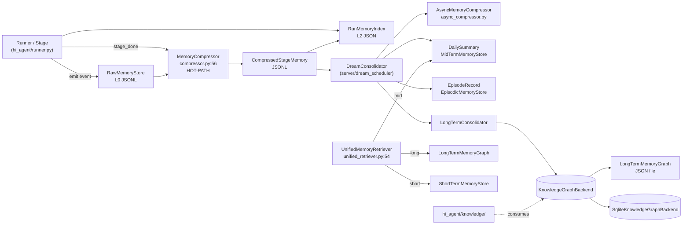
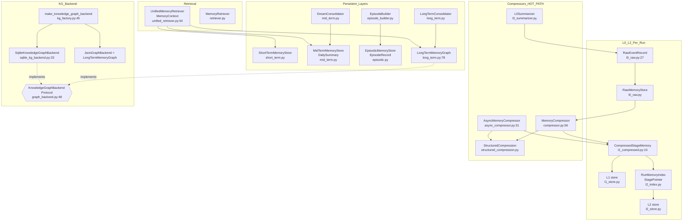
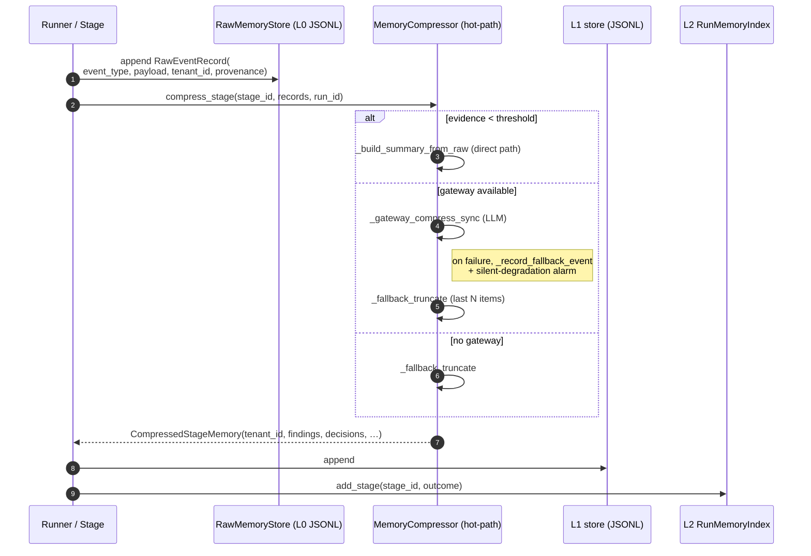
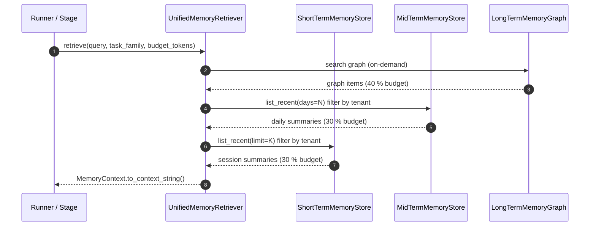

# Memory — Architecture

> **Last refreshed:** 2026-05-06 (W35 corrective close + W36 plans). HEAD `276917d8`.
> **Audience:** platform engineers + capability owners.
> **Status:** authoritative.

## 1. Purpose & Responsibilities

`hi_agent/memory/` owns the layered run-memory pipeline that converts raw runtime events into compressed stage summaries, run-level indexes, episodic records, and long-term knowledge-graph nodes. Where `hi_agent/knowledge/` owns the user-facing knowledge surface (wiki, retrieval), `hi_agent/memory/` owns the per-run / per-day / per-skill internal substrate that feeds it.

The package is layered:

| Layer | Granularity | Type | Lifetime |
|---|---|---|---|
| **L0 raw** | per-event | `RawEventRecord` (`l0_raw.py:27`) | per-run, JSONL |
| **L1 compressed** | per-stage | `CompressedStageMemory` (`l1_compressed.py:10`) | per-run, JSONL |
| **L2 indexed** | per-run | `RunMemoryIndex` + `StagePointer` (`l2_index.py:11, 19`) | per-run, JSON |
| **Mid-term** | daily aggregates | `DailySummary` (`mid_term.py:24`) | persistent |
| **Episodic** | per-run | `EpisodeRecord` (`episodic.py:13`) | persistent (cross-run) |
| **Long-term (KG)** | per-fact / per-entity | `MemoryNode` + `MemoryEdge` (`long_term.py:26, 56`) | persistent (graph) |

Concrete responsibilities:

1. Accept raw events, persist them at L0, and expose them to compressors.
2. Compress L0 → L1 stage summaries via `MemoryCompressor` (sync, hot path) and `AsyncMemoryCompressor` (async, dream/consolidate). Both are **hot-path** files under Rule 8.
3. Maintain the per-run `L2` index for navigation.
4. Build daily aggregates (`DreamConsolidator`, `MidTermMemoryStore`) and episodic records (`EpisodicMemoryStore`) for cross-run learning.
5. Provide `LongTermMemoryGraph` (the JSON KG implementation) and `SqliteKnowledgeGraphBackend` (the SQLite KG implementation), both satisfying the `KnowledgeGraphBackend` Protocol (`graph_backend.py:48`).
6. Expose `UnifiedMemoryRetriever` for budget-aware multi-tier loading (long → mid → short, `unified_retriever.py:54`).
7. Enforce Rule 12 contract spine: every persistent record carries `tenant_id` (and where applicable `run_id`, `session_id`, `project_id`); fail-closed under strict posture.

The package does **not** own:

- Knowledge ingest endpoints (delegated to `hi_agent/knowledge/`).
- Retrieval ranking / TF-IDF / BM25 (delegated to `hi_agent/knowledge/retrieval_engine.py`).
- The dream-consolidation scheduler (delegated to `hi_agent/server/dream_scheduler.py`).
- LLM gateway plumbing (delegated to `hi_agent/llm/`).

## 2. Context & Scope

**In scope:** all six layers (L0/L1/L2/mid/episodic/long-term), compressors, retrievers, KG backend Protocol + impls.

**Out of scope:** knowledge surface (wiki, structured user knowledge — see `hi_agent/knowledge/`); business memory (e.g. customer-CRM-style persistence — research-team scope under Rule 10).

## 3. Module Boundary & Dependencies

| Inbound (callers) | Reason |
|---|---|
| `hi_agent/runner.py`, `hi_agent/runner_stage.py` | Event emission + per-stage compression |
| `hi_agent/server/dream_scheduler.py` | Dream consolidation cycles |
| `hi_agent/knowledge/*` | Reads `LongTermMemoryGraph`, indexes short/mid summaries |
| `hi_agent/server/event_store.py` | L0 events also flow to event store (separate concerns) |

| Outbound (dependencies) | Reason |
|---|---|
| `hi_agent/llm/protocol.py` | `LLMGateway`, `LLMRequest` for compression |
| `hi_agent/contracts/provenance.py` | `Provenance` on `RawEventRecord` |
| `hi_agent/config/posture.py` | Strict-mode tenant enforcement |
| `hi_agent/observability/silent_degradation.py` | Compressor fallback alarms |
| `hi_agent/_sqlite_init.py` | `configure_sqlite_connection` (WAL + busy_timeout) |

**Not allowed:** importing `hi_agent/server/` from inside this package — memory is a leaf module.

## 4. Building Blocks

Key types and citations:

- `RawEventRecord` — `l0_raw.py:27`. Spine field `tenant_id` (`l0_raw.py:40`).
- `CompressedStageMemory` — `l1_compressed.py:10`. Spine field `tenant_id` (`l1_compressed.py:25`); fail-closed in `__post_init__` (`l1_compressed.py:27`).
- `RunMemoryIndex` / `StagePointer` — `l2_index.py:19, 11`. `StagePointer` is `# scope: process-internal`; `RunMemoryIndex` carries `tenant_id` spine.
- `MemoryCompressor(llm_fn, timeout_s, compress_threshold, fallback_items, gateway, max_findings, max_decisions, max_entities, max_tokens, compression_model)` — `compressor.py:56`. **Hot-path file under Rule 8**: any change invalidates T3.
- `AsyncMemoryCompressor(gateway, model, max_summary_tokens, compression_model)` — `async_compressor.py:31`. Wraps `StructuredCompressor` for richer summaries; falls back to string-concat on gateway failure.
- `MemoryNode` (`long_term.py:26`) and `MemoryEdge` (`long_term.py:56`) — fail-closed under strict posture if `tenant_id` empty.
- `LongTermMemoryGraph` (`long_term.py:78`) — JSON-file-backed graph; aliased as `JsonGraphBackend`.
- `make_knowledge_graph_backend(posture, data_dir, profile_id, project_id, tenant_id)` — `kg_factory.py:45`. Required `profile_id`. Decisions: dev → JSON, research/prod → SQLite. Override via `HI_AGENT_KG_BACKEND={json,sqlite}`; prod posture rejects `json`.
- `SqliteKnowledgeGraphBackend(data_dir, profile_id, project_id, tenant_id)` — `sqlite_kg_backend.py:33`. Pre-W31 unscoped rows auto-mapped to `__pre_w31_legacy__` bucket (`sqlite_kg_backend.py:30`).
- `UnifiedMemoryRetriever(short_term, mid_term, long_term, budget_tokens)` — `unified_retriever.py:54`. Budget allocation: long 40 % / mid 30 % / short 30 %.

## 5. Runtime View — Key Scenarios

### 5.1 Per-stage memory write during a turn

### 5.2 Retrieval at next turn

### 5.3 Posture-aware KG backend selection at boot

`kg_factory.make_knowledge_graph_backend(posture, data_dir, profile_id, project_id, tenant_id)` (`kg_factory.py:45`):

1. Reject empty `profile_id` (`ValueError` per Rule 6 / Rule 12).
2. Read `HI_AGENT_KG_BACKEND` override; if `json` under `prod` → `ValueError`; if `json` under `research` → warn + emit `hi_agent_kg_backend_override_total`.
3. Otherwise: `use_sqlite = posture.is_strict`.
4. Build the JSON file path or SQLite directory under `<data_dir>/L3/<profile_id>/<project_id?>` and return the backend.

## 6. Cross-cutting Concerns

| Concern | Mechanism |
|---|---|
| **Rule 8 — hot-path files** | `compressor.py` is hot-path. Any change to it invalidates T3 until a fresh gate run is recorded with a `T3 evidence: …` line in the PR. |
| **Rule 11 — posture-aware defaults** | `kg_factory` flips JSON → SQLite at the dev → research/prod boundary. Empty `profile_id` rejected (`kg_factory.py:72`). |
| **Rule 12 — contract spine** | `RawEventRecord.tenant_id`, `CompressedStageMemory.tenant_id`, `RunMemoryIndex.tenant_id`, `MemoryNode.tenant_id`, `MemoryEdge.tenant_id`, `EpisodeRecord.{tenant_id,user_id,session_id,project_id,run_id}` are all spine-required. All `__post_init__` methods raise under strict posture. |
| **Rule 7 — alarm signals** | `MemoryCompressor._record_fallback_event` emits a structured event whenever the LLM path fails; `record_silent_degradation` for compressor fallback in `async_compressor.py`; `hi_agent_kg_backend_override_total` for non-default KG selection. |
| **Per-tenant scoping on KG reads** | `SqliteKnowledgeGraphBackend` filters every query by `(profile_id, project_id, tenant_id)`. Pre-W31 unscoped rows auto-map to `__pre_w31_legacy__` bucket. |
| **Compression model pinning (DF-34)** | `MemoryCompressor.compression_model` and `AsyncMemoryCompressor.compression_model` let `SystemBuilder` pin a concrete coding-plan-served model so the compression call doesn't get rejected with `UnsupportedModel` from the light-tier router. |
| **WAL + busy_timeout on SQLite** | `_sqlite_init.configure_sqlite_connection` wraps every connection (D C-1). |

## 7. Architecture Decisions

### ADR-M-1: `compressor.py` is a Rule-8 hot-path file

`MemoryCompressor` runs synchronously inside the runner's stage loop and shapes the L1 record that downstream consolidation depends on. A change in its compression behaviour invalidates the operator-shape gate for the previous SHA. Hot-path files are listed in CLAUDE.md Rule 8 explicitly: `hi_agent/memory/compressor.py`. PR descriptions touching it must include a `T3 evidence: docs/delivery/<date>-<sha>-rule15-volces.json` line.

### ADR-M-2: Two compressor flavours, one contract

`MemoryCompressor` (sync) and `AsyncMemoryCompressor` (async with structured five-field summary) both produce `CompressedStageMemory`. Sync is the hot path; async is the dream/consolidate path. Sharing the contract means the L1 JSONL is layer-uniform regardless of which compressor wrote a row, which keeps retrieval simple and lets us swap implementations per posture if needed.

### ADR-M-3: KG Protocol + posture-aware factory

The `KnowledgeGraphBackend` Protocol (`graph_backend.py:48`) is satisfied by both `LongTermMemoryGraph` (JSON) and `SqliteKnowledgeGraphBackend`. The factory chooses by posture (Rule 11). Rationale: dev wants flat-file inspectability; research/prod wants durability. The Protocol means consumers (`hi_agent/knowledge/`) never branch on backend type.

### ADR-M-4: Pre-W31 SQLite rows preserved via `__pre_w31_legacy__`

When `SqliteKnowledgeGraphBackend` reads a row whose `tenant_id` is empty (a pre-W31 file), it auto-maps to the legacy bucket on construction (`sqlite_kg_backend.py:30`). New rows always populate `tenant_id`. Rationale: avoid breaking existing repos through a hard schema migration; the bucket is documented and to be retired after a clean-rebuild wave.

### ADR-M-5: Spine carried on every persistent record

`RawEventRecord`, `CompressedStageMemory`, `RunMemoryIndex`, `MemoryNode`, `MemoryEdge`, `EpisodeRecord`, `DailySummary`, `ShortTermMemory` all carry `tenant_id`. Process-internal value objects (`StagePointer`, `MemoryContext`, `CompressionResult`, `CompressionMetrics`) are explicitly marked `# scope: process-internal` and exempted from the spine gate. Rationale: a record that cannot answer "which tenant does this belong to" cannot enter the research/prod default path (Rule 12).

## 8. Quality Attributes

| Attribute | Target | Mechanism |
|---|---|---|
| Sync compression latency | <100ms below `compress_threshold` | Direct path skips LLM call entirely (`compressor.py:142`). |
| LLM compression timeout | Bounded by `timeout_s` (default 10s) | `asyncio.wait_for` in async path; `Future.result(timeout=…)` in sync path. |
| Cross-tenant isolation | Hard fail under strict posture | `__post_init__` raises in every spine-carrying dataclass. |
| Durability | Restart-survives under research/prod | SQLite with WAL; JSON files re-loaded on boot. |
| Memory growth (in-memory `LongTermMemoryGraph`) | Bounded per-profile | The graph is profile-scoped via `LongTermMemoryGraph(storage_path, profile_id, project_id)`; cross-tenant blending is rejected at construction under strict posture. |
| Auditability | Every fallback emits a metric + WARN | `MemoryCompressor.metrics.record("fallback", …)` and `_record_fallback_event` go through the silent-degradation channel. |

## 9. Risks & Technical Debt

| Risk | Severity | Mitigation / Plan |
|---|---|---|
| Memory store unbounded growth | Medium | Tier 2 / Tier 3 retention plan in `docs/governance/retention-roadmap.md`; episodic and L0/L1 JSONLs need per-day or per-run rotation (Tier 2 #14 covers SkillRegistry; analogous plans for memory tiers tracked in same doc). |
| Compression strategy drift across LLM provider changes | Medium | `compression_model` pinning (DF-34) avoids router-side rejections; `STAGE_COMPRESSION_PROMPT` change requires hot-path review; structured-compressor schema versioning in `structured_compression.py`. |
| Hot-path PR forgetting T3 evidence | High | Enforced at PR-description level in CLAUDE.md Rule 8; not yet a CI gate (DF-46 tracked as TODO). |
| Pre-W31 unscoped rows in legacy SQLite files | Low | Auto-mapped to `__pre_w31_legacy__` bucket; documented for migration window — to be retired after a clean rebuild wave. |
| `LongTermMemoryGraph` JSON file IO under high churn | Medium | Append + atomic-rename pattern; under research/prod the SQLite backend is the default to avoid this entirely. |
| Multiple compressors competing for the LLM | Low | Sync vs async run in distinct contexts (foreground stage vs dream scheduler); the gateway is the shared bottleneck and is rate-limited at its own layer. |

## 10. References

- Source: `hi_agent/memory/compressor.py` (Rule-8 hot-path), `hi_agent/memory/async_compressor.py`, `hi_agent/memory/long_term.py`, `hi_agent/memory/sqlite_kg_backend.py`, `hi_agent/memory/kg_factory.py`, `hi_agent/memory/graph_backend.py`, `hi_agent/memory/l0_raw.py`, `hi_agent/memory/l1_compressed.py`, `hi_agent/memory/l2_index.py`, `hi_agent/memory/short_term.py`, `hi_agent/memory/mid_term.py`, `hi_agent/memory/episodic.py`, `hi_agent/memory/unified_retriever.py`.
- Rules: `CLAUDE.md` Rule 6 (single construction path), Rule 7 (resilience signals), Rule 8 (operator-shape gate; **hot-path file: `compressor.py`**), Rule 11 (posture-aware defaults), Rule 12 (contract spine).
- Governance: `docs/governance/retention-roadmap.md` (memory tiers covered alongside skill registry).
- Sibling docs: `hi_agent/knowledge/ARCHITECTURE.md`, `hi_agent/skill/ARCHITECTURE.md`, `hi_agent/capability/ARCHITECTURE.md`.
