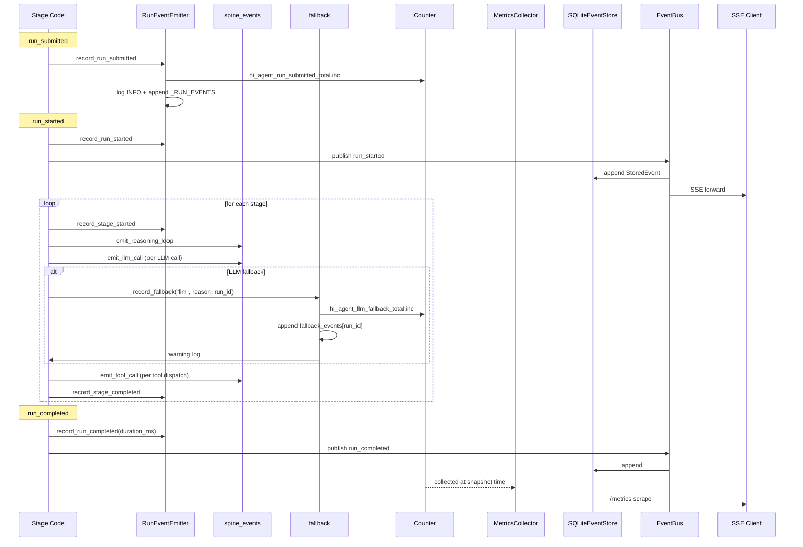

# Observability Architecture

## 1. Purpose & Position in System

`hi_agent/observability/` is the **cross-cutting spine** of hi_agent. Every other subsystem emits through it; no subsystem consumes from another directly. The package owns:
1. **12 typed run lifecycle events** (`RunEventEmitter`) with named Prometheus counters and structured per-run event lists.
2. **14 spine layers** (`spine_events`) for cross-subsystem observability — emitted at every layer boundary (LLM call, tool call, heartbeat renewed, run manager, sync bridge, http transport, etc.).
3. **Fallback recording** (Rule 7 four-prong contract): countable / attributable / inspectable / gate-asserted.
4. **Metrics aggregation** (`MetricsCollector`, `metric_counter`, `metrics`) with Prometheus exposition format.
5. **Trace context propagation** (`TraceContext`, `TraceContextManager`, `Tracer`, `SpanRecord`).
6. **Silent-degradation recording** for paths that legitimately swallow exceptions but must remain observable.
7. **Audit logging**, **log redaction**, **HTTP middleware**, **alert rules**, **trajectory export**.

The package contract is one-way: subsystems **emit**; observability **records and surfaces**. The persisted store for events is `SQLiteEventStore` in `hi_agent/server/event_store.py` (the observability emitters do not own the SQL schema). Prometheus exposition is served at `/metrics` (`hi_agent/server/app.py:406`).

It does **not** own: durable run state (delegated to `hi_agent/server/`), event consumption / SSE streaming (delegated to `hi_agent/server/sse_routes.py`), or alert delivery (delegated to `notification.py` backends).

## 2. External Interfaces

**12 typed lifecycle events** (`RunEventEmitter`, `event_emitter.py:87`):

| Method | Counter |
|---|---|
| `record_run_submitted()` | `hi_agent_run_submitted_total` |
| `record_run_started()` | `hi_agent_run_started_total` |
| `record_run_completed(duration_ms)` | `hi_agent_run_completed_total` |
| `record_run_failed(reason)` | `hi_agent_run_failed_total{reason}` |
| `record_run_cancelled(reason)` | `hi_agent_run_cancelled_total{reason}` |
| `record_run_resumed(from_stage)` | `hi_agent_run_resumed_total{from_stage}` |
| `record_stage_started(stage_id)` | `hi_agent_stage_started_total{stage}` |
| `record_stage_completed(stage_id, duration_ms)` | `hi_agent_stage_completed_total{stage}` |
| `record_stage_failed(stage_id, reason)` | `hi_agent_stage_failed_total{stage,reason}` |
| `record_artifact_created(artifact_type)` | `hi_agent_artifact_created_total{artifact_type}` |
| `record_experiment_posted(experiment_id)` | `hi_agent_experiment_posted_total` |
| `record_feedback_submitted()` | `hi_agent_feedback_submitted_total` |

`RUN_EVENT_METRIC_NAMES` (`event_emitter.py:49`) is the canonical frozenset asserted by the metrics-cardinality gate.

**14 spine emitters** (`spine_events.py` — `emit_*`):
- `emit_llm_call(tenant_id, profile_id)` — hot path: `HttpLLMGateway.complete`, `AsyncHTTPGateway.complete`, `HTTPStreamingGateway.stream`
- `emit_tool_call(tool_name, tenant_id, profile_id)` — `ActionDispatcher._execute_action_with_retry`
- `emit_heartbeat_renewed(tenant_id, run_id)` — `RunManager._heartbeat_loop`
- `emit_trace_id_propagated(trace_id, tenant_id)` — `TraceIdMiddleware`
- `emit_run_manager(tenant_id, run_id)`, `emit_tenant_context(tenant_id)`, `emit_reasoning_loop(...)`, `emit_capability_handler(...)`, `emit_sync_bridge(tenant_id)`, `emit_http_transport(...)`, `emit_artifact_ledger(...)`, `emit_event_store(...)` — added in W25-F to wire previously unobserved layers
- `emit_stage_skipped(run_id, stage_id, target, posture, reason, correlation_id)` (M.5)
- `emit_stage_inserted(run_id, anchor, new_stage, posture, reason, correlation_id)` (M.5)
- `emit_stage_replanned(run_id, action, from_stage, to_stage, posture, reason, correlation_id)` (M.5)

**Fallback recording** (`fallback.py`):
- `record_fallback(kind, reason, run_id, extra)` — `kind ∈ {llm, heuristic, capability, route}` (`fallback.py:61`)
- `get_fallback_events(run_id)` → `list[dict]`
- `clear_fallback_events(run_id)` (test isolation)
- `FallbackTaxonomy` StrEnum (legacy six-value)

**Metrics primitives**:
- `Counter(name, labels)` (`metric_counter.py`) — Prometheus-compatible counter with `.labels(...).inc()`
- `MetricsCollector` (`collector.py`) — process singleton; `snapshot()` → JSON; `to_prometheus_text()`
- `get_metrics_collector()`, `set_metrics_collector(collector)`
- `RunMetricsRecord(run_id, status, input_tokens, output_tokens, latency_ms)` (`metrics.py:10`)
- `aggregate_counters`, `avg_token_per_run`, `p95_latency`, `run_success_rate`

**Trace context**:
- `TraceContext` / `TraceContextManager` (`trace_context.py`) — propagated via ContextVar
- `Tracer`, `SpanRecord` (`tracing.py`)

**Other**:
- `Alert`, `AlertRule`, `default_alert_rules` (`collector.py`)
- `NotificationBackend`, `InMemoryNotificationBackend`, `format_webhook_payload`, `send_notification` (`notification.py`)
- `record_silent_degradation(component, reason, run_id, exc)` (`silent_degradation.py`)

## 3. Internal Components

```mermaid
graph TD
    Subsystems[hi_agent subsystems] --> SpineEmit[spine_events.emit_*]
    Subsystems --> RunEmit[RunEventEmitter.record_*]
    Subsystems --> Fallback[fallback.record_fallback]
    Subsystems --> Silent[silent_degradation.record_*]
    Subsystems --> TraceCtx[TraceContext via ContextVar]

    SpineEmit --> Counter[Counter labels.inc]
    RunEmit --> Counter
    Fallback --> Counter
    Silent --> Counter

    Counter --> MC[MetricsCollector singleton]
    MC --> PromText[/metrics Prometheus text/]
    MC --> JSON[/metrics/json/]

    RunEmit --> RunEvents[in-memory _RUN_EVENTS dict]
    Fallback --> RunFallback[in-memory fallback dict]

    Subsystems --> EventStore[(SQLiteEventStore<br/>in hi_agent.server)]
    EventStore --> SSE[/runs/{id}/events SSE/]

    TraceCtx --> StructLog[Structured log<br/>extra=trace_id]
    Subsystems --> StructLog

    AlertEng[AlertRule evaluator] --> MC
    AlertEng --> Notif[NotificationBackend]
```

| Component | File | Responsibility |
|---|---|---|
| `RunEventEmitter` | `event_emitter.py:87` | 12 typed `record_*` methods; counter + log + per-run list. |
| `spine_events.emit_*` | `spine_events.py` | 14 cross-subsystem layer probes; counter + DEBUG log. |
| `fallback.record_fallback` | `fallback.py` | Rule 7 four-prong recorder for degradation paths. |
| `MetricsCollector` | `collector.py` | Process-singleton aggregator; Prometheus + JSON exposition. |
| `Counter` | `metric_counter.py` | Cardinality-bounded counter with label support. |
| `TraceContextManager` | `trace_context.py` | ContextVar-backed trace propagation. |
| `Tracer`, `SpanRecord` | `tracing.py` | Span-level tracing primitive (in-memory by default). |
| `silent_degradation.record_silent_degradation` | `silent_degradation.py` | Records paths that legitimately swallow exceptions. |
| `Alert`, `AlertRule` | `collector.py` | Rule evaluator over MetricsCollector snapshot. |
| `NotificationBackend` | `notification.py` | Pluggable delivery for alert payloads. |
| `audit.py` | `audit.py` | Tenant-scoped access audit records. |
| `log_redaction.py` | `log_redaction.py` | Redacts PII / credentials from log records. |
| `http_middleware.py` | `http_middleware.py` | TraceIdMiddleware + access-log middleware. |
| `metric_counter.py` | `metric_counter.py` | Counter / Gauge / Histogram primitives. |
| `metrics.py` | `metrics.py` | Aggregation helpers (`p95_latency`, `aggregate_counters`). |
| `trajectory_exporter.py` | `trajectory_exporter.py` | Exports run trajectory for downstream analysis. |

## 4. Data Flow



For a simple successful run (no fallbacks): `run_submitted → run_started → stage_started/completed (×N stages) → run_completed`. Stage-level counters carry the `stage` label so per-stage health is queryable.

## 5. State & Persistence

| State | Location | Lifetime |
|---|---|---|
| Counters / Gauges / Histograms | `Counter._registry` (module-level dict in `metric_counter.py`) | Process |
| `MetricsCollector` snapshots | `_collector_singleton` | Process; replaced by `set_metrics_collector` |
| `_RUN_EVENTS` (per-run lifecycle event list) | In-memory dict in `event_emitter.py:66` | Process; cleared via `clear_run_events(run_id)` |
| Fallback events | In-memory dict in `fallback.py` (locked) | Process; drained by `RunManager.to_dict` |
| `_SILENT_EVENTS` | `silent_degradation.py` | Process |
| Trace context | ContextVar (per asyncio task / thread) | Per-task |
| Persisted events | `SQLiteEventStore` (in `hi_agent/server/`) | Durable |
| Alert state | `AlertRule._last_fired` | Per-rule |

The package owns no SQLite schema — durable persistence is delegated to `SQLiteEventStore`.

## 6. Concurrency & Lifecycle

**`RunEventEmitter`** is per-run; thread-safe via module-level `_EVENTS_LOCK` (`event_emitter.py:65`). Event list mutations are locked.

**`MetricsCollector`** is a process singleton (`get_metrics_collector` / `set_metrics_collector`). Set during `AgentServer.__init__` (`hi_agent/server/app.py:1903`) so `record_fallback` and `record_llm_request` reach the collector from any call site.

**Spine emitters** are stateless module functions; counters use `threading.Lock` internally.

**Trace context** uses Python `contextvars.ContextVar` so each asyncio task / thread has isolated context.

**Lifecycle**: no startup/shutdown hooks. Counters are constructed lazily at module import time. `MetricsCollector.snapshot()` is on-demand.

## 7. Error Handling & Observability

**Spine emitters never raise**: every call site is wrapped in `with contextlib.suppress(Exception):` and annotated `# rule7-exempt: spine emitters must never block execution path  # expiry_wave: permanent`. Failure during emit is recorded via `record_silent_degradation` rather than propagated.

**`record_fallback` is the canonical Rule 7 entry point** (`fallback.py`). Four prongs:
1. **Countable** — `MetricsCollector.fallback.<kind>` counter incremented.
2. **Attributable** — WARNING log carries `run_id`, `kind`, `reason`, `extra`.
3. **Inspectable** — append to per-run `fallback_events[run_id]` list; surfaced via `RunResult.fallback_events` and `GET /runs/{id}.fallback_events`.
4. **Gate-asserted** — Rule 8 operator-shape gate asserts `llm_fallback_count == 0`.

**Two error counters expose previously-silent failure modes** (`fallback.py:74`):
- `hi_agent_event_bus_publish_errors_total` — EventBus.publish failures on the LLM-call boundary
- `hi_agent_fallback_recording_errors_total` — `record_fallback` itself raising inside the gateway fallback branch

**`record_silent_degradation`** (`silent_degradation.py`) is the catch-all for paths that legitimately swallow exceptions but must remain observable: parse failures, best-effort cleanup, optional metric increments. Each call increments `hi_agent_silent_degradation_total{component, reason}`.

**Alert evaluation**: `AlertRule(name, query_fn, threshold, comparator)` polled via `MetricsCollector.evaluate_rules()`; firing rules trigger `NotificationBackend.send`.

## 8. Security Boundary

- **No PII in counter labels**: counter labels are bounded (`stage`, `reason`, `kind`, `posture`, `tool`, `profile`). High-cardinality fields like `run_id`, `tenant_id`, `task_id` go to logs (DEBUG/INFO/WARNING `extra={…}`), never to counter labels. This is enforced by the `metrics_cardinality` gate.
- **Log redaction** (`log_redaction.py`) — strips API keys, JWT tokens, email addresses from log records before emission.
- **Tenant scope on events**: `RunEventEmitter(run_id, tenant_id)` carries `tenant_id` on every log line and event payload. Cross-tenant log mixing is impossible because `_RUN_EVENTS` is keyed by `run_id`.
- **Audit records** (`audit.py`): `record_tenant_scoped_access(tenant_id, resource, op)` writes a tenant-scoped audit row for every `/skills/list`, `/skills/status`, `/skills/evolve`, `/skills/{id}/metrics` access — global-readonly endpoints still leave a per-tenant trail.

## 9. Extension Points

- **New typed event**: add `record_<name>` to `RunEventEmitter`; add counter; append name to `RUN_EVENT_METRIC_NAMES` so the metrics-cardinality gate validates it.
- **New spine layer**: add `emit_<name>` to `spine_events.py`; declare counter; wrap in `try/suppress`.
- **New fallback kind**: extend `_VALID_KINDS` in `fallback.py` (currently `{llm, heuristic, capability, route}`). Update Rule 8 gate's `llm_fallback_count == 0` check if the new kind should also block ship.
- **New alert backend**: implement `NotificationBackend` Protocol in `notification.py`.
- **New trace exporter**: implement against `Tracer.spans` and `SpanRecord`.
- **New aggregation helper**: add to `metrics.py`; consume from `MetricsCollector.snapshot()`.

## 10. Constraints & Trade-offs

- **In-memory event list**: `_RUN_EVENTS` is process-local; durable persistence is the responsibility of `SQLiteEventStore`. A multi-process deployment requires every process to write to the same SQLite file (or a federated store). Current architecture is single-process per pod.
- **Counter cardinality discipline**: high-cardinality labels (`run_id`, `task_id`, `tenant_id`) are intentionally excluded from counter labels. This caps Prometheus memory but means per-run drill-down requires correlating with logs.
- **Spine emitters are best-effort**: if the counter increment or log emission fails, the call site never knows. Rationale: spine observability must not block execution — the alternative (fail-closed on emit) was rejected as a stability risk.
- **`MetricsCollector` is a singleton**: `set_metrics_collector` swaps it; tests that need isolation must reset around each test. Acceptable trade-off for production simplicity.
- **No native OpenTelemetry**: tracing is in-memory (`Tracer.spans`); `trajectory_exporter.py` provides export hooks but no built-in OTLP transport. Rationale: keeps the package zero-dependency outside `httpx` and `prometheus_client`-equivalent primitives.
- **Audit records do not enforce retention**: `record_tenant_scoped_access` is append-only with no rotation. Operators must rotate the audit log file out-of-band.

## 11. References

**12 lifecycle events** (`event_emitter.py:34-46`):
- `hi_agent_run_submitted_total`, `hi_agent_run_started_total`, `hi_agent_run_completed_total`, `hi_agent_run_failed_total`, `hi_agent_run_cancelled_total`, `hi_agent_run_resumed_total`
- `hi_agent_stage_started_total`, `hi_agent_stage_completed_total`, `hi_agent_stage_failed_total`
- `hi_agent_artifact_created_total`, `hi_agent_experiment_posted_total`, `hi_agent_feedback_submitted_total`

**14 spine emitters** (`spine_events.py:34-51`):
- `emit_llm_call`, `emit_tool_call`, `emit_heartbeat_renewed`, `emit_trace_id_propagated`
- `emit_run_manager`, `emit_tenant_context`, `emit_reasoning_loop`, `emit_capability_handler`, `emit_sync_bridge`, `emit_http_transport`, `emit_artifact_ledger`, `emit_event_store` (W25-F)
- `emit_stage_skipped`, `emit_stage_inserted`, `emit_stage_replanned` (M.5)

**Files**:
- `hi_agent/observability/__init__.py` — public surface
- `hi_agent/observability/event_emitter.py` — `RunEventEmitter`
- `hi_agent/observability/spine_events.py` — spine layer probes
- `hi_agent/observability/fallback.py` — `record_fallback`, `get_fallback_events`
- `hi_agent/observability/collector.py` — `MetricsCollector`, `Alert`, `AlertRule`
- `hi_agent/observability/metric_counter.py` — `Counter` primitive
- `hi_agent/observability/metrics.py` — aggregation helpers
- `hi_agent/observability/silent_degradation.py` — silent-path recorder
- `hi_agent/observability/trace_context.py` — `TraceContextManager`
- `hi_agent/observability/tracing.py` — `Tracer`, `SpanRecord`
- `hi_agent/observability/audit.py` — tenant-scoped access audit
- `hi_agent/observability/log_redaction.py` — PII redaction
- `hi_agent/observability/http_middleware.py` — TraceIdMiddleware
- `hi_agent/observability/notification.py` — alert delivery
- `hi_agent/observability/alerts.py` — alert rule definitions
- `hi_agent/observability/trajectory_exporter.py` — trajectory export
- `hi_agent/server/event_store.py` — durable persistence (SQLiteEventStore)
- CLAUDE.md Rule 7 (Resilience Must Not Mask Signals), Rule 8 (Operator-Shape Gate)
- `scripts/check_rule7_observability.py` — Rule 7 enforcement gate
- `docs/governance/closure-taxonomy.md` Level `operationally_observable`
