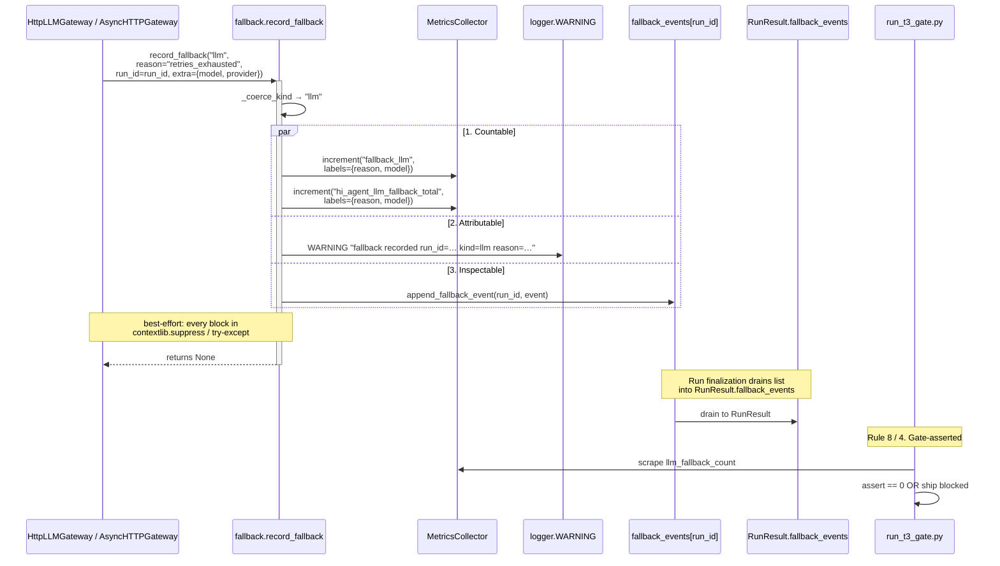

# Observability — Architecture

> **Last refreshed:** 2026-05-06 (W35 corrective close + W36 plans). HEAD `276917d8`.
> **Audience:** platform engineers + observability operators.
> **Status:** authoritative.

## 1. Purpose & Responsibilities

`hi_agent/observability/` is the **cross-cutting spine** of hi_agent. Every other subsystem emits through it; no subsystem consumes from another directly. Outside test paths, no module owns its own counter, log redaction, or trace-context primitive — those concerns live here.

The package owns:

1. **12 typed run-lifecycle events** (`RunEventEmitter` — `event_emitter.py:87`) with named Prometheus counters and structured per-run event lists.
2. **14 spine layers** (`spine_events`) for cross-subsystem observability — emitted at every layer boundary (LLM call, tool call, heartbeat renewed, run manager, sync bridge, http transport, …).
3. **Fallback recording** (`fallback.py` — Rule 7 four-prong contract: countable / attributable / inspectable / gate-asserted).
4. **Metrics aggregation** (`MetricsCollector`, `Counter`, `metrics.py`) with Prometheus exposition format and JSON snapshots; **zero external dependencies**.
5. **Idempotency-store metrics** (`idempotency_metrics.py` — W35-T6) for the `IdempotencyStore` boundary.
6. **Trace context propagation** (`TraceContext`, `TraceContextManager`, `Tracer`, `SpanRecord`).
7. **W3C traceparent ingestion** (`http_middleware.py::TraceIdMiddleware`).
8. **Silent-degradation recording** (`silent_degradation.py`) for paths that legitimately swallow exceptions but must remain observable.
9. **Audit logging** (`audit.py`), **log redaction** (`log_redaction.py`), **alert rules** (`alerts.py`), **trajectory export** (`trajectory_exporter.py`).

The package contract is one-way: subsystems **emit**; observability **records and surfaces**. Durable event persistence is delegated to `SQLiteEventStore` in `hi_agent/server/event_store.py`. Prometheus exposition is served at `/metrics` (`hi_agent/server/app.py:406`).

It does **not** own: durable run state (delegated to `hi_agent/server/`), event streaming (delegated to `hi_agent/server/sse_routes.py`), or alert delivery (delegated to `notification.py` backends).

## 2. Context & Scope

```mermaid
flowchart LR
    subgraph hi_agent["hi_agent runtime"]
        Run[runner / runner_stage]
        LLM[hi_agent.llm gateways]
        Tool[ActionDispatcher]
        Run_Mgr[RunManager]
        Idem[IdempotencyStore]
        ASGI[server.app TraceIdMiddleware]
    end

    subgraph Obs["hi_agent.observability"]
        Spine[spine_events.emit_*]
        EmitR[RunEventEmitter]
        Fb[fallback.record_fallback]
        IdemM[idempotency_metrics]
        Trace[TraceContextManager]
        Counters[MetricsCollector]
        Audit[audit / log_redaction]
    end

    subgraph Persist["hi_agent.server"]
        ES[(SQLiteEventStore)]
        SSE["/runs/&#123;id&#125;/events SSE"]
    end

    subgraph Ops["operator surface"]
        PromEP["GET /metrics<br/>Prometheus text"]
        JSON["GET /metrics/json"]
        LogDest[log dest]
        Notif[NotificationBackend]
    end

    Run --> EmitR
    Run --> Spine
    LLM --> Spine
    LLM --> Fb
    Tool --> Spine
    Run_Mgr --> Spine
    Idem --> IdemM
    ASGI --> Trace

    EmitR --> Counters
    Spine --> Counters
    Fb --> Counters
    IdemM --> Counters
    Audit --> LogDest

    Counters --> PromEP
    Counters --> JSON

    Run --> ES
    ES --> SSE

    Trace -.trace_id.-> ES
    Trace -.trace_id.-> LogDest

    Counters --> Notif
```

Boundaries:

- **Inbound**: `record_*` / `emit_*` / `record_fallback` / `record_silent_degradation` / counter helpers — called from anywhere in `hi_agent/`.
- **Outbound**: `/metrics` (Prometheus text), `/metrics/json`, structured logs to whichever logger handler the operator configures, `NotificationBackend.send` for alerts.
- **Out of scope**: SSE delivery (server), persisted run state (server), the SQL schema for stored events (server), any business taxonomy of failure (capability layer).

## 3. Module Boundary & Dependencies

| External dep | Used by | Why |
|---|---|---|
| Python stdlib (`logging`, `threading`, `contextvars`, `re`, `secrets`, `time`, `dataclasses`, `collections.deque`) | every module | zero-dependency goal — no `prometheus_client`, no `opentelemetry-sdk`. |
| `starlette.types` | `http_middleware.py` | ASGI Scope/Receive/Send types only — no Starlette runtime objects. |
| `hi_agent.server.event_store` | (consumed only) | observability writes via `RunManager`/server callers; does not import directly. |

What this package may **not** import:

- `hi_agent.runtime` — to keep observability free of event-loop assumptions.
- `hi_agent.llm` — would create a cycle (the gateway emits through us).
- `agent_kernel.*` — observability is platform-side, not kernel-side. Spine emitters carry kernel-shaped data only as opaque labels.
- Any test fixture (`hi_agent.testing`) — production-only surface.

What may import this package: anything. Spine emitters are the entry point of last resort for any silent-degradation path.

## 4. Building Blocks

```mermaid
flowchart TB
    subgraph Emit["Emit layer"]
        EE[RunEventEmitter<br/>event_emitter.py:87]
        SE[spine_events.emit_*<br/>spine_events.py]
        FB[fallback.record_fallback<br/>fallback.py:125]
        SD[silent_degradation<br/>record_silent_degradation]
        TXM[TraceIdMiddleware<br/>http_middleware.py:24]
        IM[idempotency_metrics<br/>record_replay/conflict/purged/age]
    end

    subgraph Aggregate["Aggregate layer"]
        Counter[Counter / Gauge / Histogram<br/>metric_counter.py]
        MC[MetricsCollector singleton<br/>collector.py]
        AggHelp[metrics.py<br/>p95_latency, run_success_rate]
    end

    subgraph CTX["Context"]
        TCM[TraceContextManager<br/>trace_context.py]
        Tracer[Tracer / SpanRecord<br/>tracing.py]
    end

    subgraph Sink["Sink layer"]
        Prom["MetricsCollector.to_prometheus_text"]
        Snap[snapshot JSON]
        Logs[stdlib logging]
        AuditL[audit log file]
        AlertEng[AlertRule.evaluate]
        Notif[NotificationBackend.send]
        TraceExp[trajectory_exporter]
    end

    subgraph GovEvi["governance evidence"]
        Spine14[scripts/build_observability_spine_e2e_real.py<br/>14-layer evidence]
    end

    EE --> Counter
    SE --> Counter
    FB --> Counter
    IM --> Counter
    TXM --> Counter
    SD --> Counter

    Counter --> MC
    MC --> Prom
    MC --> Snap
    MC --> AggHelp

    EE --> Logs
    FB --> Logs
    SD --> Logs
    AuditL <-- audit.record_tenant_scoped_access --- Sink

    TXM --> TCM
    TCM --> Tracer

    AlertEng --> MC
    AlertEng --> Notif

    Spine14 --> SE
    Spine14 --> EE
```

| Block | File | Responsibility |
|---|---|---|
| `RunEventEmitter` | `event_emitter.py:87` | 12 typed `record_*` methods; counter + log + per-run list. `RUN_EVENT_METRIC_NAMES` (`event_emitter.py:49`) is the canonical frozenset asserted by the metrics-cardinality gate. |
| `spine_events.emit_*` | `spine_events.py` | 14 cross-subsystem layer probes — `emit_llm_call`, `emit_tool_call`, `emit_heartbeat_renewed`, `emit_trace_id_propagated`, `emit_run_manager`, `emit_tenant_context`, `emit_reasoning_loop`, `emit_capability_handler`, `emit_sync_bridge`, `emit_http_transport`, `emit_artifact_ledger`, `emit_event_store`, `emit_stage_skipped`, `emit_stage_inserted`, `emit_stage_replanned`. Each is `with contextlib.suppress(Exception)`-guarded (`# rule7-exempt: spine emitters must never block execution path  # expiry_wave: permanent`). |
| `fallback.record_fallback` | `fallback.py:125` | Rule-7 four-prong recorder. Kinds: `{llm, heuristic, capability, route}` (`_VALID_KINDS`, `fallback.py:61`). Also exposes `event_bus_publish_errors_total` and `fallback_recording_errors_total` (`fallback.py:75-76`) for previously-silent gateway failure modes. |
| `fallback.record_llm_request` | `fallback.py:212` | Rule-8 step 3 hook — increments `hi_agent_llm_requests_total{provider, model, tier}`. |
| `idempotency_metrics` | `idempotency_metrics.py` | Four metrics for the IdempotencyStore boundary (replay / conflict / purged / record_age_seconds). |
| `MetricsCollector` | `collector.py` | Process-singleton aggregator; Prometheus + JSON exposition; `_METRIC_DEFS` registry is the source of truth for declared metrics. |
| `Counter` / `Gauge` / `Histogram` | `metric_counter.py` | Cardinality-bounded primitives; `.labels(...).inc()`. |
| `TraceIdMiddleware` | `http_middleware.py:24` | Reads W3C `traceparent`; mints fresh `secrets.token_hex(16)` if absent; sets `_current_trace_ctx` ContextVar; emits `hi_agent_http_requests_total{method,path}` and `emit_trace_id_propagated` post-request. |
| `TraceContextManager` | `trace_context.py` | `ContextVar`-backed trace propagation across async hops. |
| `Tracer`, `SpanRecord` | `tracing.py` | Span-level tracing primitive (in-memory by default). |
| `silent_degradation.record_silent_degradation` | `silent_degradation.py` | Records paths that legitimately swallow exceptions; `hi_agent_silent_degradation_total{component, reason}`. |
| `Alert`, `AlertRule`, `default_alert_rules` | `collector.py`, `alerts.py` | Rule evaluator over `MetricsCollector.snapshot()`. |
| `NotificationBackend`, `InMemoryNotificationBackend`, `format_webhook_payload`, `send_notification` | `notification.py` | Pluggable delivery for alert payloads. |
| `audit.record_tenant_scoped_access` | `audit.py` | Append-only tenant-scoped access audit. |
| `log_redaction` | `log_redaction.py` | Strips API keys, JWT tokens, email addresses. |
| `trajectory_exporter` | `trajectory_exporter.py` | Exports run trajectory for downstream analysis. |
| `metrics.py` | `metrics.py` | `RunMetricsRecord`, `aggregate_counters`, `avg_token_per_run`, `p95_latency`, `run_success_rate`. |

**Spine evidence builder** (gov-side, not under `hi_agent/observability/`):
`scripts/build_observability_spine_e2e_real.py` — emits the 14-layer JSON evidence file consumed by the manifest scorecard's `observability_spine_completeness` dimension. The 14 layers correspond 1:1 to the spine emitters above plus the run-lifecycle counters.

## 5. Runtime View — Key Scenarios

### 5.1 LLM-call fallback emission (Rule 7 hot path)

```mermaid
sequenceDiagram
    participant Gateway as HttpLLMGateway / AsyncHTTPGateway
    participant FB as fallback.record_fallback
    participant MC as MetricsCollector
    participant Log as logger.WARNING
    participant Run as fallback_events[run_id]
    participant Result as RunResult.fallback_events
    participant Gate as run_t3_gate.py

    Gateway->>+FB: record_fallback("llm",<br/>reason="retries_exhausted",<br/>run_id=run_id, extra={model, provider})

    FB->>FB: _coerce_kind → "llm"

    par 1. Countable
        FB->>MC: increment("fallback_llm",<br/>labels={reason, model})
        FB->>MC: increment("hi_agent_llm_fallback_total",<br/>labels={reason, model})
    and 2. Attributable
        FB->>Log: WARNING "fallback recorded run_id=… kind=llm reason=…"
    and 3. Inspectable
        FB->>Run: append_fallback_event(run_id, event)
    end

    Note over Gateway,FB: best-effort: every block in<br/>contextlib.suppress / try-except
    FB-->>-Gateway: returns None

    Note over Run,Result: Run finalization drains list<br/>into RunResult.fallback_events
    Run->>Result: drain to RunResult

    Note over Gate: Rule 8 / 4. Gate-asserted
    Gate->>MC: scrape llm_fallback_count
    Gate->>Gate: assert == 0 OR ship blocked
```

Notes:

- The function never raises (`fallback.py` docstring at line 140).
- `run_id="system"` increments `hi_agent_fallback_no_run_scope_total` instead of appending to a per-run list (`fallback.py:198`).
- A kind outside `_VALID_KINDS` is still recorded (Rule 7's "no silent drops") but logged at DEBUG with a migration hint.

### 5.2 W3C traceparent ingestion → SSE event correlation

```mermaid
sequenceDiagram
    participant Client as HTTP client
    participant ASGI as TraceIdMiddleware
    participant CV as _current_trace_ctx<br/>ContextVar
    participant App as ASGI app (routes)
    participant ES as SQLiteEventStore
    participant SSE as /runs/{id}/events

    Client->>+ASGI: POST /runs<br/>traceparent: 00-{32hex}-{16hex}-01
    ASGI->>ASGI: regex parse traceparent;<br/>extract 32-hex trace_id<br/>(else secrets.token_hex(16))
    ASGI->>CV: set TraceContext(trace_id, span_id)
    ASGI->>+App: scope, receive, send
    App->>App: route handler runs;<br/>any code reads<br/>TraceContextManager.current()
    App->>ES: append StoredEvent(trace_id=…)
    App-->>-ASGI: response
    ASGI->>CV: reset(token)
    ASGI->>ASGI: emit hi_agent_http_requests_total{method,path}
    ASGI->>ASGI: spine_events.emit_trace_id_propagated(trace_id, "")
    ASGI-->>-Client: 200

    Note over ES,SSE: Stored events carry trace_id;<br/>SSE consumers correlate per-tenant<br/>across multiple HTTP hops
```

A non-HTTP scope (`websocket`, `lifespan`) is passed through unchanged (`http_middleware.py:41`). Both the metric increment and the spine emit are wrapped — a wiring failure is logged at WARNING but never blocks the request.

## 6. Cross-cutting Concerns

### 6.1 Rule 7 — Resilience must not mask signals

Every silent-degradation path satisfies the four-prong contract.

| Prong | Mechanism |
|---|---|
| **Countable** | `MetricsCollector.fallback.<kind>` + canonical `hi_agent_<kind>_fallback_total{reason,…}`. Plus the two LLM-hot-path counters: `hi_agent_event_bus_publish_errors_total`, `hi_agent_fallback_recording_errors_total` (`fallback.py:75-76`). |
| **Attributable** | WARNING log carries `run_id`, `kind`, `reason`, `extra={…}`. |
| **Inspectable** | Per-run list appended in `fallback.py::append_fallback_event`; surfaced on `RunResult.fallback_events` and `GET /runs/{id}.fallback_events`. |
| **Gate-asserted** | Rule 8 operator-shape gate asserts `llm_fallback_count == 0`; T3 gate (`scripts/run_t3_gate.py`) asserts the same for three sequential real-LLM runs. |

`record_silent_degradation` (`silent_degradation.py`) is the catch-all for paths that legitimately swallow exceptions — parse failures, best-effort cleanup, optional metric increments. Each call increments `hi_agent_silent_degradation_total{component, reason}`.

### 6.2 Metric label cardinality policy

Platform-side Prometheus metrics carry raw `{tenant_id}` (and other
dimension labels). Cardinality control belongs at PromQL recording-rule
level on the operator's side, not at the metric source — this keeps
dashboard queries portable across tenants and consistent with the
`hi_agent_run_*` family conventions.

The legacy `hi_agent_llm_tokens_total` metric (W31) retains a
`{tenant_bucket}` (mod-16 hash) label for backwards compatibility with
W31-era dashboards; treat it as a documented exception. New metrics
MUST use raw `{tenant_id}` (W35 corrective C-1). Operators that want a
bucketed view should derive one via a PromQL recording rule rather than
asking the platform to bucket at emit time. See
`docs/observability/idempotency-metrics.md` for the recording-rule
pattern.

### 6.3 Trace context propagation

`TraceContext` is held in `_current_trace_ctx: ContextVar[TraceContext]` (`trace_context.py`). The middleware (`http_middleware.py:24`) sets the context on each HTTP request and resets it on response. Async hops inherit the context naturally; new threads must explicitly `Context.run` if they need it.

Stored events carry `trace_id` so `/runs/{id}/events` correlates across HTTP hops. The W3C `traceparent` regex (`http_middleware.py:17`) accepts only the standard `00-{32hex}-{16hex}-{2hex}` form; any malformed header is replaced with a fresh `secrets.token_hex(16)` rather than rejected.

### 6.4 Log redaction

`log_redaction.py` strips:

- API-key-shaped tokens (Bearer / `sk-…` / Anthropic `x-api-key`)
- JWT tokens (three-segment dot-separated)
- Email addresses

Redaction runs as a logging filter; it is opt-in per logger, attached at server startup. Counters remain unredacted because labels are bounded (see §6.2).

### 6.5 Audit logging

`audit.record_tenant_scoped_access(tenant_id, resource, op)` writes a tenant-scoped audit row for every `/skills/list`, `/skills/status`, `/skills/evolve`, `/skills/{id}/metrics` access — global-readonly endpoints still leave a per-tenant trail. Records are append-only; rotation is operator-side.

### 6.6 Concurrency

| Component | Concurrency model |
|---|---|
| `RunEventEmitter` | Per-run; module-level `_EVENTS_LOCK` guards mutations (`event_emitter.py:65`). |
| `MetricsCollector` | Process singleton (`get_metrics_collector`/`set_metrics_collector`). Set during `AgentServer.__init__` (`hi_agent/server/app.py:1903`). |
| `Counter` / `Gauge` / `Histogram` | `threading.Lock` internally; safe across threads and bridge loop. |
| Spine emitters | Stateless module functions. |
| `TraceContextManager` | `ContextVar` — per-task isolation under asyncio. |
| `_EVENTS` (fallback per-run dict) | `threading.Lock` (`fallback.py:80-81`). |
| Histograms | deque-backed raw samples; percentiles computed on read. |

No startup/shutdown hooks. Counters are constructed lazily at module import. Snapshots are on-demand.

## 7. Architecture Decisions

### 7.1 ADR-OBS-1 — In-house Prometheus-compatible MetricsCollector (no `prometheus_client`)

**Decision**: implement `Counter`/`Gauge`/`Histogram` and Prometheus text exposition in-house under `metric_counter.py` and `collector.py`.

**Rationale**: Rule 2 (simplicity) — the only prometheus features we need are counters with labels and a `/metrics` text endpoint. An external dep adds a 30+ MB transitive footprint and a runtime singleton that conflicts with our `set_metrics_collector` swap pattern.

**Consequence**: tests that need metric isolation use `set_metrics_collector(MetricsCollector())` to swap the singleton.

### 7.2 ADR-OBS-2 — Cardinality policy: raw `tenant_id` at platform; bucketing is ops-side (W35 corrective C-1)

See §6.2 above. The W35 corrective C-1 reverted three new metrics that had launched with `tenant_bucket` labels back to raw `tenant_id`, restoring consistency with the `hi_agent_run_*` family.

### 7.3 ADR-OBS-3 — Spine emitters never raise

Every spine emitter is wrapped in `with contextlib.suppress(Exception)` and annotated `# rule7-exempt: spine emitters must never block execution path  # expiry_wave: permanent`. Failure during emit is recorded via `record_silent_degradation` rather than propagated.

**Rationale**: observability that crashes the request path is worse than no observability. The alternative (fail-closed on emit) was rejected as a stability risk.

**Consequence**: a wiring defect in a counter or log is invisible until the spine evidence builder (`scripts/build_observability_spine_e2e_real.py`) catches the missing layer. Mitigation: that script runs in CI on every release.

### 7.4 ADR-OBS-4 — Process-internal `_EVENTS` dict; durable persistence delegated

`fallback._EVENTS` and `event_emitter._RUN_EVENTS` are process-local dicts. Durable storage of run lifecycle events is `SQLiteEventStore` in `hi_agent/server/`. The split keeps observability dependency-free and makes cross-process testing cheap.

**Consequence**: a multi-process deployment must route SSE through a single SQLite file (or federated store). Current architecture is single-process per pod.

### 7.5 ADR-OBS-5 — Observability spine completeness gate

The 14-layer JSON emitted by `scripts/build_observability_spine_e2e_real.py` is consumed by the release manifest scorecard's `observability_spine_completeness` dimension. A missing layer caps `current_verified_readiness`. Provenance must be `real` (i.e. the evidence was produced from a live LLM run), not structural.

### 7.6 ADR-OBS-6 — Orphan-metric audit (W35-corrective hidden H4)

A 2026-05-06 hidden-defect scan found 11 W12-G `_MetricDef` entries with
no producer call-site anywhere in `hi_agent/`, `agent_server/`, or
`agent_kernel/`: the plural-form run-lifecycle counters
(`hi_agent_runs_started_total`, `runs_completed_total`, `runs_failed_total`,
`runs_cancelled_total`, `runs_timed_out_total`) and six run/tool latency
histograms (`hi_agent_run_duration_seconds`, `run_no_progress_seconds`,
`queue_claim_latency_seconds`, `tool_latency_seconds`,
`human_gate_age_seconds`, `drain_duration_seconds`). All eleven were
deleted because they made a contract claim that no code made good on
(Rule 14 silent contract-drift). The active path uses
`runs_total{status=…}` (`runner_telemetry.py`) and the singular
`hi_agent_run_*_total` family owned by `RunEventEmitter`. The deletion is
held in place by `tests/unit/test_metrics_catalogue_complete.py
::TestW35OrphanMetricsStayDeleted`. **Policy: a metric declaration
requires at least one emitter at landing time.** Reserved-for-upcoming
declarations get an inline `# orphan: pending wire-up in W<N>-<TRACK>`
comment naming the consumer; otherwise do not declare.

## 8. Quality Attributes

| Attribute | Target | How achieved | Evidence |
|---|---|---|---|
| Latency overhead per emit | < 50 µs typical | lock-free fast path; raw-sample histograms; deque-bounded | benchmarked in `tests/perf/` (advisory) |
| Cardinality bound | counter labels enumerable; no `run_id`/`task_id`/raw timestamps in labels | `metrics_cardinality` gate validates `RUN_EVENT_METRIC_NAMES` | `event_emitter.py:49` |
| Failure-mode visibility | every silent path has an alarm | Rule 7 four-prong + `record_silent_degradation` | `scripts/check_rule7_observability.py` |
| Spine completeness | 14 layers emit per real-LLM run | spine evidence builder | `docs/observability/spine-evidence/<sha>.json` |
| Contract stability | counter names freeze once published | catalogue test pinned | `test_metrics_catalogue_complete.py` |
| Trace propagation | every `/runs` HTTP hop carries trace_id end-to-end | `TraceIdMiddleware` + ContextVar + stored event field | `tests/integration/test_trace_propagation.py` |

## 9. Risks & Technical Debt

| Risk / debt | Severity | Tracking |
|---|---|---|
| Spine evidence provenance still **structural** for some evidence files (the 14-layer JSON exists but was generated from a synthetic shape rather than a live run). Real-provenance is a hard requirement of the manifest scorecard but legacy fixtures may slip in during dev. | medium | W36 spine-real-provenance enforcement; `score_caps.yaml::observability_spine_completeness` cap. |
| Six histograms deleted by H4 (`hi_agent_run_duration_seconds`, `run_no_progress_seconds`, `queue_claim_latency_seconds`, `tool_latency_seconds`, `human_gate_age_seconds`, `drain_duration_seconds`) may need revival. They were removed because no producer existed; the latency contracts they implied are still valid, and operators have asked for them back. Revival must land producer + consumer + test in the same commit. | medium | W36 plan; Rule 14 reapplies to any revival commit. |
| `MetricsCollector` is a singleton — tests that need isolation must reset around each test. Acceptable trade-off but a cross-test leak has surfaced twice in W31/W34. | low | `conftest.py` fixture resets the collector for unit tests; integration tests inherit process state. |
| `_RUN_EVENTS` is process-local — multi-process deployment requires every process to write to the same SQLite file (or a federated store). No federated store today. | low | document-only; single-process-per-pod is the deployment shape. |
| Audit records are append-only with no rotation. Operators must rotate the audit log out-of-band. | low | runbook section in `docs/operator/audit-rotation.md`. |
| `_VALID_KINDS` is a frozenset of four; new kinds require code change in `fallback.py` plus the Rule-8 gate's `llm_fallback_count` predicate. | low | comment at `fallback.py:61`; covered by review. |
| Spine emitters are best-effort — if the counter increment or log emission itself fails (e.g. during fork-bomb or OOM), the call site never knows. Mitigation: `record_silent_degradation` re-records and the spine builder catches missing layers in CI. | low | accepted; documented in ADR-OBS-3. |
| No native OpenTelemetry — `Tracer.spans` is in-memory; `trajectory_exporter.py` provides export hooks but no built-in OTLP transport. | low | accepted; out-of-scope for the platform's zero-dep goal. |

## 10. References

- `hi_agent/observability/__init__.py` — public surface
- `hi_agent/observability/event_emitter.py` — `RunEventEmitter`, `RUN_EVENT_METRIC_NAMES` (line 49)
- `hi_agent/observability/spine_events.py` — 14 spine emitters
- `hi_agent/observability/fallback.py` — `record_fallback` (line 125), `record_llm_request` (line 212)
- `hi_agent/observability/idempotency_metrics.py` — `record_replay`, `record_conflict`, `record_purged`, `record_age`
- `hi_agent/observability/collector.py` — `MetricsCollector`, `_METRIC_DEFS`, `Alert`, `AlertRule`
- `hi_agent/observability/metric_counter.py` — `Counter`, `Gauge`, `Histogram`
- `hi_agent/observability/http_middleware.py` — `TraceIdMiddleware` (line 24), W3C traceparent regex (line 17)
- `hi_agent/observability/trace_context.py` — `TraceContext`, `TraceContextManager`, `_current_trace_ctx`
- `hi_agent/observability/tracing.py` — `Tracer`, `SpanRecord`
- `hi_agent/observability/silent_degradation.py` — `record_silent_degradation`
- `hi_agent/observability/audit.py` — `record_tenant_scoped_access`
- `hi_agent/observability/log_redaction.py` — PII redaction filter
- `hi_agent/observability/notification.py` — alert delivery
- `hi_agent/observability/alerts.py` — default alert rules
- `hi_agent/observability/trajectory_exporter.py` — trajectory export
- `hi_agent/observability/metrics.py` — aggregation helpers
- `hi_agent/server/event_store.py` — durable persistence (`SQLiteEventStore`)
- `hi_agent/server/app.py:406` — `/metrics` route; `app.py:1903` — collector wired
- `scripts/build_observability_spine_e2e_real.py` — 14-layer evidence builder
- `scripts/check_rule7_observability.py` — Rule-7 enforcement gate
- `tests/unit/test_metrics_catalogue_complete.py::TestW35OrphanMetricsStayDeleted` — H4 deletion guard
- `docs/observability/idempotency-metrics.md` — recording-rule patterns
- `docs/governance/closure-taxonomy.md` — `operationally_observable` level
- CLAUDE.md Rule 7 (Resilience Must Not Mask Signals), Rule 8 (Operator-Shape Gate), Rule 14 (Manifest single fact source)
