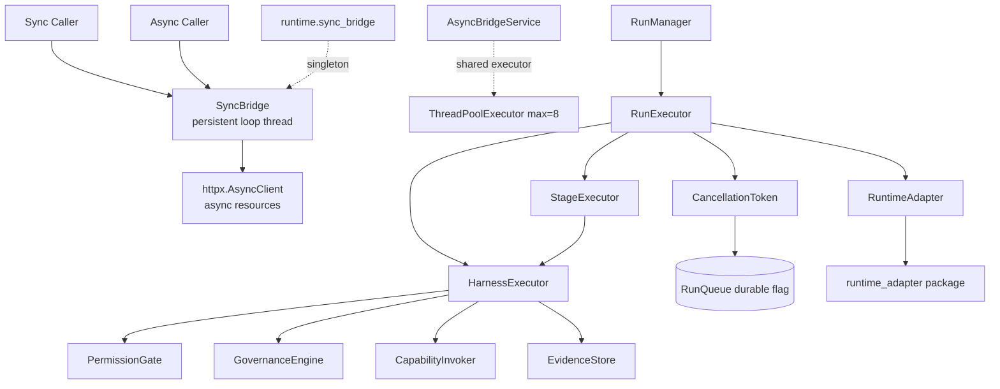
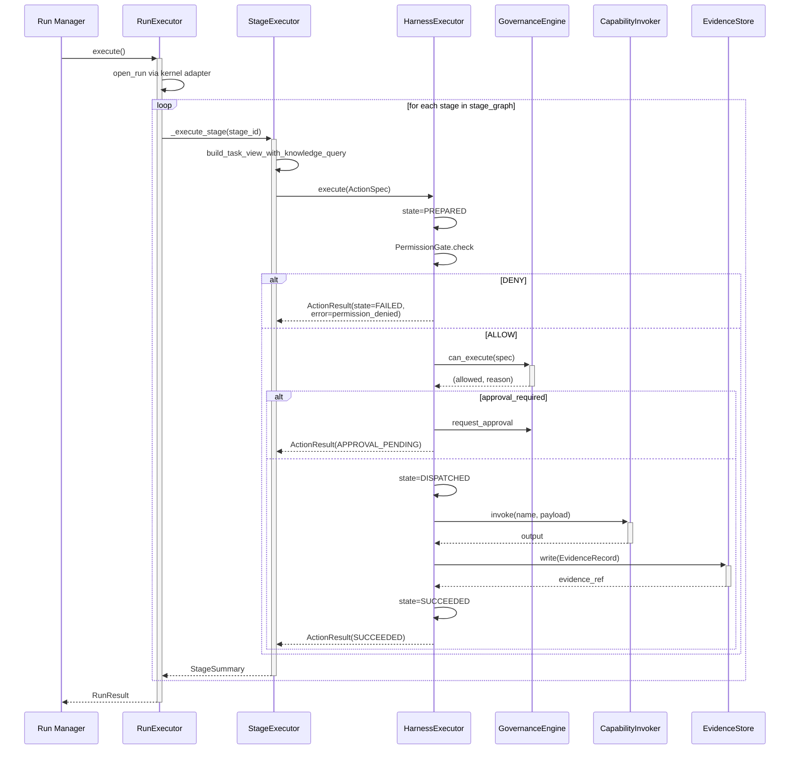

# Runtime Architecture

## 1. Purpose & Position in System

`hi_agent/runtime/` is the platform's runtime helper namespace. It owns the in-process primitives the runtime kernel uses to execute work without depending on the kernel facade adapter spine: the persistent event-loop bridge for async/sync interop, cooperative cancellation, profile-aware runtime configuration, and the unified action execution harness (governance + permissions + evidence). The two principal entry points are `RunExecutor` (`hi_agent/runner.py:176`) for trace-style stage traversal and `HarnessExecutor` (`hi_agent/runtime/harness/executor.py:26`) for unified action dispatch.

The runtime is **async-first** in its core but offers a **sync bridge** for callers that cannot adopt async (`SyncBridge` — `runtime/sync_bridge.py`). This split is binding under Rule 5: every async resource (`httpx.AsyncClient`, `asyncpg.Pool`, async iterators, `asyncio.TaskGroup`) is bound to exactly one event loop for its entire lifetime; the bridge guarantees that loop is the same across calls.

It does **not** own: kernel facade calls (delegated to `hi_agent/runtime_adapter/`), HTTP route handling (delegated to `hi_agent/server/`), capability registration (delegated to `hi_agent/capability/`), or LLM transport (delegated to `hi_agent/llm/`). The `harness/` sub-package was relocated here from `hi_agent/harness/` in W31-H.6 to unify the runtime helper namespace.

## 2. External Interfaces

**Public exports** (`hi_agent/runtime/__init__.py`):

- `SyncBridge`, `SyncBridgeError`, `SyncBridgeShutdownError`, `get_bridge()` — durable event-loop thread (`sync_bridge.py:62`)
- `ProfileRuntimeResolver`, `ResolvedProfile` — profile-aware runtime resolver (`profile_runtime.py`)

**Harness exports** (`hi_agent/runtime/harness/__init__.py`):

- `HarnessExecutor` — pipeline executor (governance → permission → dispatch → evidence)
- `GovernanceEngine`, `RetryPolicy`
- `ActionSpec`, `ActionResult`, `ActionState`, `EffectClass`, `SideEffectClass`, `EvidenceRecord`
- `EvidenceStore`, `EvidenceStoreProtocol`, `SqliteEvidenceStore`

**Cancellation primitives** (`runtime/cancellation.py`):

- `CancellationToken(run_id, run_queue=None)` — checked at execution boundaries
- `RunCancelledError`

**Async bridge** (`runtime/async_bridge.py`):

- `AsyncBridgeService.get_executor()` — process-lifetime ThreadPoolExecutor for sync→async bridging (max 8 workers)
- `AsyncBridgeService.run_sync(fn, *args, timeout)` — coroutine that runs a sync callable on the shared executor

**Runner contract** (`hi_agent/runner.py`):

- `RunExecutor(contract, kernel, ...)` — the canonical TRACE S1→S5 driver; consumed by the default `executor_factory` in `AgentServer`

## 3. Internal Components



| Component | File | Responsibility |
|---|---|---|
| `SyncBridge` | `sync_bridge.py:62` | Single durable event loop on daemon thread; one `_loop` per process. |
| `get_bridge()` | `sync_bridge.py:195` | Process-wide singleton; registers `atexit.shutdown`. |
| `AsyncBridgeService` | `async_bridge.py:16` | Shared `ThreadPoolExecutor` for async→sync bridging (Rule 5 reverse direction). |
| `CancellationToken` | `cancellation.py:21` | In-memory flag + optional `RunQueue` poll for durable cancellation. |
| `ProfileRuntimeResolver` | `profile_runtime.py` | Resolves profile-scoped runtime config (capability set, model tier, posture). |
| `RunExecutor` | `hi_agent/runner.py:176` | Top-level trace-stage driver; orchestrates 30+ injected dependencies. |
| `StageExecutor` | `hi_agent/runner_stage.py:43` | Per-stage execution helper extracted from RunExecutor. |
| `HarnessExecutor` | `harness/executor.py:26` | Action lifecycle: PREPARED → DISPATCHED → SUCCEEDED/FAILED. |
| `GovernanceEngine` | `harness/governance.py` | Rule enforcement (effect class, approval requirements). |
| `EvidenceStore` / `SqliteEvidenceStore` | `harness/evidence_store.py` | Append-only evidence ledger; EvidenceStoreProtocol contract. |
| `PermissionGate` | `harness/permission_rules.py` | Per-tool permission check before action dispatch. |

## 4. Data Flow



The TRACE pipeline is constructed in `RunExecutor.__init__` (`runner.py:179`) — over 50 keyword-only constructor arguments, all optional. Each is a hi_agent subsystem injected by `SystemBuilder` (memory stores, knowledge manager, retrieval engine, skill recorder, route engine, evolve engine, restart policy engine, etc.). Stage execution within the loop is delegated to `StageExecutor._execute_stage` (`runner_stage.py:43`) which builds a task view with knowledge, calls the route engine to propose actions, dispatches them through the harness, and aggregates a `StageSummary`.

## 5. State & Persistence

| State | Location | Lifetime |
|---|---|---|
| `SyncBridge._loop`, `_thread` | Process singleton | Until interpreter exit (atexit shutdown) |
| `AsyncBridgeService._executor` | Class-level `ThreadPoolExecutor` | Process |
| `CancellationToken._cancelled` | In-memory bool | Per run |
| `RunQueue.cancellation_flag` | SQLite row | Persistent across process restart |
| `RunExecutor._action_states`, `_action_results` | In-memory dicts inside HarnessExecutor | Per run |
| Evidence ledger | `SqliteEvidenceStore` (`harness/evidence_store.py`) | Process-durable |
| L0 / L1 / L2 memory | injected via `RunExecutor(raw_memory=, compressor=, …)` | Run-scoped or profile-scoped depending on builder |

`RunExecutor` itself holds **no durable state** — it is reconstructed per run. All persistence is delegated to injected stores.

## 6. Concurrency & Lifecycle

**Rule 5 deep-dive — `SyncBridge`** (`sync_bridge.py`):

The historical anti-pattern was sync code calling `asyncio.run(coro)` per call, which creates a new loop, runs the coroutine, then closes the loop. Any `httpx.AsyncClient`, `asyncpg.Pool`, async iterator, or task group constructed inside the coroutine is bound to that loop — and dies with it. The next call constructs a fresh resource on a fresh loop. Connection pools never reuse; the 04-22 prod incident was `RuntimeError: Event loop is closed` on a pooled client.

`SyncBridge` solves this by running **one** asyncio event loop on a daemon thread for the life of the process:

```
main thread       sync_bridge thread
  call_sync(coro)─▶run_coroutine_threadsafe──▶ loop.run_forever()
                       │
                       └──▶ future.result(timeout)
```

Every `bridge.call_sync(coro)` schedules onto the same `_loop`. Resources constructed by one `call_sync` remain valid for every subsequent call. `atexit.register(bridge.shutdown)` handles teardown (`sync_bridge.py:205`).

Lazy start: the thread is spawned on first `call_sync` invocation (`_ensure_started`, `sync_bridge.py:86`). `_ready: threading.Event` synchronizes thread startup. Shutdown is idempotent (`sync_bridge.py:164`); calls `loop.call_soon_threadsafe(loop.stop)` then joins.

**AsyncBridgeService** (`async_bridge.py:16`) is the **reverse** direction — async code that needs to run a sync callable without blocking the event loop. It owns a process-lifetime `ThreadPoolExecutor(max_workers=8)`. `loop.run_in_executor(executor, fn, *args)` is wrapped with optional timeout via `asyncio.wait_for`.

**Forbidden patterns** (CLAUDE.md Rule 5):
1. Constructing an async resource in `__init__` of a sync-facing class then `asyncio.run`ning its methods.
2. Sharing an `AsyncClient`/`ClientSession` across two `asyncio.run(...)` calls.
3. Passing an async resource built in loop A into a coroutine on loop B.
4. Wrapping an async library with a sync façade that `asyncio.run`s per method.

Enforced by `scripts/check_rules.py` Rule 5 — every `asyncio.run(` call site must be in an entry point or routed through `sync_bridge`.

**RunExecutor lifecycle**: the executor is constructed once per run (in the executor_factory closure), wires every dependency at construction, then `execute()` runs synchronously on the dispatch thread. `cancellation_token` is checked at stage boundaries and inside long-running capability invocations.

**HarnessExecutor lifecycle**: stateless across actions but tracks per-action state in `_action_states` / `_action_results` dicts (`harness/executor.py:75`) for observability.

## 7. Error Handling & Observability

**Spine emitters** (`hi_agent/observability/spine_events.py`):
- `emit_sync_bridge` — fired on every `call_sync` (`sync_bridge.py:158`)
- `emit_capability_handler` — fired on every harness action dispatch
- `emit_reasoning_loop` — fired by RunExecutor stage iteration

All spine emitters are wrapped in `with contextlib.suppress(Exception):` and annotated `# rule7-exempt: spine emitters must never block execution path`.

**HarnessExecutor errors** (`harness/executor.py:118`):
- `PermissionGate` internal failure → fail-closed with `error_code=permission_gate_error` (logged at ERROR with `exc_info=True`)
- Governance violation → `state=FAILED, error_code=governance_violation`
- Approval required → `state=APPROVAL_PENDING, error_code=approval_pending`
- Capability dispatch exception → retried per `RetryPolicy.max_retries`; final failure → `state=FAILED` with `error_code` from the underlying exception

**RunExecutor errors**: caught at the run-level by RunManager._execute_run; runner.py emits structured `RunResult.fallback_events` per Rule 7 contract (countable + attributable + inspectable).

**Cancellation observability**: `CancellationToken.is_cancelled` raises `RunCancelledError` at boundary checks; the run transitions to `cancelled` and emits `run_cancelled` event.

## 8. Security Boundary

**Permission gate** (`harness/permission_rules.py`): consulted before any tool dispatch. `PermissionAction.DENY` short-circuits execution with no governance call, no LLM call, no side effect. Internal errors fail-closed (no silent ALLOW).

**Governance gate** (`harness/governance.py`): consulted after permission. Validates effect class against posture (e.g. `dangerous` actions denied under `prod`); enforces approval workflow for `irreversible_write` and `dangerous` capabilities.

**Trust boundary**: `RunExecutor` receives `tenant_id`, `user_id`, `session_id`, `project_id`, `run_id` via `RunExecutionContext` (passed in via injected components). Every memory write, evidence record, and capability invocation carries the spine. No code in `runtime/` reaches across tenant scopes.

**Sync bridge isolation**: `SyncBridge` is process-singleton. Multi-tenant isolation is enforced upstream (in route handlers / `TenantContext`). The bridge does not introspect coroutine arguments.

## 9. Extension Points

- **New action effect class**: extend `EffectClass` enum (`harness/contracts.py:12`); add governance rule in `GovernanceEngine`.
- **Custom evidence store**: implement `EvidenceStoreProtocol` (`harness/evidence_store.py`); inject via `HarnessExecutor(evidence_store=…)`.
- **Custom permission rule**: subclass / configure `PermissionGate`; pass to `HarnessExecutor(permission_gate=…)`.
- **Custom RunExecutor**: subclass or compose; assign as `executor_factory` on `AgentServer`.
- **New spine emitter**: add `emit_<name>` to `observability/spine_events.py`; call site adds `try/except` wrapper.
- **Custom cancellation source**: extend `CancellationToken._run_queue` polling logic.

## 10. Constraints & Trade-offs

- **One bridge loop per process** — sufficient for the workload but cannot exploit multi-core parallelism for async work; CPU-bound work should use the AsyncBridgeService thread pool.
- **`asyncio.run` is forbidden in library code** — entry points only. Verified by `scripts/check_rules.py`. Existing call sites that pre-date Rule 5 are tracked in the rule incident log.
- **`HarnessExecutor` requires injected `evidence_store`** (`harness/executor.py:64`) — no inline default. This was Rule 13 / DF-11 fix; without injection, two unshared in-memory stores existed (production SQLite vs. inline default).
- **`RunExecutor.__init__` argument explosion** — 50+ kwargs reflects the spread of subsystems the runner orchestrates. `SystemBuilder.build_run_executor` is the single Rule 6 construction path.
- **Cancellation is cooperative** — checks are at stage boundaries and inside long-running capabilities. A capability that does not check the token will not be cancelled until it returns. Watchdogs (in `hi_agent/failures/watchdog.py`) enforce wall-clock limits as backstop.
- **Harness moved namespace** — `hi_agent.harness` shim still exists for back-compat; will be removed in Wave 34 per the `RUNTIME-LAYERS.md` migration note.

## 11. References

- `hi_agent/runtime/sync_bridge.py` — durable event loop bridge (Rule 5)
- `hi_agent/runtime/async_bridge.py` — shared executor for async→sync
- `hi_agent/runtime/cancellation.py` — `CancellationToken`
- `hi_agent/runtime/profile_runtime.py` — profile-aware runtime resolution
- `hi_agent/runtime/harness/executor.py`, `governance.py`, `evidence_store.py`, `contracts.py`, `permission_rules.py` — unified action pipeline
- `hi_agent/runner.py` — `RunExecutor`
- `hi_agent/runner_stage.py` — `StageExecutor`
- `hi_agent/runner_lifecycle.py`, `runner_telemetry.py` — runner companion modules
- `hi_agent/runtime_adapter/ARCHITECTURE.md` — kernel facade adapter spine
- `hi_agent/RUNTIME-LAYERS.md` — runtime/runtime_adapter split rule
- CLAUDE.md Rule 5 (Async/Sync Resource Lifetime), Rule 13 (Capability Maturity)
- `scripts/check_rules.py` — Rule 5 enforcement
