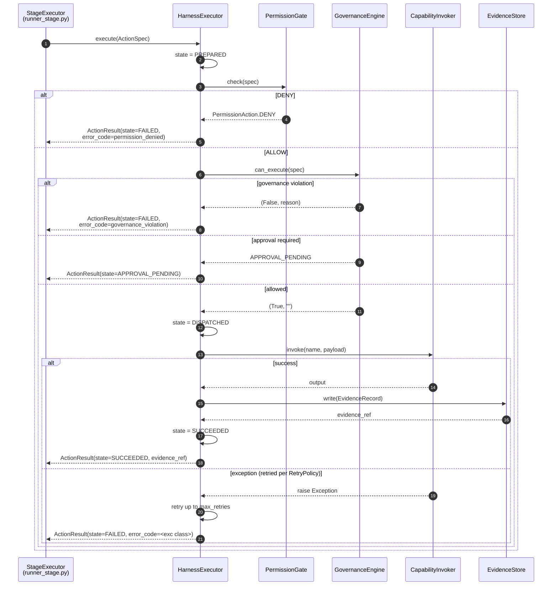
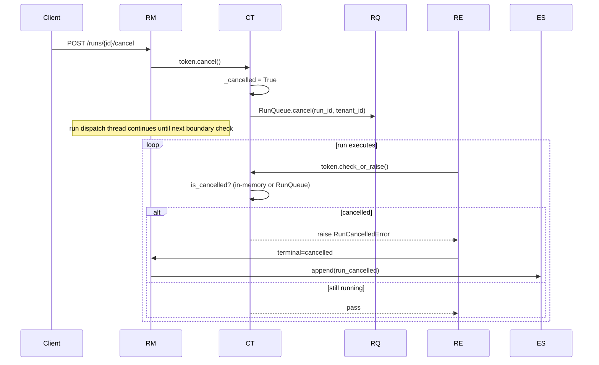

# hi_agent/runtime — Architecture

> **Last refreshed:** 2026-05-06 (W35 corrective close + W36 plans). HEAD `276917d8`.
> **Audience:** platform engineers + W36 implementers.
> **Status:** authoritative.

---

## 1. Purpose & Responsibilities

`hi_agent/runtime/` is the platform's **runtime helper namespace**. It owns the in-process primitives the kernel uses to execute work without depending on the kernel-facade transport spine:

- The persistent event-loop bridge for sync/async interop — `SyncBridge` (`hi_agent/runtime/sync_bridge.py:62`)
- The shared-executor reverse-direction bridge — `AsyncBridgeService` (`async_bridge.py:16`)
- Cooperative cancellation — `CancellationToken` (`cancellation.py:21`)
- Profile-aware runtime resolution — `ProfileRuntimeResolver` (`profile_runtime.py`)
- The unified **action execution harness** (governance + permission + dispatch + evidence) — `harness/` sub-package, relocated here in W31-H.6

The runtime is **async-first** in its core but offers a **sync bridge** for callers that cannot adopt async. This split is binding under Rule 5: every async resource (`httpx.AsyncClient`, `asyncpg.Pool`, async iterators, `asyncio.TaskGroup`) is bound to exactly one event loop for its entire lifetime; the bridge guarantees that loop is the same across calls.

It does **not** own: kernel facade transport (delegated to `hi_agent/runtime_adapter/`), HTTP route handling (delegated to `hi_agent/server/`), capability registration (delegated to `hi_agent/capability/`), or LLM transport (delegated to `hi_agent/llm/`). The legacy import path `hi_agent.harness` is a deprecation shim, removed in Wave 36 — see `hi_agent/RUNTIME-LAYERS.md`.

---

## 2. Context & Scope

```mermaid
flowchart LR
    subgraph CALLERS["sync-facing callers"]
        AS_RT[agent_server/runtime/<br/>route handlers<br/>(async, but invoke<br/>sync libs via bridge)]
        RM[hi_agent/server/RunManager<br/>(threading.Thread dispatch)]
        EXEC[hi_agent/runner.RunExecutor<br/>(stage execution)]
    end

    subgraph RUNTIME_PKG["hi_agent/runtime/"]
        SB[SyncBridge<br/>sync_bridge.py:62]
        AB[AsyncBridgeService<br/>async_bridge.py:16]
        CT[CancellationToken<br/>cancellation.py:21]
        PR[ProfileRuntimeResolver<br/>profile_runtime.py]
        HE[HarnessExecutor<br/>harness/executor.py:26]
    end

    subgraph LOOPS["asyncio loops"]
        BLOOP[(bridge loop<br/>daemon thread<br/>process-singleton)]
        TPOOL[(ThreadPoolExecutor<br/>max_workers=8<br/>process-singleton)]
    end

    subgraph ASYNC_RES["async resources<br/>bound to bridge loop"]
        HTTPX[httpx.AsyncClient<br/>connection pools]
        AGEN[async iterators<br/>SSE streams]
        TG[asyncio.TaskGroup]
    end

    AS_RT -. async-native, no bridge needed .-> ASYNC_RES
    RM -- bridge.call_sync(coro) --> SB
    EXEC -- bridge.call_sync(coro) --> SB
    SB -- run_coroutine_threadsafe --> BLOOP
    BLOOP -. owns lifetime .-> ASYNC_RES

    AB -- run_in_executor --> TPOOL

    classDef bridge fill:#dbeafe,stroke:#2563eb
    classDef loop fill:#fef3c7,stroke:#d97706
    classDef res fill:#dcfce7,stroke:#16a34a
    class SB,AB bridge
    class BLOOP,TPOOL loop
    class HTTPX,AGEN,TG res
```

The bridge has **no inbound network surface**. It is a pure in-process primitive. Its only "scope" is the process: one bridge loop per Python interpreter, one shared executor per Python interpreter.

---

## 3. Module Boundary & Dependencies

| Module | Owns | Outbound deps |
|---|---|---|
| `sync_bridge.py` | `SyncBridge`, `SyncBridgeError`, `SyncBridgeShutdownError`, `get_bridge()` singleton, `atexit.shutdown` registration | `asyncio`, `threading`, `atexit`, `observability.spine_events` (lazy) |
| `async_bridge.py` | `AsyncBridgeService.get_executor`, `run_sync`, `run_sync_in_thread` | `asyncio`, `concurrent.futures` |
| `cancellation.py` | `CancellationToken`, `RunCancelledError` | `hi_agent.server.run_queue` (TYPE_CHECKING; at runtime via injection) |
| `profile_runtime.py` | `ProfileRuntimeResolver`, `ResolvedProfile` | `hi_agent.contracts.config`, `hi_agent.evaluation.contracts` |
| `harness/executor.py` | `HarnessExecutor` — action lifecycle PREPARED → DISPATCHED → SUCCEEDED/FAILED | `harness/governance`, `harness/permission_rules`, `harness/evidence_store`, `harness/contracts`, `capability/invoker` |
| `harness/governance.py` | `GovernanceEngine`, `RetryPolicy` — effect class + approval enforcement | `harness/contracts`, `config/posture` |
| `harness/permission_rules.py` | `PermissionGate` — fail-closed pre-dispatch check | `harness/contracts` |
| `harness/evidence_store.py` | `EvidenceStore`, `EvidenceStoreProtocol`, `SqliteEvidenceStore` | `sqlite3` |
| `harness/contracts.py` | `ActionSpec`, `ActionResult`, `ActionState`, `EffectClass`, `SideEffectClass`, `EvidenceRecord` | (none) |
| `harness/__init__.py` | Re-exports all harness public symbols | (intra-package) |

Inbound: `hi_agent/server/`, `hi_agent/runner.py`, `hi_agent/runner_stage.py`, `hi_agent/runtime_adapter/` (cancellation only), `agent_server/runtime/` via the seam.

---

## 4. Building Blocks

```mermaid
flowchart TB
    subgraph PUBLIC["public exports — runtime/__init__.py"]
        SB[SyncBridge]
        SE[SyncBridgeError / SyncBridgeShutdownError]
        GB["get_bridge() singleton"]
        PR[ProfileRuntimeResolver]
        RP[ResolvedProfile]
    end

    subgraph BRIDGES
        SBI[SyncBridge<br/>sync_bridge.py:62]
        ABI[AsyncBridgeService<br/>async_bridge.py:16]
    end

    subgraph CANCEL
        CT[CancellationToken<br/>cancellation.py:21]
        RCE[RunCancelledError]
    end

    subgraph HARNESS["harness/ — unified action pipeline"]
        HE[HarnessExecutor<br/>harness/executor.py:26]
        GOV[GovernanceEngine]
        RPOL[RetryPolicy]
        PG[PermissionGate]
        EVS[EvidenceStore + SqliteEvidenceStore]
        SPECS[ActionSpec / ActionResult / ActionState]
        EFFC[EffectClass / SideEffectClass]
        EVR[EvidenceRecord]
    end

    SB --> SBI
    GB --> SBI
    PR --> PR

    HE --> GOV
    HE --> PG
    HE --> EVS
    HE --> SPECS
    GOV --> RPOL
    SPECS --> EFFC
    EVS --> EVR

    SBI -. emits spine_events.emit_sync_bridge .-> SPINE[(observability spine)]
    HE -. emits spine_events.emit_capability_handler .-> SPINE

    classDef bridge fill:#dbeafe,stroke:#2563eb
    classDef harness fill:#dcfce7,stroke:#16a34a
    classDef obs fill:#fef3c7,stroke:#d97706
    class SBI,ABI bridge
    class HE,GOV,PG,EVS,SPECS harness
    class SPINE obs
```

The harness pipeline is a strict order: **PermissionGate → GovernanceEngine → CapabilityInvoker → EvidenceStore**. PermissionGate fails closed (internal errors deny, never silently allow); GovernanceEngine validates effect class against posture and may demand approval; CapabilityInvoker dispatches the actual tool; EvidenceStore appends the audit record after success.

---

## 5. Runtime View — Key Scenarios

### 5.1 Rule 5 canonical pattern — sync caller bridges to a long-lived async resource

```mermaid
sequenceDiagram
    autonumber
    participant Sync as Sync caller<br/>(RunManager dispatch thread)
    participant Bridge as SyncBridge.call_sync
    participant Loop as bridge loop<br/>(daemon thread)
    participant Client as httpx.AsyncClient<br/>(constructed once)

    Sync->>Bridge: bridge = get_bridge()
    Sync->>Bridge: client = bridge.call_sync(_build())
    Bridge->>Loop: run_coroutine_threadsafe(_build())
    Loop->>Client: AsyncClient(timeout=5.0)
    Client-->>Loop: instance
    Loop-->>Bridge: future.result()
    Bridge-->>Sync: client (alive on bridge loop)

    loop for each call site
        Sync->>Bridge: bridge.call_sync(_get(client, url))
        Bridge->>Loop: run_coroutine_threadsafe(_get(client, url))
        Loop->>Client: await client.get(url)
        Note over Client: connection pool reused —<br/>same loop, same socket
        Client-->>Loop: response
        Loop-->>Bridge: future.result()
        Bridge-->>Sync: response
    end

    Sync->>Bridge: bridge.call_sync(client.aclose())
    Bridge->>Loop: schedule client.aclose
    Loop->>Client: aclose
```

**Why this matters.** Before Rule 5 was binding, the pattern was:

```python
# Forbidden — anti-pattern
def fetch(url):
    async def _go():
        async with httpx.AsyncClient() as c:
            return await c.get(url)
    return asyncio.run(_go())
```

`asyncio.run` creates a fresh loop per call, runs the coroutine, then closes the loop. The connection pool inside `_go` is bound to that doomed loop — the second call rebuilds everything. Worse, when developers tried to share the client across calls, the second `asyncio.run` would call into a client whose pool sockets were registered on a closed loop, surfacing `RuntimeError: Event loop is closed`. That was the **04-22 prod incident** — every retry against the LLM gateway died with a closed loop.

`SyncBridge` fixes this by guaranteeing **one** event loop for the life of the process; resources live as long as the bridge does.

### 5.2 Harness pipeline (action dispatch)


```mermaid
sequenceDiagram
    autonumber
    participant SE as StageExecutor<br/>(runner_stage.py)
    participant HE as HarnessExecutor
    participant PG as PermissionGate
    participant GE as GovernanceEngine
    participant CI as CapabilityInvoker
    participant ES as EvidenceStore

    SE->>HE: execute(ActionSpec)
    HE->>HE: state = PREPARED
    HE->>PG: check(spec)
    alt DENY
        PG-->>HE: PermissionAction.DENY
        HE-->>SE: ActionResult(state=FAILED,<br/>error_code=permission_denied)
    else ALLOW
        HE->>GE: can_execute(spec)
        alt governance violation
            GE-->>HE: (False, reason)
            HE-->>SE: ActionResult(state=FAILED,<br/>error_code=governance_violation)
        else approval required
            GE-->>HE: APPROVAL_PENDING
            HE-->>SE: ActionResult(state=APPROVAL_PENDING)
        else allowed
            GE-->>HE: (True, "")
            HE->>HE: state = DISPATCHED
            HE->>CI: invoke(name, payload)
            alt success
                CI-->>HE: output
                HE->>ES: write(EvidenceRecord)
                ES-->>HE: evidence_ref
                HE->>HE: state = SUCCEEDED
                HE-->>SE: ActionResult(state=SUCCEEDED, evidence_ref)
            else exception (retried per RetryPolicy)
                CI-->>HE: raise Exception
                HE->>HE: retry up to max_retries
                HE-->>SE: ActionResult(state=FAILED, error_code=<exc class>)
            end
        end
    end
```

### 5.3 Cancellation round-trip


```mermaid
sequenceDiagram
    Client->>RM: POST /runs/{id}/cancel
    RM->>CT: token.cancel()
    CT->>CT: _cancelled = True
    CT->>RQ: RunQueue.cancel(run_id, tenant_id)
    Note over RM: run dispatch thread continues until next boundary check

    loop run executes
        RE->>CT: token.check_or_raise()
        CT->>CT: is_cancelled? (in-memory or RunQueue)
        alt cancelled
            CT-->>RE: raise RunCancelledError
            RE->>RM: terminal=cancelled
            RM->>ES: append(run_cancelled)
        else still running
            CT-->>RE: pass
        end
    end
```

Cancellation is **cooperative**: a capability that does not check the token will not be cancelled until it returns. Watchdogs (`hi_agent/failures/watchdog.py`) enforce wall-clock limits as a backstop.

---

## 6. Cross-cutting Concerns

| Concern | Site | Rule |
|---|---|---|
| **Persistent loop singleton** | `get_bridge()` (`sync_bridge.py:195`) registers `atexit.shutdown` on first use | Rule 5 |
| **Idempotent shutdown** | `SyncBridge.shutdown(timeout)` (`sync_bridge.py:164`) — repeated calls are no-ops | safe SIGTERM teardown |
| **Lazy thread start** | `_ensure_started` (`sync_bridge.py:86`) — bridge thread spawned on first `call_sync` | Don't pay the cost in bridge-unused processes |
| **Spine emitter on every `call_sync`** | `emit_sync_bridge` (`sync_bridge.py:158`) wrapped in `with contextlib.suppress(Exception)` | Rule 7 (rule7-exempt: spine emitters never block execution) |
| **Posture awareness** | GovernanceEngine reads `Posture.from_env()` to gate `dangerous` actions | Rule 11 |
| **Spine completeness** | RunExecutor receives `RunExecutionContext` carrying tenant_id/user_id/session_id/project_id/run_id; harness logs and evidence carry the spine | Rule 12 |
| **Fail-closed permission** | `PermissionGate` internal failure surfaces `error_code=permission_gate_error` (logged ERROR with `exc_info=True`) — never silent ALLOW | Rule 7 + security |
| **Asyncgen teardown** | `loop.shutdown_asyncgens()` inside `with contextlib.suppress(Exception)` because the loop is terminating anyway | annotated `# rule7-exempt: expiry_wave="permanent"` |
| **CancellationToken durable flag** | When constructed with `RunQueue`, `is_cancelled` polls the SQLite `cancellation_flag` row; cached on first True read | survives across thread / restart boundaries |
| **AsyncBridgeService shared executor** | One `ThreadPoolExecutor(max_workers=8)` for the process; replaces per-call `ThreadPoolExecutor(max_workers=1)` | no thread-pool churn under load |

---

## 7. Architecture Decisions

| ADR | Decision | Why |
|---|---|---|
| **Rule 5: One persistent event loop, not `asyncio.run` per call** | `SyncBridge` runs one loop on a daemon thread for the life of the process | Async resources (`httpx.AsyncClient`, async iterators, task groups) are loop-bound; per-call loop creation kills them. The 04-22 prod outage was `RuntimeError: Event loop is closed` on retry |
| **`asyncio.run` is forbidden in library code** | Verified by `scripts/check_rules.py`; only entry points (`__main__`, CLI, test fixtures) may call it | Single rule beats per-site review; pre-existing call sites tracked in incident log |
| **AsyncBridgeService = process singleton ThreadPoolExecutor** | Replaces per-call `ThreadPoolExecutor(max_workers=1)` allocations | Pool churn under load was the 04-23 latency regression |
| **`HarnessExecutor` requires injected `evidence_store`** | No inline default — `harness/executor.py:64` raises if absent | DF-11: inline default produced two unshared in-memory stores. Rule 6 single construction path applied |
| **harness moved into runtime/** | W31-H.6: relocated `hi_agent/harness/` → `hi_agent/runtime/harness/`; legacy import path is a deprecation shim | Unified runtime-helper namespace; shim removed Wave 36 |
| **`runtime/` ≠ `runtime_adapter/`** | `runtime/` = in-process helpers; `runtime_adapter/` = kernel facade transport | Pre-W31 the names overlapped; `RUNTIME-LAYERS.md` codifies the split |
| **Cancellation cooperative** | Token checked at boundaries; capability code that ignores it isn't preemptively killed | Preemptive interrupt is unsafe in Python; watchdogs are the backstop |
| **CancellationToken durable via RunQueue** | Tenant-scoped via `tenant_id` kwarg (W33 D.2); `RunQueue.cancel`/`is_cancelled` filter on tenant | Cross-thread/process cancellation must respect tenant isolation |
| **Test-fixture distinction** | Production code = `runtime/sync_bridge` and `runtime/async_bridge`; pytest fixtures (e.g. anyio loop fixtures) are separate and live under `tests/` | Tests should not piggyback on the production singleton (state leakage between tests) |

---

## 8. Quality Attributes

| Attribute | Target | How verified |
|---|---|---|
| **Cross-loop stability** | 3 sequential real-LLM runs reuse the same gateway/adapter/AsyncClient | Rule 8 step 4 (sync_bridge guarantees this) |
| **Bridge startup latency** | `_ready.wait(timeout=5.0)` — bridge thread reaches loop within 5 s | `SyncBridgeError` if not |
| **Bridge shutdown** | `shutdown(timeout=5.0)` joins thread within budget | atexit handler |
| **Harness pipeline correctness** | every action carries `state` ∈ {PREPARED, DISPATCHED, SUCCEEDED, FAILED, APPROVAL_PENDING}; transitions enforced | unit tests in `tests/runtime/harness/` |
| **PermissionGate fail-closed** | internal error → `error_code=permission_gate_error` (never ALLOW) | Rule 7 + manual review |
| **EvidenceStore append-only** | every successful action writes one EvidenceRecord; reader paths read-only | `EvidenceStoreProtocol` test contract |
| **Cancellation latency** | cancel signal observed at next boundary check (≤ stage duration) | `tests/integration/test_cancellation_round_trip.py` |
| **Lint clean** | `ruff check .` exits 0 | CI |

---

## 9. Risks & Technical Debt

| Risk | Where | Mitigation |
|---|---|---|
| **One bridge loop per process** | `SyncBridge` | Sufficient for current workload; CPU-bound parallelism uses `AsyncBridgeService`'s thread pool. Multi-loop patterns require ADR before adoption |
| **Loop shutdown order during SIGTERM** | `app.py` lifespan teardown → `run_manager.shutdown` → `bridge.shutdown` (atexit) | Server lifespan joins active dispatch threads first; bridge atexit shutdown last. Risk: a slow-finishing async resource on the bridge after dispatch threads exit may log warnings during interpreter teardown — observed but harmless |
| **Cross-loop resource leakage** | a coroutine constructed under `asyncio.get_event_loop()` and then scheduled via `bridge.call_sync` would attach to the wrong loop | Library policy: never construct coroutines outside their target loop. Enforced by code review + Rule 5 site check |
| **`asyncio.run` legacy call sites** | tracked in `docs/rules-incident-log.md` | Rule 5 gate (`scripts/check_rules.py`) blocks new sites; legacy sites scheduled for migration |
| **HarnessExecutor `_action_states` dict unbounded** | `harness/executor.py:75` per-process | per-run lifetime; Rule 6 retention not yet binding (low volume) |
| **Cancellation cooperative** | a runaway capability that ignores the token won't cancel | watchdog (`hi_agent/failures/watchdog.py`) wall-clock backstop |
| **Harness namespace shim** | `hi_agent.harness` re-exports from `hi_agent.runtime.harness` | Removed in Wave 36 per `RUNTIME-LAYERS.md` migration note |
| **`RunExecutor.__init__` argument explosion** | 50+ kwargs reflects breadth of injected subsystems | `SystemBuilder.build_run_executor` is the Rule 6 single construction path; consumers don't construct RunExecutor by hand |

---

## 10. References

- `hi_agent/runtime/sync_bridge.py` — `SyncBridge`, `get_bridge()`, durable event-loop bridge (Rule 5)
- `hi_agent/runtime/async_bridge.py` — `AsyncBridgeService` shared executor for async→sync
- `hi_agent/runtime/cancellation.py` — `CancellationToken`, `RunCancelledError`
- `hi_agent/runtime/profile_runtime.py` — `ProfileRuntimeResolver`, `ResolvedProfile`
- `hi_agent/runtime/harness/executor.py`, `governance.py`, `permission_rules.py`, `evidence_store.py`, `contracts.py` — unified action pipeline
- `hi_agent/runner.py` — `RunExecutor` (top-level trace driver consuming the runtime helpers)
- `hi_agent/runner_stage.py` — `StageExecutor` per-stage helper
- `hi_agent/server/ARCHITECTURE.md` — RunManager dispatches into RunExecutor / harness
- `hi_agent/runtime_adapter/ARCHITECTURE.md` — kernel facade transport (sibling concept)
- `hi_agent/observability/spine_events.py` — `emit_sync_bridge`, `emit_capability_handler`
- `hi_agent/RUNTIME-LAYERS.md` — runtime/runtime_adapter split rule + harness migration
- CLAUDE.md Rule 5 (Async/Sync Resource Lifetime), Rule 6 (Single Construction Path), Rule 7 (Resilience), Rule 13 (Capability Maturity)
- `scripts/check_rules.py` — Rule 5 + Rule 6 + Rule 7 enforcement
- `docs/rules-incident-log.md` — 04-22 closed-loop incident origin of Rule 5
