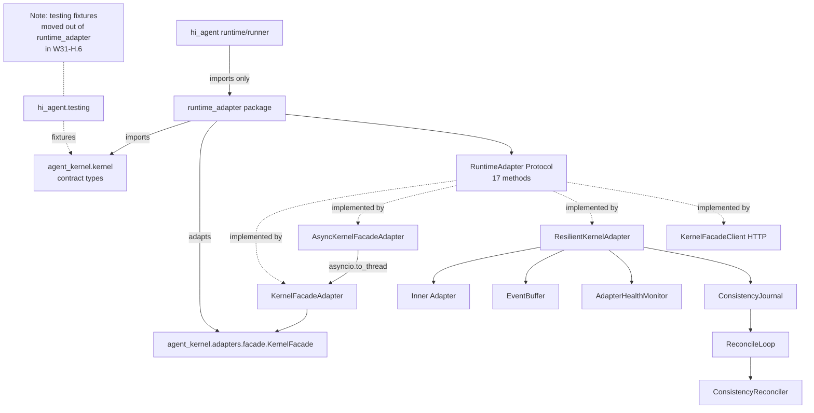
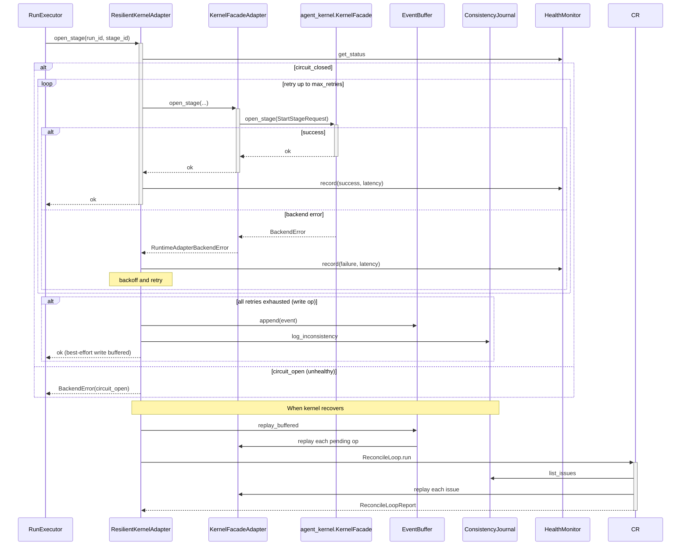

# Runtime Adapter Architecture

## 1. Purpose & Position in System

`hi_agent/runtime_adapter/` is the **kernel facade adapter spine** — the seam between `hi_agent` (the runtime kernel) and `agent_kernel` (the execution substrate). It is the **one and only** module in `hi_agent` permitted to import from `agent_kernel.kernel`. Every other `hi_agent` module that needs a kernel contract type (e.g. `Action`, `RuntimeEvent`, `TaskAttempt`, `FAILURE_GATE_MAP`) imports it from `hi_agent.runtime_adapter` — never directly from `agent_kernel`.

This rule was enforced architecturally in W31-H.6 after a defect class where `hi_agent.runtime_adapter` was leaking `agent_kernel.testing` fixtures (`InMemoryDedupeStore`, `InMemoryKernelRuntimeEventLog`, `StaticRecoveryGateService`) into production paths. The fixtures were moved to `hi_agent/testing/` so production callers no longer transitively pull in test-only primitives. The `__all__` audit (carryover H-16') is the gate that prevents recurrence.

The package owns three things:
1. **Re-exports** of the kernel contract surface (`FAILURE_GATE_MAP`, `Action`, `RuntimeEvent`, `TaskAttempt`, `SideEffectClass`, `TraceFailureCode`, `ExhaustedPolicy`, `TaskRestartPolicy`).
2. **Adapter implementations** that satisfy the `RuntimeAdapter` Protocol: `KernelFacadeAdapter` (sync), `AsyncKernelFacadeAdapter` (async), `ResilientKernelAdapter` (retry + circuit breaker + buffer + journal), `KernelFacadeClient` (HTTP transport).
3. **Resilience primitives**: `EventBuffer`, `AdapterHealthMonitor`, consistency journal (`InMemoryConsistencyJournal`, `FileBackedConsistencyJournal`), `ReconcileLoop`, `ConsistencyReconciler`.

It does **not** own: stage execution semantics (delegated to `hi_agent/runner.py` + `hi_agent/runtime/harness/`), the agent kernel itself (lives in `agent_kernel/`), or HTTP route handling (delegated to `hi_agent/server/`).

## 2. External Interfaces

**Kernel contract re-exports** (`__init__.py:11`):
```python
from agent_kernel.kernel import (
    FAILURE_GATE_MAP, FAILURE_RECOVERY_MAP,
    Action, ExhaustedPolicy, RuntimeEvent, SideEffectClass,
    TaskAttempt, TaskRestartPolicy, TraceFailureCode,
)
```

**`RuntimeAdapter` Protocol** (`protocol.py:15`) — 17 methods covering:
- Stage lifecycle: `open_stage`, `mark_stage_state`
- Task view: `record_task_view`, `bind_task_view_to_decision`
- Run lifecycle: `start_run`, `query_run`, `cancel_run`, `resume_run`, `signal_run`
- Trace runtime: `query_trace_runtime`, `stream_run_events`
- Branch lifecycle: `open_branch`, `mark_branch_state`
- Approval / gates: see `protocol.py` for the full surface
- `mode` property: `Literal["local-fsm", "http"]`

**Adapter classes** (`__init__.py:70-112` `__all__`):
- `KernelFacadeAdapter(facade)` — wraps `agent_kernel.adapters.facade.KernelFacade` (`kernel_facade_adapter.py:42`)
- `AsyncKernelFacadeAdapter(facade)` — async wrapper over `KernelFacadeAdapter` via `asyncio.to_thread` (`async_kernel_facade_adapter.py:14`)
- `ResilientKernelAdapter(inner, journal, …)` — retry + circuit + buffer + journal (`resilient_kernel_adapter.py:1`)
- `KernelFacadeClient(base_url, …)` — HTTP transport to a remote kernel facade (`kernel_facade_client.py`)
- `create_local_adapter(...)` — factory returning a `KernelRuntime` + `LocalSubstrateConfig` (`kernel_facade_adapter.py`)

**Resilience primitives**:
- `EventBuffer(max_size)` — bounded in-memory replay buffer for write operations that fail (`event_buffer.py:21`)
- `AdapterHealthMonitor(window_seconds, …)` — sliding window error-rate + latency tracker (`health.py:20`)
- `InMemoryConsistencyJournal`, `FileBackedConsistencyJournal` (`consistency.py`)
- `ConsistencyReconciler` + `ReconcileLoop` (`reconciler.py`, `reconcile_loop.py`)
- `EventSummaryStore` + `summarize_runtime_events` (`event_summary_store.py`, `event_stream_summary.py`)

**Health checks**: `SubstrateHealthChecker`, `TemporalConnectionHealthCheck`, `check_temporal_connection` (`temporal_health.py`).

**Errors**: `RuntimeAdapterError`, `RuntimeAdapterBackendError`, `IllegalStateTransitionError` (`errors.py`).

## 3. Internal Components



| Component | File | Responsibility |
|---|---|---|
| `RuntimeAdapter` Protocol | `protocol.py:15` | The 17-method behavioural contract. |
| `KernelFacadeAdapter` | `kernel_facade_adapter.py:42` | Forwards Protocol calls to a real `KernelFacade` instance; constructs typed request DTOs. |
| `AsyncKernelFacadeAdapter` | `async_kernel_facade_adapter.py:14` | Wraps the sync adapter for asyncio contexts via `asyncio.to_thread`. |
| `ResilientKernelAdapter` | `resilient_kernel_adapter.py:1` | Adds retry-with-backoff, circuit breaker, event buffer for failed writes, consistency journal, health monitoring. |
| `KernelFacadeClient` | `kernel_facade_client.py` | HTTP transport to a remote `agent_server`-hosted kernel facade. |
| `EventBuffer` | `event_buffer.py:21` | Bounded `deque` of pending writes; thread-safe; counter `hi_agent_event_buffer_overflow_total`. |
| `AdapterHealthMonitor` | `health.py:20` | Sliding-window error rate + latency p50/p95; emits status `ok`/`degraded`/`unhealthy`. |
| `ConsistencyJournal` | `consistency.py` | Append-only ledger of writes that committed locally but failed on the backend. |
| `ConsistencyReconciler` | `reconciler.py` | Replays journal entries against the backend until clean. |
| `ReconcileLoop` | `reconcile_loop.py:37` | Multi-round driver with retry / backoff / dead-letter accounting. |
| `EventSummaryStore` | `event_summary_store.py` | Aggregated runtime event history queryable by run_id. |
| `SubstrateHealthChecker` | `temporal_health.py` | Probes Temporal substrate connectivity. |

## 4. Data Flow



The Protocol is intentionally narrow (17 methods) so the adapter layer stays thin. The resilience features compose: production deployments use `ResilientKernelAdapter(KernelFacadeAdapter(facade), journal=FileBackedConsistencyJournal(...))`. In-process tests typically use `KernelFacadeAdapter` directly.

## 5. State & Persistence

| State | Storage | Lifetime |
|---|---|---|
| `EventBuffer._events` | In-memory `deque(max_size)` | Process; drained by `replay_buffered` on recovery |
| `AdapterHealthMonitor._records` | In-memory `deque` filtered by `window_seconds` | Process; sliding window |
| `InMemoryConsistencyJournal._issues` | In-memory list | Process |
| `FileBackedConsistencyJournal` | JSONL file | Persistent across restarts |
| `EventSummaryStore` | SQLite (per-run) | Persistent |
| `KernelFacadeAdapter._current_run_id` | In-memory string | Per-adapter instance; tracks active run |

## 6. Concurrency & Lifecycle

`KernelFacadeAdapter` is constructed once per `AgentServer` (lazy — built on first run via `SystemBuilder._kernel`). `AsyncKernelFacadeAdapter` wraps it; sync calls forward through `asyncio.to_thread` so they do not block the calling event loop.

`ResilientKernelAdapter` adds:
- **Retry loop** with exponential backoff (`max_retries`, `backoff_base`, `backoff_factor`).
- **Circuit breaker** keyed off `AdapterHealthMonitor.get_status()`. Status `unhealthy` → fail-fast for `unhealthy_error_rate` window.
- **Write-op buffering**: when retries exhausted, the operation is appended to `EventBuffer` and journal; the call returns successfully (best-effort durability) so the caller continues.
- **Replay**: `replay_buffered()` (called by recovery code on kernel recovery) drains the buffer through the inner adapter.

Locks: `EventBuffer` uses `threading.Lock` (`event_buffer.py`), `AdapterHealthMonitor` uses lock-protected sliding deque, `ConsistencyJournal` impls are thread-safe.

**Adapter consolidation per W31 H-track __all__ audit (carryover H-16')**: `runtime_adapter/__init__.py` `__all__` is the single canonical export set. Adding a new adapter or contract type requires:
1. Implement under `hi_agent/runtime_adapter/<name>.py`.
2. Re-export in `__init__.py`.
3. Add to `__all__` (alphabetised).
4. Confirm the contract type re-export comes from `agent_kernel.kernel`, never from `agent_kernel.testing`.

## 7. Error Handling & Observability

**Errors** (`errors.py`):
- `RuntimeAdapterError` — base class.
- `RuntimeAdapterBackendError` — wraps any kernel-side exception uniformly.
- `IllegalStateTransitionError` — raised when callers attempt invalid state transitions.

**Counters**:
- `hi_agent_event_buffer_overflow_total` — incremented when `EventBuffer.append` evicts an event due to capacity (`event_buffer.py:18`).
- `hi_agent_kernel_adapter_*` family — emitted by `ResilientKernelAdapter` per attempt outcome.

**Logs**: `ResilientKernelAdapter` emits WARNING on retry, ERROR on circuit transitions, INFO on replay completion. `EventBuffer` logs WARNING on overflow.

**Health surface**: `/health.subsystems.kernel_adapter` (in `hi_agent/server/app.py:257`) reads `kernel.get_health()` and `kernel.get_buffer_size()` — both come from `ResilientKernelAdapter` when the adapter is wrapped.

## 8. Security Boundary — Runtime Layering Rule

**Binding rule (W31)**:

```
hi_agent code → hi_agent.runtime_adapter → agent_kernel.kernel
                  (re-exports)             (contract types)
```

- **No** other `hi_agent` module imports from `agent_kernel.*`. `hi_agent.runner`, `hi_agent.execution.*`, `hi_agent.runtime.harness.*`, etc. all import their kernel types from `hi_agent.runtime_adapter`.
- **No** production code under `hi_agent/runtime_adapter/` imports from `agent_kernel.testing`. Test fixtures (`InMemoryDedupeStore`, `InMemoryKernelRuntimeEventLog`, `StaticRecoveryGateService`) live under `hi_agent/testing/` and are imported only by test code.

This layering rule is the security boundary because `agent_kernel.kernel` is the substrate on which Temporal workflows and durable state machines run. Bypassing the adapter layer means code can construct kernel objects without going through the contract types validated at this seam — which historically masked tenant-scope leaks and lifecycle violations.

**Enforcement**: import-graph audit in CI; manual review of any PR touching `runtime_adapter/__init__.py` `__all__`.

## 9. Extension Points

- **New kernel contract type**: add the import to `__init__.py:11`; add to `__all__`; downstream `hi_agent` modules import via `from hi_agent.runtime_adapter import <Name>`.
- **New adapter implementation**: subclass / compose with `RuntimeAdapter` Protocol; export under `runtime_adapter/<file>.py`; re-export in `__init__.py`.
- **New resilience primitive**: implement under `runtime_adapter/<file>.py`; if it operates on Protocol types, follow the same import-via-package rule.
- **Custom journal backend**: implement the `ConsistencyJournal` interface (`consistency.py`); pass to `ResilientKernelAdapter(journal=…)`.
- **Health probe extension**: add `_CallRecord` field; extend `AdapterHealthMonitor.get_health()`.

## 10. Constraints & Trade-offs

- **`KernelFacadeAdapter` requires a real `KernelFacade`** — the constructor (`kernel_facade_adapter.py:65`) does an `isinstance` check; no duck-typed substitutes. This protects against test-doubles leaking into production paths but means tests must use the real facade or `create_local_adapter()`.
- **`ResilientKernelAdapter` write-op buffering trades latency for durability** — failed writes return `ok` to the caller while the operation queues in the buffer. The caller cannot tell whether the operation reached the kernel. Reconciliation via `ReconcileLoop` handles consistency drift; the journal is the audit trail.
- **`AsyncKernelFacadeAdapter` adds a thread hop per call** (`asyncio.to_thread`) — fine for facade RPC latencies but not suitable for tight inner loops. For high-frequency operations, structure the calling code as sync-on-bridge instead of async-on-adapter.
- **Re-exports stale on `agent_kernel` schema drift** — every change to `agent_kernel.kernel.contracts` must be checked against the `__init__.py:11` import list. CI imports the module, so a missing symbol fails fast, but renames go silent.
- **No HTTP-side multiplexing in `KernelFacadeClient`** — one client per adapter; for multi-region deployments use multiple `ResilientKernelAdapter` instances behind a routing layer.
- **W31 carryover items**: H-1' (test fixture relocation — done), H-16' (`__all__` audit — verify policy, ongoing). See `docs/rules-incident-log.md` for narrative.

## 11. References

- `hi_agent/runtime_adapter/__init__.py` — re-exports + `__all__`
- `hi_agent/runtime_adapter/protocol.py` — `RuntimeAdapter` (17 methods)
- `hi_agent/runtime_adapter/kernel_facade_adapter.py` — sync adapter
- `hi_agent/runtime_adapter/async_kernel_facade_adapter.py` — async wrapper
- `hi_agent/runtime_adapter/resilient_kernel_adapter.py` — resilience composition
- `hi_agent/runtime_adapter/kernel_facade_client.py` — HTTP transport
- `hi_agent/runtime_adapter/event_buffer.py`, `health.py`, `consistency.py`, `reconciler.py`, `reconcile_loop.py` — resilience primitives
- `hi_agent/runtime_adapter/event_summary_store.py`, `event_stream_summary.py`, `event_summary_commands.py` — event aggregation
- `hi_agent/runtime_adapter/temporal_health.py` — substrate health
- `hi_agent/runtime_adapter/errors.py` — typed errors
- `hi_agent/RUNTIME-LAYERS.md` — runtime/runtime_adapter split rule (this is the source of truth)
- `hi_agent/testing/` — test fixtures relocated from runtime_adapter (W31-H.6)
- CLAUDE.md "Narrow-Trigger Rules" — `kernel_facade_client.py` requires side-by-side path/method table
- `docs/rules-incident-log.md` — W31 H-1', H-16' incident records
