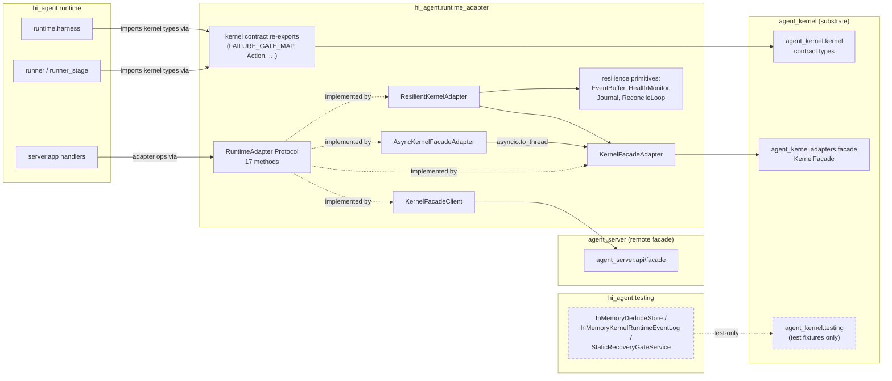
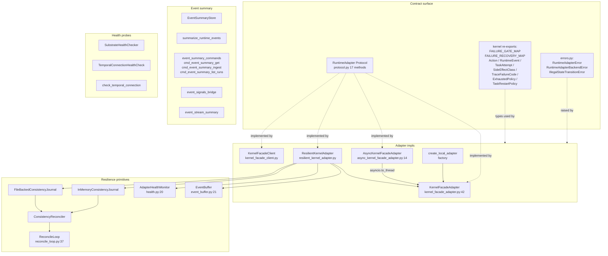

# Runtime Adapter — Architecture

> **Last refreshed:** 2026-05-06 (W35 corrective close + W36 plans). HEAD `276917d8`.
> **Audience:** platform engineers + observability operators.
> **Status:** authoritative.

## 1. Purpose & Responsibilities

`hi_agent/runtime_adapter/` is the **kernel facade adapter spine** — the seam between `hi_agent` (the runtime kernel) and `agent_kernel` (the execution substrate). It is the **one and only** module in `hi_agent` permitted to import from `agent_kernel.kernel`. Every other `hi_agent` module that needs a kernel contract type (`Action`, `RuntimeEvent`, `TaskAttempt`, `FAILURE_GATE_MAP`, …) imports it from `hi_agent.runtime_adapter` — never directly from `agent_kernel`.

This rule was enforced architecturally in W31-H.6 after a defect class where `hi_agent.runtime_adapter` was leaking `agent_kernel.testing` fixtures (`InMemoryDedupeStore`, `InMemoryKernelRuntimeEventLog`, `StaticRecoveryGateService`) into production paths. The fixtures were moved to `hi_agent/testing/` so production callers no longer transitively pull in test-only primitives. The `__all__` audit (carryover H-16') is the gate that prevents recurrence.

The package owns three things:

1. **Re-exports** of the kernel contract surface (`FAILURE_GATE_MAP`, `FAILURE_RECOVERY_MAP`, `Action`, `RuntimeEvent`, `TaskAttempt`, `SideEffectClass`, `TraceFailureCode`, `ExhaustedPolicy`, `TaskRestartPolicy`).
2. **Adapter implementations** that satisfy the `RuntimeAdapter` Protocol: `KernelFacadeAdapter` (sync), `AsyncKernelFacadeAdapter` (async), `ResilientKernelAdapter` (retry + circuit + buffer + journal), `KernelFacadeClient` (HTTP transport).
3. **Resilience primitives**: `EventBuffer`, `AdapterHealthMonitor`, consistency journal (`InMemoryConsistencyJournal`, `FileBackedConsistencyJournal`), `ReconcileLoop`, `ConsistencyReconciler`, `EventSummaryStore`, `summarize_runtime_events`, `SubstrateHealthChecker`, `TemporalConnectionHealthCheck`.

It does **not** own: stage execution semantics (delegated to `hi_agent/runner.py` + `hi_agent/runtime/harness/`), the agent kernel itself (lives in `agent_kernel/`), or HTTP route handling (delegated to `hi_agent/server/` and `agent_server/api/`).

`__init__.py` annotates each `__all__` entry with `# scope: public-contract` or `# scope: process-internal` (added W32-D D.5; annotation-only).

## 2. Context & Scope


```mermaid
flowchart LR
    subgraph HiAgent["hi_agent runtime"]
        Runner[runner / runner_stage]
        Harness[runtime.harness]
        Server[server.app handlers]
    end

    subgraph RA["hi_agent.runtime_adapter"]
        ProtoSurf[RuntimeAdapter Protocol<br/>17 methods]
        Reexport["kernel contract re-exports<br/>(FAILURE_GATE_MAP, Action, …)"]
        Sync[KernelFacadeAdapter]
        Async[AsyncKernelFacadeAdapter]
        Resil[ResilientKernelAdapter]
        HTTP[KernelFacadeClient]
        Resilience["resilience primitives:<br/>EventBuffer, HealthMonitor,<br/>Journal, ReconcileLoop"]
    end

    subgraph AK["agent_kernel (substrate)"]
        Contracts[agent_kernel.kernel<br/>contract types]
        Facade[agent_kernel.adapters.facade<br/>KernelFacade]
        TestFix["agent_kernel.testing<br/>(test fixtures only)"]
    end

    subgraph AS["agent_server (remote facade)"]
        ASRoute[agent_server.api/facade]
    end

    subgraph Testing["hi_agent.testing"]
        Fix[InMemoryDedupeStore /<br/>InMemoryKernelRuntimeEventLog /<br/>StaticRecoveryGateService]
    end

    Runner -->|imports kernel types via| Reexport
    Harness -->|imports kernel types via| Reexport
    Server -->|adapter ops via| ProtoSurf

    ProtoSurf -.implemented by.-> Sync
    ProtoSurf -.implemented by.-> Async
    ProtoSurf -.implemented by.-> Resil
    ProtoSurf -.implemented by.-> HTTP

    Sync --> Facade
    Async -->|asyncio.to_thread| Sync
    Resil --> Sync
    Resil --> Resilience
    HTTP --> ASRoute

    Reexport --> Contracts

    Fix -.test-only.-> TestFix

    style TestFix stroke-dasharray: 5 5
    style Fix stroke-dasharray: 5 5
```

Boundaries:

- **Inbound**: `RuntimeAdapter` Protocol method calls from `hi_agent/runner.py`, `runtime/harness/`, `server/run_executor.py`, `server/run_manager.py`.
- **Outbound (in-process)**: `agent_kernel.adapters.facade.KernelFacade` for the local FSM substrate.
- **Outbound (HTTP)**: `agent_server`-hosted kernel facade via `KernelFacadeClient`.
- **Out of scope**: stage execution semantics, capability invocation, persistence of run state.

The adapter `mode` Protocol property is `Literal["local-fsm", "http"]` (`protocol.py:23`) so callers can branch on substrate selection without sniffing types.

## 3. Module Boundary & Dependencies

| External dep | Used by | Why |
|---|---|---|
| `agent_kernel.kernel` (contract types) | `__init__.py:11` | re-export to the rest of `hi_agent`; no other `hi_agent` module is allowed to import from `agent_kernel.*`. |
| `agent_kernel.adapters.facade.KernelFacade` | `kernel_facade_adapter.py` | the local FSM substrate that the sync adapter delegates to. |
| `hi_agent.contracts` | `protocol.py:8` | `StageState` and request DTOs (`ApprovalRequest`, `HumanGateRequest`). |
| `httpx` | `kernel_facade_client.py` | HTTP transport to remote facade (`agent_server`). |
| stdlib (`asyncio`, `threading`, `collections.deque`, `dataclasses`, `time`, `pathlib`, `json`) | resilience primitives | journal serialization; sliding-window deques. |

What this package may **not** import:

- `agent_kernel.testing` — test fixtures must live under `hi_agent/testing/`. Enforced by W31-H.6 + the `__all__` annotation audit.
- `hi_agent.llm` / `hi_agent.observability.fallback` directly from production paths — adapter callers use `record_silent_degradation` if needed but the adapter itself surfaces typed errors.
- `hi_agent.server` — the server consumes the adapter, not the other way round.

What may import this package: `hi_agent.runner`, `hi_agent.runtime.*`, `hi_agent.server.*`, `hi_agent.execution.*`. **Anything that needs a kernel contract type must come through here.**

## 4. Building Blocks


```mermaid
flowchart TB
    subgraph Contract["Contract surface"]
        Proto[RuntimeAdapter Protocol<br/>protocol.py 17 methods]
        Reex["kernel re-exports:<br/>FAILURE_GATE_MAP<br/>FAILURE_RECOVERY_MAP<br/>Action / RuntimeEvent /<br/>TaskAttempt / SideEffectClass /<br/>TraceFailureCode /<br/>ExhaustedPolicy /<br/>TaskRestartPolicy"]
        Errs[errors.py:<br/>RuntimeAdapterError<br/>RuntimeAdapterBackendError<br/>IllegalStateTransitionError]
    end

    subgraph Adapters["Adapter impls"]
        SA[KernelFacadeAdapter<br/>kernel_facade_adapter.py:42]
        AA[AsyncKernelFacadeAdapter<br/>async_kernel_facade_adapter.py:14]
        RA[ResilientKernelAdapter<br/>resilient_kernel_adapter.py]
        HA[KernelFacadeClient<br/>kernel_facade_client.py]
        Local[create_local_adapter<br/>factory]
    end

    subgraph Resilience["Resilience primitives"]
        EB[EventBuffer<br/>event_buffer.py:21]
        HM[AdapterHealthMonitor<br/>health.py:20]
        IMJ[InMemoryConsistencyJournal]
        FBJ[FileBackedConsistencyJournal]
        CR[ConsistencyReconciler]
        RL[ReconcileLoop<br/>reconcile_loop.py:37]
    end

    subgraph EvtSum["Event summary"]
        ESS[EventSummaryStore]
        SRE[summarize_runtime_events]
        ESC["event_summary_commands<br/>cmd_event_summary_get<br/>cmd_event_summary_ingest<br/>cmd_event_summary_list_runs"]
        ESB[event_signals_bridge]
        ESS2[event_stream_summary]
    end

    subgraph Health["Health probes"]
        SHC[SubstrateHealthChecker]
        TCH[TemporalConnectionHealthCheck]
        TCheck[check_temporal_connection]
    end

    Proto -.implemented by.-> SA
    Proto -.implemented by.-> AA
    Proto -.implemented by.-> RA
    Proto -.implemented by.-> HA

    AA -->|asyncio.to_thread| SA
    RA --> SA
    RA --> EB
    RA --> HM
    RA --> IMJ
    RA --> FBJ

    IMJ --> CR
    FBJ --> CR
    CR --> RL

    Local --> SA

    Reex -.types used by.-> Adapters
    Errs -.raised by.-> Adapters
```

| Component | File | Responsibility |
|---|---|---|
| `RuntimeAdapter` Protocol | `protocol.py:15` | The 17-method behavioural contract: stage lifecycle (`open_stage`, `mark_stage_state`); task view (`record_task_view`, `bind_task_view_to_decision`); run lifecycle (`start_run`, `query_run`, `cancel_run`, `resume_run`, `signal_run`); trace runtime (`query_trace_runtime`, `stream_run_events`); branch lifecycle (`open_branch`, `mark_branch_state`); approval / gates; `mode` property `Literal["local-fsm", "http"]`. |
| `KernelFacadeAdapter` | `kernel_facade_adapter.py:42` | Forwards Protocol calls to a real `KernelFacade` instance; constructs typed request DTOs; constructor `isinstance` check rejects duck-typed substitutes. |
| `AsyncKernelFacadeAdapter` | `async_kernel_facade_adapter.py:14` | Wraps the sync adapter for asyncio contexts via `asyncio.to_thread`. |
| `ResilientKernelAdapter` | `resilient_kernel_adapter.py` | Adds retry-with-backoff, circuit breaker, event buffer for failed writes, consistency journal, health monitoring. |
| `KernelFacadeClient` | `kernel_facade_client.py` | HTTP transport to a remote `agent_server`-hosted kernel facade. CLAUDE.md narrow-trigger rule: any change must include a side-by-side client↔server path/method table. |
| `create_local_adapter` | `kernel_facade_adapter.py` | Factory returning a `KernelRuntime` + `LocalSubstrateConfig` for in-process tests and dev. |
| `EventBuffer` | `event_buffer.py:21` | Bounded `deque(max_size)` of pending writes; `threading.Lock`; counter `hi_agent_event_buffer_overflow_total`. |
| `AdapterHealthMonitor` | `health.py:20` | Sliding-window error-rate + latency p50/p95; emits `ok` / `degraded` / `unhealthy`. |
| `InMemoryConsistencyJournal` / `FileBackedConsistencyJournal` | `consistency.py` | Append-only ledger of writes that committed locally but failed on the backend. JSONL persistence for the file-backed variant. |
| `ConsistencyReconciler` | `reconciler.py` | Replays journal entries against the backend until clean; returns `ConsistencyReconcileReport`, `ConsistencyIssueStatus`. |
| `ReconcileLoop` | `reconcile_loop.py:37` | Multi-round driver with retry / backoff / dead-letter accounting; `ReconcileLoopReport`. |
| `EventSummaryStore` | `event_summary_store.py` | Aggregated runtime event history queryable by `run_id`. |
| `summarize_runtime_events` | `event_stream_summary.py` | Reduces a stream of `RuntimeEvent` to a compact dict. |
| `cmd_event_summary_*` | `event_summary_commands.py` | CLI command handlers for event summary subcommands. |
| `event_signals_bridge` | `event_signals_bridge.py` | Bridges kernel signals into the runtime adapter event stream. |
| `SubstrateHealthChecker` / `TemporalConnectionHealthCheck` / `check_temporal_connection` | `temporal_health.py` | Probes Temporal substrate connectivity. |
| `RuntimeAdapterError` / `RuntimeAdapterBackendError` / `IllegalStateTransitionError` | `errors.py` | Typed errors. |

## 5. Runtime View — Key Scenarios

### 5.1 Resilient `open_stage` write with retry, buffer, and journal

```mermaid
sequenceDiagram
    participant RE as RunExecutor
    participant RKA as ResilientKernelAdapter
    participant HM as AdapterHealthMonitor
    participant Inner as KernelFacadeAdapter
    participant Facade as agent_kernel.KernelFacade
    participant EB as EventBuffer
    participant CJ as ConsistencyJournal
    participant CR as ConsistencyReconciler

    RE->>+RKA: open_stage(run_id, stage_id)
    RKA->>HM: get_status

    alt circuit_closed (ok / degraded)
        loop retry up to max_retries
            RKA->>+Inner: open_stage(...)
            Inner->>+Facade: open_stage(StartStageRequest)
            alt success
                Facade-->>-Inner: ok
                Inner-->>-RKA: ok
                RKA->>HM: record(success, latency)
                RKA-->>-RE: ok
            else backend error
                Facade-->>Inner: BackendError
                Inner-->>RKA: RuntimeAdapterBackendError
                RKA->>HM: record(failure, latency)
                Note over RKA: exponential backoff;<br/>retry next attempt
            end
        end
        alt all retries exhausted (write op)
            RKA->>EB: append(event)
            RKA->>CJ: log_inconsistency
            RKA-->>RE: ok (best-effort write buffered)
            Note over RKA,RE: caller continues; durability<br/>handled by reconciler later
        end
    else circuit_open (unhealthy)
        RKA-->>RE: RuntimeAdapterBackendError(circuit_open)
    end

    Note over RKA,CR: Later, when kernel recovers
    RKA->>EB: replay_buffered
    EB->>Inner: replay each pending op
    RKA->>+CR: ReconcileLoop.run
    CR->>CJ: list_issues
    CR->>Inner: replay each issue
    CR-->>-RKA: ReconcileLoopReport
```

The Protocol is intentionally narrow (17 methods) so the adapter layer stays thin. The resilience features compose: production deployments use `ResilientKernelAdapter(KernelFacadeAdapter(facade), journal=FileBackedConsistencyJournal(...))`. In-process tests typically use `KernelFacadeAdapter` directly via `create_local_adapter`.

The `AsyncKernelFacadeAdapter` adds a thread hop per call (`asyncio.to_thread`) — fine for facade RPC latencies but not suitable for tight inner loops. For high-frequency operations, structure the calling code as sync-on-bridge instead of async-on-adapter.

## 6. Cross-cutting Concerns

### 6.1 Runtime layering rule (W31 binding)

```
hi_agent code → hi_agent.runtime_adapter → agent_kernel.kernel
                  (re-exports)             (contract types)
```

- **No** other `hi_agent` module imports from `agent_kernel.*`. `hi_agent.runner`, `hi_agent.execution.*`, `hi_agent.runtime.harness.*`, etc. all import their kernel types from `hi_agent.runtime_adapter`.
- **No** production code under `hi_agent/runtime_adapter/` imports from `agent_kernel.testing`. Test fixtures live under `hi_agent/testing/`.

This layering rule is the security boundary because `agent_kernel.kernel` is the substrate on which Temporal workflows and durable state machines run. Bypassing the adapter layer means code can construct kernel objects without going through the contract types validated at this seam — which historically masked tenant-scope leaks and lifecycle violations.

**Enforcement**: import-graph audit in CI; manual review of any PR touching `runtime_adapter/__init__.py` `__all__`.

### 6.2 Rule 6 — single construction path per resource class

`KernelFacadeAdapter` is constructed once per `AgentServer` (lazy — built on first run via `SystemBuilder._kernel`). `AsyncKernelFacadeAdapter` wraps it. `ResilientKernelAdapter` composes them: `ResilientKernelAdapter(KernelFacadeAdapter(facade), journal=…)`.

There is no `x or DefaultKernelAdapter()` inline-fallback shape anywhere in this package. The `KernelFacadeAdapter` constructor (`kernel_facade_adapter.py:65`) does an explicit `isinstance` check on the facade argument; passing `None` raises immediately rather than silently constructing a stub. This is the canonical Rule 6 shape.

Adding a new adapter requires:

1. Implement under `hi_agent/runtime_adapter/<name>.py`.
2. Re-export in `__init__.py`.
3. Add to `__all__` (alphabetised) with the appropriate scope annotation.
4. Confirm the contract type re-export comes from `agent_kernel.kernel`, never from `agent_kernel.testing`.

### 6.3 Rule 7 — silent-degradation surface

The adapter raises rather than swallows. The two intentional silent-degradation points:

- **`EventBuffer` overflow** — increments `hi_agent_event_buffer_overflow_total` (`event_buffer.py:18`) and logs WARNING.
- **`ResilientKernelAdapter` write-op buffering** — when retries are exhausted on a write op, the operation is appended to `EventBuffer` and the journal; the call returns `ok` to preserve liveness. The journal is the audit trail; `ReconcileLoop` is the eventual-consistency mechanism.

Other counters: `hi_agent_kernel_adapter_*` family from `ResilientKernelAdapter` per attempt outcome; `AdapterHealthMonitor` exposes status via `get_status()` to the `/health.subsystems.kernel_adapter` probe (`hi_agent/server/app.py:257`).

### 6.4 Concurrency

| Component | Concurrency model |
|---|---|
| `KernelFacadeAdapter` | Single-threaded; thread-safety inherited from underlying facade. |
| `AsyncKernelFacadeAdapter` | One thread hop per call via `asyncio.to_thread`. |
| `ResilientKernelAdapter` | Retry loop on calling thread; `EventBuffer` and `AdapterHealthMonitor` lock-protected internally. |
| `EventBuffer` | `threading.Lock` (`event_buffer.py`). |
| `AdapterHealthMonitor` | Lock-protected sliding deque. |
| `ConsistencyJournal` impls | Thread-safe append; file-backed flushes per-write. |

`KernelFacadeAdapter._current_run_id` is per-adapter-instance and tracks the active run; multi-run callers must construct an adapter per run or carefully serialize.

### 6.5 Posture-aware defaults

| Posture | Defaults |
|---|---|
| `dev` | In-memory journal (`InMemoryConsistencyJournal`); EventBuffer `max_size=64`; retry budget low. |
| `research` | File-backed journal (`FileBackedConsistencyJournal`); EventBuffer `max_size=512`; full retry policy. |
| `prod` | File-backed journal mandatory; reconciler enabled; circuit breaker enabled; substrate health probe required for `/health` to return 200. |

Posture is set by `HI_AGENT_POSTURE`. The `check_temporal_connection` probe (`temporal_health.py`) is required to pass under `prod` before the adapter accepts traffic.

## 7. Architecture Decisions

### 7.1 ADR-RA-1 — One seam between hi_agent and agent_kernel (W31-H.6)

`runtime_adapter` is the **only** `hi_agent` module that imports from `agent_kernel.*`. Rationale: every prior tenant-scope leak we have seen originated in code that constructed kernel objects without going through the seam. Centralising the import graph means a single PR diff at `__init__.py:11` catches schema drift on every kernel rev.

**Consequence**: re-exports are stale on `agent_kernel` schema drift — every change to `agent_kernel.kernel.contracts` must be checked against the `__init__.py:11` import list. CI imports the module, so a missing symbol fails fast, but renames go silent. Mitigation: the `__all__` annotation audit (W32-D D.5) flags any unannotated entry.

### 7.2 ADR-RA-2 — Test fixtures relocated to `hi_agent.testing`

Test-only fixtures (`InMemoryDedupeStore`, `InMemoryKernelRuntimeEventLog`, `StaticRecoveryGateService`) used to live under `agent_kernel.testing`. After a 2026-04-04 incident where a production import path transitively pulled them in, they were moved to `hi_agent/testing/` and `runtime_adapter` was forbidden from re-exporting them. The W31-H.6 closure record details the migration.

### 7.3 ADR-RA-3 — `RuntimeAdapter` Protocol stays narrow at 17 methods

Rule 2 (simplicity). Every method on the Protocol corresponds to a kernel-side state transition or query that hi_agent runner actually invokes. Adding a new method is a contract-version-bump event.

### 7.4 ADR-RA-4 — `ResilientKernelAdapter` write-op buffering trades latency for durability

When retries are exhausted on a write, the adapter appends to `EventBuffer` and the journal, then returns `ok` to the caller. Rationale: the kernel facade's typical failure modes (Temporal connection blip, leader election) are transient on minute timescales; failing the write to the caller would surface a Temporal-internal hiccup as a user-visible error. The reconciler closes the loop on durability.

**Consequence**: the caller cannot tell whether the operation reached the kernel. The journal is the audit trail. For operations where this trade-off is unacceptable, callers must use the bare `KernelFacadeAdapter` instead.

### 7.5 ADR-RA-5 — Consolidation with `agent_server.runtime` is W37+ work

`agent_server` (the northbound facade) introduced its own runtime kernel binding for the v1 contract (`agent_server/api/`, `agent_server/facade/`). At HEAD `276917d8` both paths coexist:

- **Legacy / kernel-substrate path**: `hi_agent.runner` → `runtime_adapter` → `agent_kernel.adapters.facade.KernelFacade`. Used by all `hi_agent`-internal callers.
- **Northbound path**: `agent_server.api.routes_*` → `agent_server.facade.*` → `runtime_adapter.KernelFacadeClient` → remote `agent_server`-hosted facade. Used by the v1 northbound contract.

Consolidation (collapsing the two paths into a single binding) is W37+ work. The narrow-trigger rule on `kernel_facade_client.py` (CLAUDE.md "Narrow-Trigger Rules") requires every change to that file to ship with a side-by-side client↔server path/method table; this is the gate that prevents drift while the two paths coexist.

## 8. Quality Attributes

| Attribute | Target | How achieved | Evidence |
|---|---|---|---|
| Single source of kernel types | every `hi_agent` consumer goes through `runtime_adapter` | enforced import-graph; PR review on `__all__` | CI; `__init__.py:11` |
| Backend transient resilience | retries + circuit + write buffering | `ResilientKernelAdapter` composition | `tests/integration/test_resilient_kernel_adapter.py` |
| Eventual consistency | failed writes drained by reconciler | `ReconcileLoop` + `ConsistencyReconciler` | `tests/integration/test_reconcile_loop.py` |
| Substrate health probe | `prod` adapter rejects traffic until substrate healthy | `check_temporal_connection` + `/health.subsystems.kernel_adapter` | `hi_agent/server/app.py:257` |
| Test fixture isolation | no test code under `runtime_adapter/` | W31-H.6 relocation | W31 closure record |
| Schema drift fails fast | import-time symbol check | `__init__.py:11` direct imports | CI module-import smoke |
| Contract surface stability | 17 Protocol methods; no kwargs on hot path | `protocol.py` review on every PR | git log on `protocol.py` |

## 9. Risks & Technical Debt

| Risk / debt | Severity | Tracking |
|---|---|---|
| **Dual paths still wired**: `runtime_adapter` (legacy) and `agent_server.runtime` (northbound v1) both exist at HEAD. Consolidation is W37+ work; until then, every change to `kernel_facade_client.py` requires a side-by-side path/method table. | medium | CLAUDE.md narrow-trigger rule; W37 consolidation roadmap. |
| **Re-exports stale on `agent_kernel` schema drift**: a renamed kernel symbol fails fast (import error), but a renamed *field* on a kernel dataclass is silent until an integration test runs. | medium | per-rev review of `agent_kernel.kernel.contracts`; integration smoke catches most. |
| **`ResilientKernelAdapter` write-op buffering returns `ok` to the caller** even when the kernel never received the write. Reconciliation closes the loop, but a caller that needs synchronous durability must use the bare `KernelFacadeAdapter`. | medium | documented; covered by ADR-RA-4. |
| **`AsyncKernelFacadeAdapter` thread hop per call**: `asyncio.to_thread` adds ~50-100 µs per op. Fine for facade RPC latencies (typical 1-50 ms) but unsuitable for tight inner loops. | low | accepted; alternative path is sync-on-bridge. |
| **No HTTP-side multiplexing in `KernelFacadeClient`**: one client per adapter; for multi-region deployments use multiple `ResilientKernelAdapter` instances behind a routing layer. | low | accepted; multi-region is not on roadmap. |
| **`KernelFacadeAdapter._current_run_id` is per-adapter-instance**: multi-run callers must construct an adapter per run or carefully serialize. | low | per-call-site review; default factory is per-run. |
| **W31 carryover items**: H-1' (test fixture relocation — done), H-16' (`__all__` audit — verify policy, ongoing). See `docs/rules-incident-log.md`. | low | tracked; H-16' is annotation-only and verified per PR. |
| **No `tenant_id` field on `RuntimeAdapter` Protocol method signatures** — tenant scope flows via the kernel-side request DTOs and the facade's tenant context. A bug at this seam could leak across tenants. | low | covered by `agent_kernel.kernel`-side checks; integration tests assert per-tenant isolation. |

## 10. References

- `hi_agent/runtime_adapter/__init__.py` — re-exports + scope-annotated `__all__`
- `hi_agent/runtime_adapter/protocol.py` — `RuntimeAdapter` Protocol (17 methods); `mode` property at line 23
- `hi_agent/runtime_adapter/kernel_facade_adapter.py` — sync adapter (line 42); `create_local_adapter` factory
- `hi_agent/runtime_adapter/async_kernel_facade_adapter.py` — async wrapper (line 14)
- `hi_agent/runtime_adapter/resilient_kernel_adapter.py` — resilience composition
- `hi_agent/runtime_adapter/kernel_facade_client.py` — HTTP transport
- `hi_agent/runtime_adapter/event_buffer.py` — `EventBuffer` (line 21)
- `hi_agent/runtime_adapter/health.py` — `AdapterHealthMonitor` (line 20)
- `hi_agent/runtime_adapter/consistency.py` — journal impls
- `hi_agent/runtime_adapter/reconciler.py` — `ConsistencyReconciler`, `ConsistencyReconcileReport`, `ConsistencyIssueStatus`
- `hi_agent/runtime_adapter/reconcile_loop.py` — `ReconcileLoop` (line 37), `ReconcileLoopReport`
- `hi_agent/runtime_adapter/event_summary_store.py` / `event_stream_summary.py` / `event_summary_commands.py` / `event_signals_bridge.py` — event aggregation
- `hi_agent/runtime_adapter/temporal_health.py` — substrate health probes
- `hi_agent/runtime_adapter/errors.py` — typed errors
- `hi_agent/RUNTIME-LAYERS.md` — runtime/runtime_adapter split rule (source of truth)
- `hi_agent/testing/` — test fixtures relocated from runtime_adapter (W31-H.6)
- `agent_kernel.kernel` — contract types imported at `__init__.py:11`
- `agent_kernel.adapters.facade.KernelFacade` — local FSM substrate
- `agent_server/api/` + `agent_server/facade/` — northbound v1 path that uses `KernelFacadeClient`
- CLAUDE.md "Narrow-Trigger Rules" — `kernel_facade_client.py` requires side-by-side path/method table on change
- CLAUDE.md Rule 6 (single construction path), Rule 7 (silent-degradation surface)
- `docs/rules-incident-log.md` — W31 H-1', H-16' incident records
