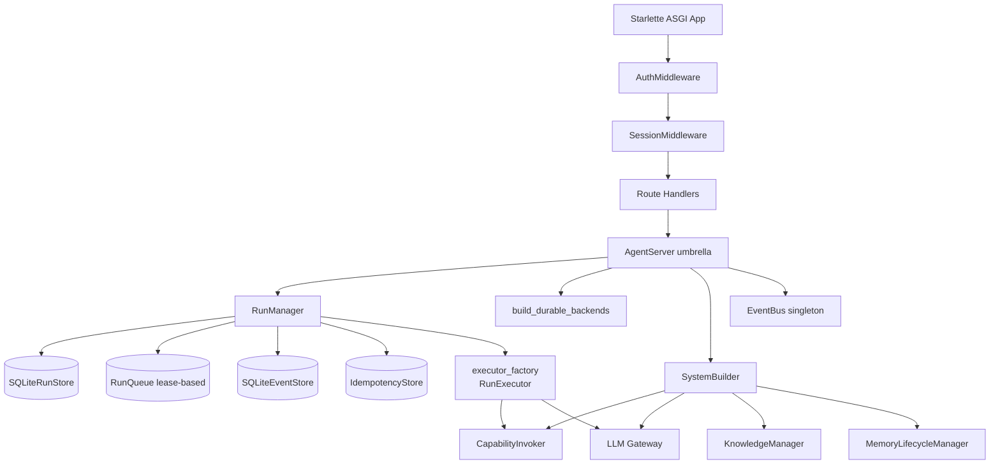
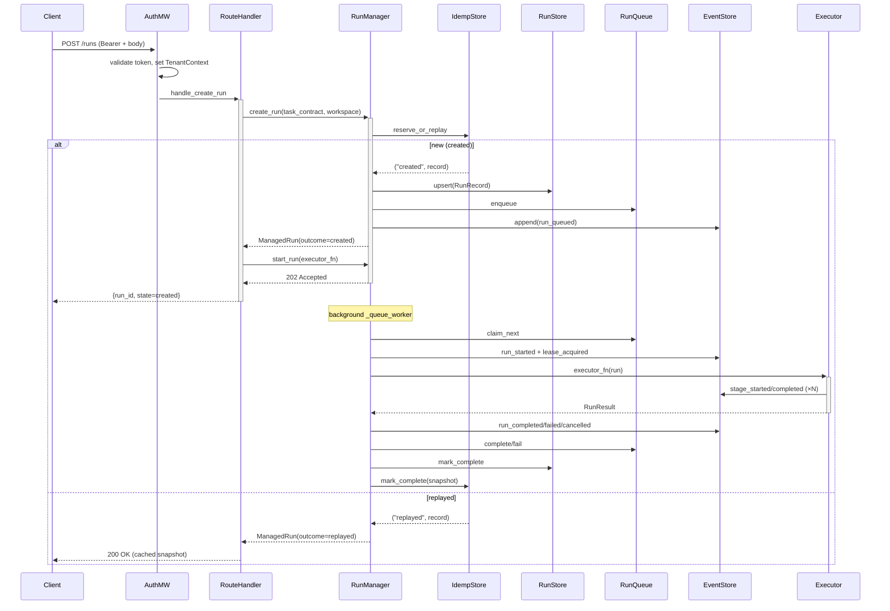

# Server Architecture

## 1. Purpose & Position in System

`hi_agent/server/` is the canonical hi_agent HTTP layer. It owns the run lifecycle (queueing, execution, cancellation, recovery), the durable persistence boundaries (run state, events, idempotency, sessions, team registry), and the Starlette ASGI application that exposes `/runs`, `/health`, `/metrics`, `/manifest`, `/knowledge/*`, `/memory/*`, `/skills/*`, `/tools`, and `/mcp/*` endpoints. The umbrella class is `AgentServer` (`hi_agent/server/app.py:1645`), instantiated once per process and consumed by `agent_server/runtime/kernel_adapter.py`.

This package is being **superseded as the public surface** by `agent_server/`, the versioned northbound facade. New external integrations should target the contract-frozen `agent_server/api/routes_*` paths; `hi_agent/server/` continues to host the runtime kernel under it. The seam is one-directional: `agent_server` depends on `hi_agent.server.app.AgentServer`, never the other way.

It does **not** own: business-agent profiles (those live in `hi_agent/profiles/`), capability execution semantics (delegated to `hi_agent/runtime/harness/` via `CapabilityInvoker`), the kernel facade (delegated to `hi_agent/runtime_adapter/`), or the LLM gateway (delegated to `hi_agent/llm/`).

## 2. External Interfaces

**HTTP endpoints** (declared in `hi_agent/server/app.py:1344` `build_app`):

- `POST /runs`, `GET /runs/{run_id}`, `GET /runs`, `POST /runs/{run_id}/cancel`, `POST /runs/{run_id}/signal`, `POST /runs/{run_id}/resume`, `POST /runs/{run_id}/feedback`, `GET /runs/{run_id}/events` (SSE)
- `GET /health` (`app.py:127`), `GET /ready` (`app.py:304`)
- `GET /metrics` (Prometheus), `GET /metrics/json`, `GET /cost`
- `POST /knowledge/ingest`, `GET /knowledge/query`, `POST /memory/dream`, `GET /memory/status`
- `GET /skills/list`, `POST /skills/evolve`, `GET /skills/{id}/metrics`
- `POST /tools/call`, `POST /mcp/tools/call`, `POST /mcp/tools/list`
- `GET /manifest`, `GET /context/health`, `GET /management/capacity`

**Programmatic surface** (`hi_agent/server/__init__.py`):

- `AgentServer(host, port, config, rate_limit_rps, profile_registry)`
- `RunManager(max_concurrent, queue_size, idempotency_store, run_store, run_queue, event_store, postmortem_engine)`
- `ManagedRun` dataclass — fields include `run_id`, `tenant_id`, `state`, `result`, `current_stage`, `started_at`, `finished_at`, `idempotency_key`, `outcome`, `trace_id` (`run_manager.py:68`)
- `build_app(agent_server)` — returns the configured Starlette app

**Persistence contracts**: `RunRecord` (`run_store.py:21`), `StoredEvent` (`event_store.py:20`), `IdempotencyRecord` (`idempotency.py:23`), `TeamRun` (from `hi_agent.contracts.team_runtime`), session records.

## 3. Internal Components

| Component | File | Responsibility |
|---|---|---|
| `AgentServer` | `app.py:1645` | Umbrella holder for all subsystems; owns `_builder`, `_config_stack`, durable backends, RunManager. |
| `RunManager` | `run_manager.py:100` | Thread-safe run lifecycle: create_run → enqueue → dispatch → terminal. Lease heartbeat on durable path. |
| `SQLiteRunStore` | `run_store.py:41` | Durable run records (status, priority, attempts, results). WAL mode + threading.Lock. |
| `RunQueue` | `run_queue.py:53` | Lease-based durable queue with claim_next / heartbeat / complete / fail / dead_letter. |
| `SQLiteEventStore` | `event_store.py:58` | Per-run event ledger; backs SSE replay via `Last-Event-ID`. |
| `IdempotencyStore` | `idempotency.py:48` | Deduplicates submissions by idempotency_key; reserve_or_replay returns "created"/"replayed"/"conflict". |
| `TeamRunRegistry` | `team_run_registry.py:48` | SQLite registry of active team runs (durable under research/prod). |
| `AuthMiddleware` | `auth_middleware.py:96` | API-key + JWT validation; RBAC; populates `TenantContext` ContextVar. |
| `EventBus` | `event_bus.py` | Sync/async observer fan-out; persists via injected event_store. |
| `_rehydrate_runs` | `app.py:1196` | On lifespan startup: re-enqueues lease-expired runs per posture. |

## 4. Data Flow

`create_run` (`run_manager.py:344`) enforces tenant_id under research/prod posture; falls back to `default` only under dev with a WARNING (T-12'). The durable execution path (`_execute_run_durable`, `run_manager.py:792`) starts a daemon heartbeat thread that renews the queue lease at `lease_heartbeat_interval_seconds` and transitions to `lease_lost` + DLQ if renewal is denied.

## 5. State & Persistence

| Store | Backend | Lifetime | Schema |
|---|---|---|---|
| `SQLiteRunStore` | SQLite WAL @ `HI_AGENT_DATA_DIR/runs.db` | Process-durable | `run_records(run_id PK, tenant_id, user_id, session_id, task_contract_json, status, priority, attempt_count, ...)` (`run_store.py:48`) |
| `RunQueue` | SQLite WAL @ `run_queue.sqlite` | Process-durable, posture-aware (`:memory:` under dev) | run_queue rows with lease columns; `_resolve_db_path` (`run_queue.py:30`) |
| `SQLiteEventStore` | SQLite WAL @ `event_store.sqlite` | Process-durable | `run_events(event_id UNIQUE, run_id, sequence, event_type, payload_json, tenant_id, ...)` (`event_store.py:35`) |
| `IdempotencyStore` | SQLite WAL @ `idempotency.sqlite` | TTL-bounded | per-tenant idempotency_records keyed by (tenant_id, idempotency_key) |
| `TeamRunRegistry` | SQLite WAL or `:memory:` | Posture-aware | `team_runs(team_id PK, ...)` (`team_run_registry.py:48`) |
| `_runs` dict | In-memory `dict[str, ManagedRun]` | Process | Live snapshot rebuilt from `_rehydrate_runs` |
| `_queue` PriorityQueue | In-memory `queue.PriorityQueue` | Process; tie-break only | Used only when `run_queue is None` |
| `_event_seqs` | In-memory `dict[str, int]` | Process; seeded from `event_store.max_sequence` | Per-run sequence counter |

All durable backends are constructed via `build_durable_backends` (`hi_agent/server/_durable_backends.py`) — Rule 6 single construction path. `HI_AGENT_DATA_DIR` overrides `server_db_dir` from config.

## 6. Concurrency & Lifecycle

`AgentServer.__init__` (`app.py:1648-1975`) is synchronous and idempotent; it builds durable backends, RunManager, SystemBuilder, MCPServer, ArtifactRegistry, MemoryLifecycleManager, KnowledgeManager, RetrievalEngine, SkillEvolver/Loader, MetricsCollector, RunContextManager, ContextManager, SLOMonitor — each guarded by try/except so a single subsystem failure does not abort startup.

**Starlette lifespan** (`app.py:1450`):

1. Start `MemoryLifecycleManager` (background dream/consolidate scheduler)
2. Warm `RetrievalEngine` index (`warm_index_async`)
3. Start `SLOMonitor`
4. Start `ConfigFileWatcher` if `HI_AGENT_CONFIG_FILE` set
5. Start `LongRunningOpCoordinator` + `OpPoller` (G-8)
6. Call `_rehydrate_runs` (`app.py:1196`) — scans queue for lease-expired runs; re-enqueues per posture; emits `dlq_checked` + `recovery_decision` events
7. Install SIGTERM handler → `run_manager.shutdown()`
8. yield (server live)
9. Teardown: `run_manager.shutdown()` → `mm.stop()` → `slo.stop()` → watcher cancel → MCP transport close → evidence_store close

**RunManager threading**: one `_queue_worker` daemon (`run_manager.py:589`) drains the queue. Each claimed run is dispatched on its own daemon thread via `_execute_run` (in-memory queue) or `_execute_run_durable` (durable queue + heartbeat thread). `_semaphore` (Semaphore(max_concurrent)) bounds active runs. `shutdown(timeout)` (`run_manager.py:1405`) sets `_shutdown=True`, joins worker + active threads to deadline, marks stragglers `failed`, releases their leases.

**Rule 5 considerations**: synchronous run dispatch uses `threading.Thread`; the LLM gateway (constructed in async route handlers) uses `httpx.AsyncClient` whose lifetime is bound to `runtime/sync_bridge.py`'s persistent loop (see `runtime/ARCHITECTURE.md`). No async resource is constructed inside `RunManager`.

## 7. Error Handling & Observability

**Counters** (Prometheus, registered via `Counter`):
- `hi_agent_event_publish_errors_total`, `hi_agent_lease_renew_errors_total`, `hi_agent_run_execution_errors_total` (`run_manager.py:37-39`)
- `hi_agent_health_check_errors_total{check_name=…}` (`app.py:124`)
- `hi_agent_runtime_lease_lost_total` (incremented on heartbeat denial)
- `hi_agent_events_published_total` (per successful event append)
- 12 typed run lifecycle counters from `RunEventEmitter` (see `observability/ARCHITECTURE.md`)

**Logs**: every fallback path emits `WARNING+` with `extra={error: str(exc), run_id: …}` and `exc_info=True`. Examples: `_publish_run_event` failure (`run_manager.py:303`), `_on_stage_event` parse failure (`run_manager.py:215`), heartbeat renewal denied (`run_manager.py:848`).

**Spine events** (Rule 7): emitted by `emit_run_manager`, `emit_heartbeat_renewed`, `emit_event_store` (see `observability/spine_events.py`). Wrapped in `try/except` with `# rule7-exempt: expiry_wave="permanent"` annotation — spine emitters never block execution path.

**Lifecycle events** (12 named): `run_queued`, `run_started`, `run_completed`, `run_failed`, `run_cancelled`, `run_finalized`, `lease_acquired`, `heartbeat_renewed`, `lease_lost`, `dlq_checked`, `recovery_decision`, plus stage/artifact/feedback events from RunExecutor.

**Health envelope**: `/health` aggregates run_manager, memory, metrics, context, event_bus, kernel_adapter; 200 always (`app.py:127`). `/ready` returns 200 only when subsystem ready + not draining + queue not saturated; 503 otherwise (`app.py:304`).

## 8. Security Boundary

**Authentication** (`auth_middleware.py:96`):
- `HI_AGENT_API_KEY` env var (comma-separated valid keys); `Authorization: Bearer <token>`
- Three-part Bearer values are decoded as JWT and validated via `validate_jwt_claims` (sub, aud, exp)
- Empty `HI_AGENT_API_KEY` → middleware no-op (dev backwards compat); `HI_AGENT_AUTH_REQUIRED=1` forces fail-closed
- Exempt paths: `/health`, `/metrics`, `/metrics/json` (`auth_middleware.py:47`)

**RBAC** via `RBACEnforcer` (`auth_middleware.py:37`): write methods (POST/PUT/DELETE/PATCH) require `write` role; reads require `read`. Operation policy decorators (`@require_operation`) gate sensitive endpoints.

**Tenant scoping**:
- `TenantContext` (`tenant_context.py:18`) is set per-request by AuthMiddleware via ContextVar; isolated per asyncio task.
- `RunManager._owns(run, ctx)` (`run_manager.py:320`) gates every `get_run` / `list_runs` / `cancel_run` against tenant_id + user_id (+ session_id when provided).
- Every persistence row carries `tenant_id`: `RunRecord` (`run_store.py:25`), `StoredEvent` (`event_store.py:28`), `IdempotencyRecord` (`idempotency.py:26`).
- Under research/prod posture, `RunManager.create_run` rejects missing tenant_id with `TenantScopeError` (`run_manager.py:413`); under dev it falls back to `"default"` with a WARNING.

**Trust boundary**: middleware → handler → RunManager → executor. Below RunManager, code receives `RunExecutionContext` (`hi_agent/context/run_execution_context.py`) carrying tenant_id; downstream stores re-enforce posture validation in `__post_init__`.

## 9. Extension Points

- **Add a route**: drop a `routes_<name>.py` exporting `handle_<op>` async functions; register in `build_app` (`app.py:1344`). Annotate with `# tdd-red-sha: <sha>` per Rule 4 / R-AS-5.
- **Add a durable backend**: extend `_durable_backends.build_durable_backends` to construct + return; expose on `AgentServer.__init__`.
- **Custom executor**: assign `agent_server.executor_factory = lambda run_data: my_executor`; default is `_default_executor_factory` (`app.py:1982`). Per-run override via `task_contract.run_executor`.
- **Custom stage graph**: set `agent_server.stage_graph` after construction; `/manifest` will reflect it.
- **Profile injection**: pass `profile_registry` to `AgentServer(...)` constructor; flows to `SystemBuilder`.
- **Plugins / MCP**: `_builder._wire_plugin_contributions` discovers skill_dirs and mcp_servers from `plugins/` directory.

## 10. Constraints & Trade-offs

- **In-memory `_runs` dict is authoritative for live state** — durable stores back it, but a partial restart between an enqueue and a `_publish_run_event` will reconcile only via lease expiry + `_rehydrate_runs`. Tested under W14 systemic class closure; remaining gap is fully-atomic enqueue.
- **PriorityQueue tie-break is in-memory only** — `_queue_seq` resets on restart. Acceptable because the durable RunQueue is the source of truth in research/prod.
- **EventBus is a process-local singleton** (`event_bus`) — multi-process deployment requires every process to wire the same SQLite event store; the bus does not federate across processes.
- **AuthMiddleware no-op without `HI_AGENT_API_KEY`** — dev-friendly default but every deployment must set the env var (or `HI_AGENT_AUTH_REQUIRED=1`) to be production-safe. Posture-aware: research/prod fail-closed when both absent.
- **Lifespan startup is best-effort** — every subsystem is wrapped in try/except so one failure does not abort. The trade-off is that `/health` may return `degraded` instead of failing the process; operators must monitor `/health.subsystems.*.status`.
- **Soft replacement by `agent_server/`** — public surface is migrating; `hi_agent/server/` stays the kernel but its routes are pre-versioning and may be soft-deprecated.

## 11. References

- `hi_agent/server/app.py` — Starlette app, lifespan, `_rehydrate_runs`, AgentServer
- `hi_agent/server/run_manager.py` — RunManager, ManagedRun
- `hi_agent/server/run_store.py`, `run_queue.py`, `event_store.py`, `idempotency.py`, `team_run_registry.py` — durable backends
- `hi_agent/server/_durable_backends.py` — single construction path (Rule 6)
- `hi_agent/server/auth_middleware.py`, `tenant_context.py` — security boundary
- `hi_agent/server/event_bus.py` — sync/async observer fan-out
- `hi_agent/server/recovery.py` — `decide_recovery_action`, RecoveryAlarm (Rule 7)
- `hi_agent/runtime_adapter/ARCHITECTURE.md` — kernel facade adapter spine
- `hi_agent/observability/ARCHITECTURE.md` — 12 typed events, 14 spine layers
- `agent_server/api/routes_*.py` — versioned northbound facade (W24+)
- CLAUDE.md Rules 5, 6, 7, 8, 11, 12, 14
- `scripts/check_rule7_observability.py`, `scripts/run_t3_gate.py` — gate scripts
