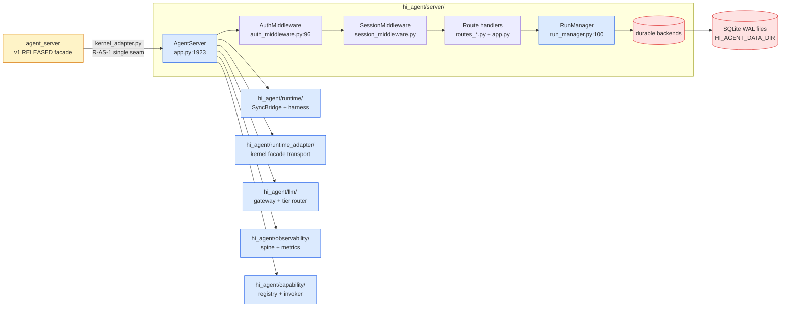
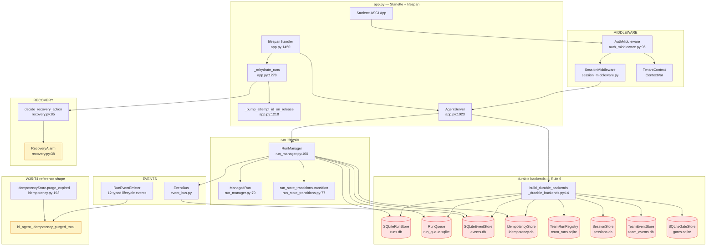
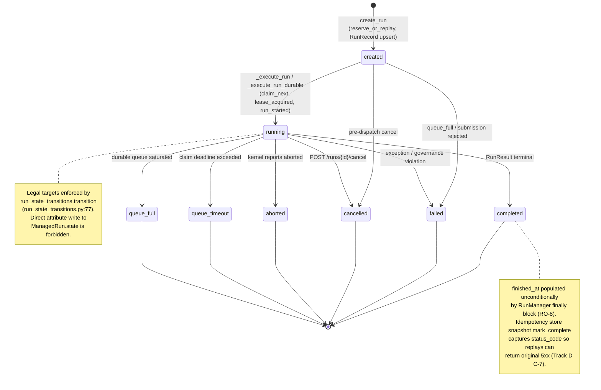
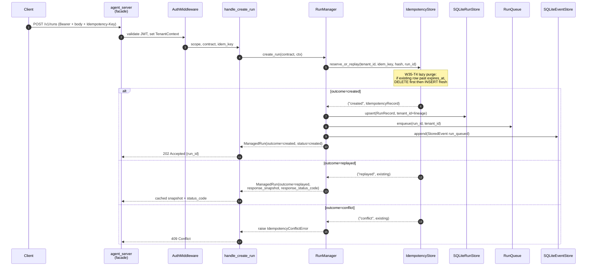
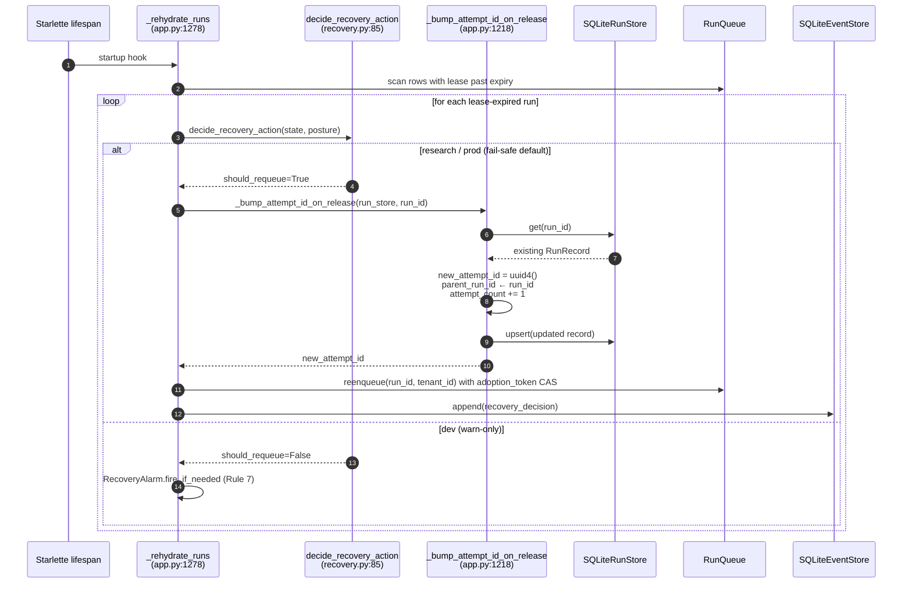

# hi_agent/server — Architecture

> **Last refreshed:** 2026-05-06 (W35 corrective close + W36 plans). HEAD `276917d8`.
> **Audience:** platform engineers + W36-A3 / A4 / A5 implementers.
> **Status:** authoritative.

---

## 1. Purpose & Responsibilities

`hi_agent/server/` is the **run-lifecycle kernel and durable persistence boundary** for the platform. It owns:

- The `AgentServer` umbrella (`hi_agent/server/app.py:1923`) — single object holding all subsystem references for a process
- The Starlette ASGI app (`build_app`, `app.py:1467`) and ~60 route handlers, including `/runs`, `/health`, `/ready`, `/metrics`, `/manifest`, `/knowledge/*`, `/memory/*`, `/skills/*`, `/tools`, `/mcp/*`, `/team/events`, `/sessions`, `/ops/dlq`, `/replay/*`
- The `RunManager` (`run_manager.py:100`) — thread-safe run lifecycle from `created` to terminal, with lease heartbeat, idempotent replay, and tenant-scoped reads
- Six durable SQLite stores: `SQLiteRunStore` (`run_store.py:133`), `RunQueue` (`run_queue.py:105`), `SQLiteEventStore` (`event_store.py:74`), `IdempotencyStore` (`idempotency.py:89`), `TeamRunRegistry` (`team_run_registry.py:48`), `SessionStore` (`session_store.py`); plus `SQLiteGateStore` and `TeamEventStore`
- The single construction path for those stores: `_durable_backends.build_durable_backends` (`_durable_backends.py:14`, Rule 6)
- AuthMiddleware (`auth_middleware.py:96`), SessionMiddleware (`session_middleware.py`), and the `TenantContext` ContextVar (`tenant_context.py:18`) — the trust boundary
- The `EventBus` (`event_bus.py`) — process-local sync/async observer fan-out
- Lease recovery: `_rehydrate_runs` (`app.py:1278`) + `decide_recovery_action` (`recovery.py:85`) + `RecoveryAlarm` (`recovery.py:38`, Rule 7 reference)
- Re-lease attempt_id bump helper: `_bump_attempt_id_on_release` (`app.py:1218`, W35-T9 / W35-C-3)
- Idempotency TTL purge: `IdempotencyStore.purge_expired` (`idempotency.py:193`, W35-T4 — the W36-A3 reference shape)

It does **not** own: business-agent profiles (delegated to `hi_agent/profiles/` and the injected `profile_registry`), capability execution semantics (delegated to `hi_agent/runtime/harness/` via `CapabilityInvoker`), the kernel facade transport (delegated to `hi_agent/runtime_adapter/`), or the LLM gateway (delegated to `hi_agent/llm/`).

This package is being **soft-deprecated as the public surface** by `agent_server/`, the versioned northbound facade. New external integrations target the contract-frozen `agent_server/api/v1/*` paths; `hi_agent/server/` continues to host the runtime kernel under it. The seam is one-directional: `agent_server/` depends on `hi_agent.server.app.AgentServer`, never the other way (R-AS-1).

---

## 2. Context & Scope

```mermaid
flowchart LR
    AS[agent_server<br/>v1 RELEASED facade] -->|kernel_adapter.py<br/>R-AS-1 single seam| APP[AgentServer<br/>app.py:1923]

    subgraph SERVER[hi_agent/server/]
        APP --> AUTH[AuthMiddleware<br/>auth_middleware.py:96]
        AUTH --> SES[SessionMiddleware<br/>session_middleware.py]
        SES --> ROUTES[Route handlers<br/>routes_*.py + app.py]
        ROUTES --> RM[RunManager<br/>run_manager.py:100]
        RM --> BACKENDS[(durable backends)]
    end

    APP --> RUNTIME[hi_agent/runtime/<br/>SyncBridge + harness]
    APP --> ADAPTER[hi_agent/runtime_adapter/<br/>kernel facade transport]
    APP --> LLM_PKG[hi_agent/llm/<br/>gateway + tier router]
    APP --> OBS[hi_agent/observability/<br/>spine + metrics]
    APP --> CAP[hi_agent/capability/<br/>registry + invoker]

    BACKENDS --> SQLITE[(SQLite WAL files<br/>HI_AGENT_DATA_DIR)]

    classDef frozen fill:#fef3c7,stroke:#d97706
    classDef kernel fill:#dbeafe,stroke:#2563eb
    classDef store fill:#fee2e2,stroke:#dc2626
    class AS frozen
    class APP,RM,RUNTIME,ADAPTER,LLM_PKG,OBS,CAP kernel
    class BACKENDS,SQLITE store
```

The middleware chain is fixed: `AuthMiddleware → SessionMiddleware → route handler`. AuthMiddleware sets `TenantContext` per-request; every downstream `RunManager` call reads it via ContextVar.

---

## 3. Module Boundary & Dependencies

| Module | Owns | Outbound deps |
|---|---|---|
| `app.py` | `AgentServer` umbrella, `build_app`, lifespan, route registration, `_rehydrate_runs`, `_bump_attempt_id_on_release` | `_durable_backends`, `run_manager`, every routes_*.py, `runtime/sync_bridge`, `config/builder` |
| `run_manager.py` | `RunManager`, `ManagedRun`, run lifecycle threads, lease heartbeat, idempotent replay | `run_store`, `run_queue`, `event_store`, `idempotency`, `tenant_context`, `runtime/cancellation`, `run_state_transitions` |
| `run_store.py` | `RunRecord` dataclass + `SQLiteRunStore` (durable WAL) | `contracts/run`, `config/posture` |
| `run_queue.py` | `RunQueue` lease-based durable queue (claim_next / heartbeat / complete / fail / dead_letter) | `config/posture`, `contracts/errors` |
| `event_store.py` | `StoredEvent` + `SQLiteEventStore` (per-run ledger; SSE replay backing) | `config/posture`, `contracts/_spine_validation` |
| `idempotency.py` | `IdempotencyRecord` + `IdempotencyStore` + `purge_expired` (W35-T4) | `config/posture`, `observability/idempotency_metrics` |
| `team_run_registry.py` | `TeamRunRegistry` (durable team-run membership) | `contracts/team_runtime`, `config/posture` |
| `_durable_backends.py` | `build_durable_backends` (Rule 6 single construction) | every store + `evolve/experiment_store`, `evolve/feedback_store`, `management/gate_store`, `route_engine/decision_audit_store` |
| `auth_middleware.py` | API-key + JWT validation, RBAC, ContextVar population | `auth/jwt_middleware`, `auth/rbac_enforcer`, `tenant_context` |
| `tenant_context.py` | `TenantContext` ContextVar; per-asyncio-task isolation | (none) |
| `event_bus.py` | Sync/async observer fan-out; persists via injected `event_store` | `event_store` |
| `recovery.py` | `RecoveryState`, `decide_recovery_action`, `RecoveryAlarm` (Rule 7) | `config/posture`, `observability/collector` |
| `run_state_transitions.py` | Legal state graph + `transition()` (single write path for `ManagedRun.state`) | (none) |
| `routes_*.py` | Per-feature route handlers (runs, knowledge, memory, skills, sessions, team, ops) | `run_manager`, `auth_middleware`, request-validation |

Inbound: only `agent_server/runtime/kernel_adapter.py`, `agent_server/bootstrap.py`, and tests.

---

## 4. Building Blocks

```mermaid
flowchart TB
    subgraph APP_LAYER["app.py — Starlette + lifespan"]
        STAR[Starlette ASGI App]
        LIFE[lifespan handler<br/>app.py:1450]
        REHY[_rehydrate_runs<br/>app.py:1278]
        BUMP[_bump_attempt_id_on_release<br/>app.py:1218]
        AGENT[AgentServer<br/>app.py:1923]
    end

    subgraph MIDDLEWARE
        AUTH[AuthMiddleware<br/>auth_middleware.py:96]
        SES[SessionMiddleware<br/>session_middleware.py]
        TC[TenantContext<br/>ContextVar]
    end

    subgraph LIFECYCLE["run lifecycle"]
        RM[RunManager<br/>run_manager.py:100]
        MR[ManagedRun<br/>run_manager.py:79]
        RST[run_state_transitions.transition<br/>run_state_transitions.py:77]
    end

    subgraph DURABLE["durable backends — Rule 6"]
        BUILD[build_durable_backends<br/>_durable_backends.py:14]
        RS[(SQLiteRunStore<br/>runs.db)]
        RQ[(RunQueue<br/>run_queue.sqlite)]
        ES[(SQLiteEventStore<br/>events.db)]
        IS[(IdempotencyStore<br/>idempotency.db)]
        TRR[(TeamRunRegistry<br/>team_runs.sqlite)]
        SS[(SessionStore<br/>sessions.db)]
        TES[(TeamEventStore<br/>team_events.db)]
        GS[(SQLiteGateStore<br/>gates.sqlite)]
    end

    subgraph RECOVERY
        REC[decide_recovery_action<br/>recovery.py:85]
        ALARM[RecoveryAlarm<br/>recovery.py:38]
    end

    subgraph IDEM["W35-T4 reference shape"]
        PURGE[IdempotencyStore.purge_expired<br/>idempotency.py:193]
        METRIC[hi_agent_idempotency_purged_total]
    end

    subgraph EVENTS
        EB[EventBus<br/>event_bus.py]
        EE[RunEventEmitter<br/>12 typed lifecycle events]
    end

    STAR --> AUTH
    AUTH --> TC
    AUTH --> SES
    SES --> AGENT
    LIFE --> AGENT
    LIFE --> REHY
    REHY --> BUMP
    REHY --> REC
    REC --> ALARM

    AGENT --> BUILD
    BUILD --> RS
    BUILD --> RQ
    BUILD --> ES
    BUILD --> IS
    BUILD --> TRR
    BUILD --> SS
    BUILD --> TES
    BUILD --> GS

    AGENT --> RM
    RM --> MR
    RM --> RST
    RM --> RS
    RM --> RQ
    RM --> ES
    RM --> IS
    RM --> EB

    EB --> ES
    EE --> METRIC
    PURGE --> METRIC

    classDef store fill:#fee2e2,stroke:#dc2626
    classDef alarm fill:#fef3c7,stroke:#d97706
    class RS,RQ,ES,IS,TRR,SS,TES,GS store
    class ALARM,METRIC alarm
```

**Single Construction Path** (Rule 6): every durable store is constructed inside `build_durable_backends` (`_durable_backends.py:14`) and injected by name. Inline `x or DefaultX()` patterns are forbidden and CI-rejected.

---

## 5. Runtime View — Key Scenarios

### 5.1 Run lifecycle state machine

```mermaid
stateDiagram-v2
    [*] --> created : create_run<br/>(reserve_or_replay, RunRecord upsert)
    created --> running : _execute_run / _execute_run_durable<br/>(claim_next, lease_acquired, run_started)
    created --> failed : queue_full / submission rejected
    created --> cancelled : pre-dispatch cancel

    running --> completed : RunResult terminal
    running --> failed : exception / governance violation
    running --> cancelled : POST /runs/{id}/cancel
    running --> aborted : kernel reports aborted
    running --> queue_timeout : claim deadline exceeded
    running --> queue_full : durable queue saturated

    completed --> [*]
    failed --> [*]
    cancelled --> [*]
    aborted --> [*]
    queue_timeout --> [*]
    queue_full --> [*]

    note right of running
        Legal targets enforced by
        run_state_transitions.transition
        (run_state_transitions.py:77).
        Direct attribute write to
        ManagedRun.state is forbidden.
    end note

    note right of completed
        finished_at populated unconditionally
        by RunManager finally block (RO-8).
        Idempotency store snapshot mark_complete
        captures status_code so replays can
        return original 5xx (Track D C-7).
    end note
```

### 5.2 Submit a run with idempotency

```mermaid
sequenceDiagram
    autonumber
    participant Client
    participant AS as agent_server<br/>(facade)
    participant Auth as AuthMiddleware
    participant Handler as handle_create_run
    participant RM as RunManager
    participant Idem as IdempotencyStore
    participant RS as SQLiteRunStore
    participant RQ as RunQueue
    participant ES as SQLiteEventStore

    Client->>AS: POST /v1/runs (Bearer + body + Idempotency-Key)
    AS->>Auth: validate JWT, set TenantContext
    Auth->>Handler: scope, contract, idem_key
    Handler->>RM: create_run(contract, ctx)
    RM->>Idem: reserve_or_replay(tenant_id, idem_key, hash, run_id)
    Note over Idem: W35-T4 lazy purge:<br/>if existing row past expires_at,<br/>DELETE first then INSERT fresh
    alt outcome=created
        Idem-->>RM: ("created", IdempotencyRecord)
        RM->>RS: upsert(RunRecord, tenant_id+lineage)
        RM->>RQ: enqueue(run_id, tenant_id)
        RM->>ES: append(StoredEvent run_queued)
        RM-->>Handler: ManagedRun(outcome=created, status=created)
        Handler-->>AS: 202 Accepted {run_id}
    else outcome=replayed
        Idem-->>RM: ("replayed", existing)
        RM-->>Handler: ManagedRun(outcome=replayed,<br/>response_snapshot, response_status_code)
        Handler-->>AS: cached snapshot + status_code
    else outcome=conflict
        Idem-->>RM: ("conflict", existing)
        RM-->>Handler: raise IdempotencyConflictError
        Handler-->>AS: 409 Conflict
    end
```

### 5.3 W35-T9 re-lease attempt_id bump

```mermaid
sequenceDiagram
    autonumber
    participant Lifespan as Starlette lifespan
    participant Rehy as _rehydrate_runs<br/>(app.py:1278)
    participant Rec as decide_recovery_action<br/>(recovery.py:85)
    participant Bump as _bump_attempt_id_on_release<br/>(app.py:1218)
    participant RS as SQLiteRunStore
    participant RQ as RunQueue
    participant ES as SQLiteEventStore

    Lifespan->>Rehy: startup hook
    Rehy->>RQ: scan rows with lease past expiry
    loop for each lease-expired run
        Rehy->>Rec: decide_recovery_action(state, posture)
        alt research / prod (fail-safe default)
            Rec-->>Rehy: should_requeue=True
            Rehy->>Bump: _bump_attempt_id_on_release(run_store, run_id)
            Bump->>RS: get(run_id)
            RS-->>Bump: existing RunRecord
            Bump->>Bump: new_attempt_id = uuid4()<br/>parent_run_id ← run_id<br/>attempt_count += 1
            Bump->>RS: upsert(updated record)
            Bump-->>Rehy: new_attempt_id
            Rehy->>RQ: reenqueue(run_id, tenant_id) with adoption_token CAS
            Rehy->>ES: append(recovery_decision)
        else dev (warn-only)
            Rec-->>Rehy: should_requeue=False
            Rehy->>Rehy: RecoveryAlarm.fire_if_needed (Rule 7)
        end
    end
```

The bump matters because under W34-F.2, two attempts of the same run carrying the same `attempt_id` collide on every cross-attempt metric and trace. The helper was **extracted** (W35-C-3) from inline code so the W34-F.2 lineage invariants are unit-testable without the full FastAPI startup harness.

---

## 6. Cross-cutting Concerns

| Concern | Site | Rule |
|---|---|---|
| **AuthMiddleware** sets TenantContext ContextVar per request | `auth_middleware.py:96` | W35-T3 (auth-authoritative tenant_id) |
| **Posture validation** at construction sites for `RunRecord`, `StoredEvent`, `IdempotencyRecord`, `TeamRun` | `run_store.py:91`, `event_store.py:38`, `idempotency.py:45` | Rule 11 (posture) + Rule 12 (spine) — W35-T1 |
| **`_owns(run, ctx)`** gates every read | `run_manager.py:320` | tenant_id + user_id (+ session_id when scoped) |
| **State transition** centralized | `run_state_transitions.transition` (`run_state_transitions.py:77`) | sole writer for `ManagedRun.state`; rejects illegal edges |
| **Lease heartbeat** under research/prod | `_execute_run_durable` daemon thread (`run_manager.py:792`) | renews at `lease_heartbeat_interval_seconds`; `lease_lost` → DLQ |
| **Idempotency TTL purge** | `IdempotencyStore.purge_expired` (`idempotency.py:193`) + lifespan loop | W35-T4; W36-A3 reference shape |
| **Recovery alarm** | `RecoveryAlarm.fire_if_needed` (`recovery.py:38`) | Rule 7 reference: counter + WARNING + caller-side fallback_event |
| **Rate limiting** per client IP | `rate_limiter.py` | rolling 60 s window; max `rate_limit_rps` |
| **SSE replay via `Last-Event-ID`** | `routes_events.py` reads `SQLiteEventStore.list_after_sequence` | events ordered by per-run sequence counter |
| **EventBus persistence** | `event_bus.py` writes through to `SQLiteEventStore` before fan-out | failure path emits `hi_agent_event_publish_errors_total` |
| **Spine emitters** wrapped in `try/except` | `run_manager.py` + `recovery.py` | annotated `# rule7-exempt: expiry_wave="permanent"` per Rule 7 |

---

## 7. Architecture Decisions

| ADR | Decision | Why |
|---|---|---|
| **Rule 6: `build_durable_backends`** | Single construction path for every SQLite store; backends injected by name into `AgentServer` | Inline `x or DefaultX()` produced two unshared in-memory stores (DF-11) — durable production rows never matched in-memory cache |
| **Rule 5: SyncBridge from RunManager dispatch** | RunManager dispatches on threading.Thread; LLM gateway constructed from those threads uses `httpx.AsyncClient` whose lifetime is bound to `runtime.sync_bridge`'s persistent loop | No async resource is constructed inside RunManager; cross-thread reuse is bridge-mediated |
| **W35-T1: Posture-aware spine validation** | `__post_init__` raises `SpineCompletenessError` / `ValueError` under research/prod when required fields empty; warns under dev | Storage-layer reconstructions trivially satisfy NOT NULL columns; the check matters at **fresh-construction sites** to prevent orphaned records |
| **W35-T3: Auth-authoritative tenant_id** | `RunManager.create_run` rejects request-body tenant_id under research/prod; only TenantContext (JWT-derived) is trusted | Single trust origin; bypass via request body is closed |
| **W35-T4: Idempotency TTL purge as W36-A3 reference** | `purge_expired` + lazy purge inside `reserve_or_replay` + lifespan loop + Prometheus counter | Smallest, hottest store proved the pattern; W36-A3 clones it across 8 Tier-1 stores |
| **W35-T9: Re-lease attempt_id bump** | On `_rehydrate_runs` lease re-enqueue, mint fresh UUID4 attempt_id and link parent_run_id to original run_id | Two attempts sharing one attempt_id collided on every cross-attempt metric |
| **W35-C-3: Helper extraction** | `_bump_attempt_id_on_release` extracted from inline `_rehydrate_runs` block | Inline logic was untestable without the full FastAPI startup harness; the helper is a pure function over `run_store + run_id + logger` |
| **`run_state_transitions.transition` is the single writer** | All state changes go through `transition(run, target_state, reason=…)`; direct `run.state = …` is rejected by review | Terminal-to-terminal races (executor success vs. external cancel) are now WARNING + no-op instead of corruption |
| **Soft-replacement by `agent_server/`** | Routes pre-versioning may be soft-deprecated; `agent_server/api/v1/*` is the contract surface | Lets `hi_agent/server/` evolve internal shapes; the kernel role is intact |

---

## 8. Quality Attributes

| Attribute | Target | How verified |
|---|---|---|
| **Run dispatch p95** | ≤ `2 × observed_p95` per Rule 8 step 3 | `docs/delivery/<sha>.md` gate run |
| **Cancellation round-trip** | live-run cancel = 200 + drives terminal; unknown id = 404 | Rule 8 step 6 |
| **Lifecycle observability** | `current_stage` non-`None` within 30 s; `finished_at` populated on every terminal | Rule 8 step 5 + RO-8 |
| **Idempotent replay correctness** | replay returns original status_code (200/5xx/499/504) | Track D C-7 |
| **Tenant isolation** | cross-tenant `get_run` returns 404 (not 403, not the row) | `RunManager._owns` (`run_manager.py:320`) |
| **Lease recovery** | research/prod default re-enqueue; `HI_AGENT_RECOVERY_REENQUEUE=0` triggers RecoveryAlarm | `_rehydrate_runs` + `RecoveryAlarm` |
| **Durable spine completeness** | every persistent row carries `tenant_id` (research/prod) | `__post_init__` posture validation; `scripts/check_contract_spine_completeness.py` |
| **State graph correctness** | every transition documented in `_LEGAL_TRANSITIONS`; CI-tested | `run_state_transitions.py:32` |

---

## 9. Risks & Technical Debt

| Risk | Where | W36 plan |
|---|---|---|
| **5 of 8 W36-A3 stores lack `tenant_id` columns** | event_store, run_store, audit_store, gate_store, feedback_store, team_event_store, decision_audit, session_store — only 3 carry `tenant_id` today | W36-A4 schema-lineage extension before A3 chunk-DELETE per tenant |
| **`SQLiteEventStore` is the highest-volume table** | `event_store.py:74`; per-run unbounded growth | W36-A3 Store 1 binding: chunked `DELETE … LIMIT 5000` + retention env vars (`HI_AGENT_EVENT_STORE_RETENTION_DAYS=30`, `…_PURGE_INTERVAL_S=3600`) |
| **Cross-store FK ordering** | run deleted before its events → orphaned events | W36-A3 plan §risk: events purged first within retention window; runs purged last |
| **In-memory `_runs` dict is authoritative for live state** | `run_manager.py` | W14 systemic class closure tested partial-restart reconciliation; remaining gap = fully-atomic enqueue (no W36 binding yet) |
| **PriorityQueue tie-break in-memory only** | `run_manager.py:_queue` | `_queue_seq` resets on restart; durable RunQueue is source of truth in research/prod |
| **EventBus is process-local singleton** | `event_bus.py` | multi-process deployment requires every process to wire the same SQLite event store; bus does not federate |
| **AuthMiddleware no-op without `HI_AGENT_API_KEY`** | `auth_middleware.py:96` | dev-friendly default; `HI_AGENT_AUTH_REQUIRED=1` forces fail-closed; posture-aware research/prod fail-closed when both absent |
| **Lifespan startup is best-effort** | `app.py:1450` | every subsystem wrapped in try/except; `/health` may report `degraded` instead of failing the process |
| **Boot-time assertions B1–B14 missing** | various subsystems | W36-A5 binding: `assert_research_posture_required` helper; `agent_server/api/__init__.py:138-156` is the W35-T8 reference |
| **W36-A3 cumulative tenant_id label cardinality** | retention purge metrics | accept tenant-mixed series for W36; tenant-labelled chunked purges follow W36-A4 |

---

## 10. References

- `hi_agent/server/app.py` — Starlette app, lifespan, `_rehydrate_runs`, `_bump_attempt_id_on_release`, `AgentServer`
- `hi_agent/server/run_manager.py` — `RunManager`, `ManagedRun`, lease heartbeat, idempotent dispatch
- `hi_agent/server/run_store.py`, `run_queue.py`, `event_store.py`, `idempotency.py`, `team_run_registry.py`, `session_store.py`, `team_event_store.py` — durable backends
- `hi_agent/server/_durable_backends.py` — single construction path (Rule 6)
- `hi_agent/server/auth_middleware.py`, `tenant_context.py` — security boundary
- `hi_agent/server/event_bus.py` — sync/async observer fan-out
- `hi_agent/server/recovery.py` — `decide_recovery_action`, `RecoveryAlarm` (Rule 7 reference)
- `hi_agent/server/run_state_transitions.py` — single state-write path
- `hi_agent/runtime/ARCHITECTURE.md` — sync_bridge + harness + cancellation
- `hi_agent/runtime_adapter/ARCHITECTURE.md` — kernel facade transport
- `hi_agent/observability/ARCHITECTURE.md` — 12 typed lifecycle events + 14 spine layers
- `agent_server/api/routes_*.py` — versioned northbound facade (W24+)
- `docs/governance/retention-roadmap.md` — 24 unbounded-growth stores; W36-A3 Tier 1
- `docs/governance/boot-time-assertions-roadmap.md` — B1–B14
- `docs/superpowers/plans/2026-05-06-wave-36-a3-tier1-retention-adoption.md` — W36-A3 binding
- CLAUDE.md Rules 5, 6, 7, 8, 11, 12, 14, 15
- `scripts/check_rule7_observability.py`, `scripts/run_t3_gate.py`, `scripts/check_durable_wiring.py`, `scripts/check_contract_spine_completeness.py`
