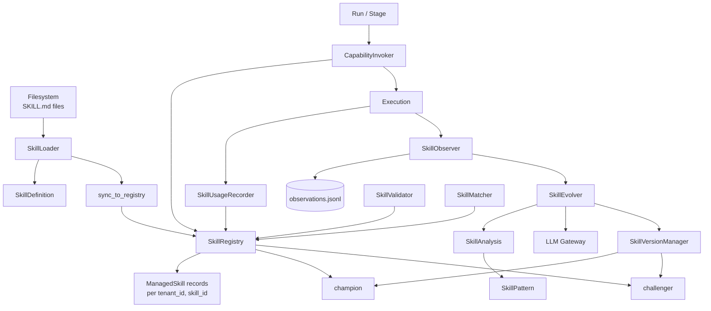
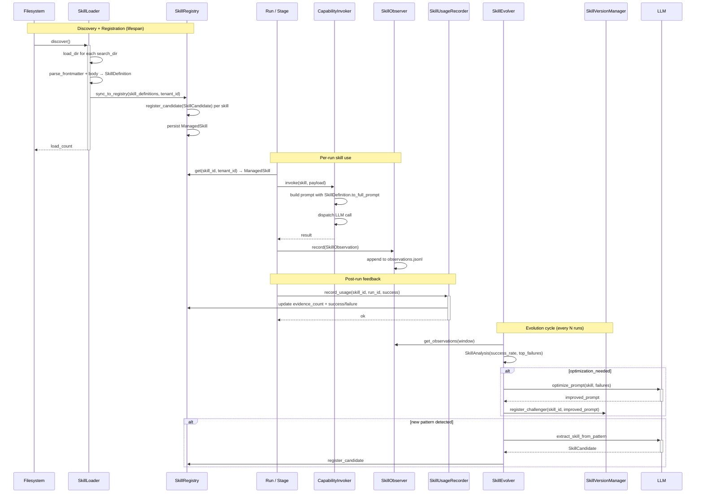

# Skill Architecture

## 1. Purpose & Position in System

`hi_agent/skill/` owns the platform's first-class skill capability layer. A **skill** is a packaged prompt fragment + applicability scope + lifecycle metadata stored as a `SKILL.md` file with YAML frontmatter and markdown body. Skills are loaded from the filesystem, registered with lifecycle metadata, observed during execution, and evolved over time.

The package owns:
1. **`SkillDefinition`** — the on-disk contract (parsed from `SKILL.md`).
2. **`SkillLoader`** — multi-source filesystem discovery (built-in / user / project / generated) with token-budget-aware loading.
3. **`SkillRegistry`** — lifecycle store keyed by `(tenant_id, skill_id)`; `ManagedSkill` records track Candidate → Provisional → Certified → Deprecated → Retired.
4. **`SkillObserver`** — non-blocking JSONL telemetry of every skill execution.
5. **`SkillEvolver`** — analyses observations + drives skill evolution (optimize prompt / create new skill).
6. **`SkillUsageRecorder`** — feedback loop: post-run, updates registry evidence counts.
7. **`SkillVersionManager`** — champion / challenger versioning for A/B testing.
8. **`SkillValidator`** — schema validation on load and at lifecycle transitions.
9. **`SkillMatcher`** — query-time skill selection.

It does **not** own: the LLM call that consumes the skill prompt (delegated to `hi_agent/llm/`), capability execution (delegated to `hi_agent/capability/`), or skill-related HTTP endpoints (delegated to `hi_agent/server/routes_runs.py` and friends).

## 2. External Interfaces

**Public exports** (`hi_agent/skill/__init__.py`):

Definition + loading:
- `SkillDefinition(skill_id, name, version, description, when_to_use, prompt_content, allowed_tools, model, tags, lifecycle_stage, confidence, cost_estimate_tokens, requires_bins, requires_env, source, source_path, tenant_id, ...)` (`definition.py:154`)
- `SkillLoader(search_dirs, max_skills_in_prompt, max_prompt_tokens)` (`loader.py:80`)
- `SkillPrompt(full_skills, compact_skills, total_tokens, budget_tokens, full_count, compact_count, truncated_count)` (`loader.py:42`)

Registry:
- `SkillRegistry(storage_dir)` (`registry.py:66`)
- `ManagedSkill(skill_id, name, description, version, lifecycle_stage, applicability_scope, preconditions, forbidden_conditions, evidence_requirements, side_effect_class, rollback_policy, evidence_count, success_count, failure_count, source_run_ids, promotion_history, tenant_id)` (`registry.py:28`)
- `PromotionRecord(from_stage, to_stage, evidence, timestamp, reason)` (`registry.py:17`)

Observation + recording:
- `SkillObserver(storage_path)` (`observer.py`)
- `SkillObservation(observation_id, skill_id, skill_version, run_id, stage_id, timestamp, success, input_summary, output_summary, quality_score, tokens_used, latency_ms, failure_code, task_family, tags, tenant_id, user_id, session_id, project_id, max_summary_len)` (`observer.py:22`)
- `SkillMetrics` (`observer.py`)
- `SkillUsageRecorder(registry)` (`recorder.py:10`)

Evolution:
- `SkillEvolver(observer, registry, version_mgr, llm_gateway, evolve_interval=10, ...)` (`evolver.py`)
- `EvolutionReport` (`evolver.py`)
- `SkillAnalysis(skill_id, total_executions, success_rate, avg_quality, top_failures, optimization_needed, suggestions, tenant_id)` (`evolver.py:37`)
- `SkillPattern` (`evolver.py`)

Versioning + matching:
- `SkillVersionManager(storage_dir)` (`version.py`)
- `SkillVersionRecord` (`version.py`)
- `SkillMatcher(...)` (`matcher.py`) — query-time selection
- `SkillValidator()` (`validator.py`) — schema + invariant checks

## 3. Internal Components

| Component | File | Responsibility |
|---|---|---|
| `SkillDefinition` | `definition.py:154` | YAML frontmatter + markdown body parsed contract; validates `tenant_id` under strict posture. |
| `SkillLoader` | `loader.py:80` | Multi-source discovery; token-budget-aware loading (full / compact / truncated). |
| `SkillRegistry` | `registry.py:66` | Lifecycle store; `register_candidate`, `promote`, `deprecate`, `retire`. |
| `ManagedSkill` | `registry.py:28` | Lifecycle record (Candidate → Provisional → Certified → Deprecated → Retired). |
| `SkillObserver` | `observer.py` | Non-blocking JSONL append per execution. |
| `SkillObservation` | `observer.py:22` | Single execution observation (success, tokens, latency, quality_score, failure_code). |
| `SkillUsageRecorder` | `recorder.py:10` | Post-run evidence_count + success/failure counter update. |
| `SkillEvolver` | `evolver.py` | OPTIMIZE (improve prompt) + CREATE (extract pattern → new skill). |
| `SkillVersionManager` | `version.py` | Champion / challenger versioning with rollback. |
| `SkillValidator` | `validator.py` | Frontmatter schema + lifecycle transition validation. |
| `SkillMatcher` | `matcher.py` | Query → ranked list of applicable skills. |

## 4. Data Flow

The skill resolution path: `run.task_contract.skill_id → SkillRegistry.get(skill_id, tenant_id) → ManagedSkill → CapabilityInvoker.invoke(...)` produces the result. `SKILL.md` parsing happens once at discovery; the `SkillDefinition.prompt_content` field carries the markdown body for prompt injection.

## 5. State & Persistence

| State | Location | Lifetime |
|---|---|---|
| `SkillDefinition._skills` | In-memory dict in `SkillLoader` | Process; reloaded on `discover()` |
| `SkillRegistry._skills` | In-memory dict + JSON files in `<storage_dir>/<tenant_id>/<skill_id>.json` | Process + persistent JSON |
| `SkillObservation` records | JSONL file at `<observer.storage_path>/observations.jsonl` | Persistent, append-only |
| `SkillVersionRecord` | JSON in `<version_mgr.storage_dir>/` | Persistent |
| `SkillMatcher` index | Optional in-memory TF-IDF index | Process |

Default storage paths:
- `SkillRegistry`: `.hi_agent/skills/`
- `SkillLoader.search_dirs`: built-in (`hi_agent/skills/`) + user (`~/.hi_agent/skills/`) + project (`.hi_agent/skills/`) + generated (from evolve)
- `SkillObserver`: `.hi_agent/skills/observations.jsonl`

## 6. Concurrency & Lifecycle

**Discovery** (`SkillLoader.discover`) runs at lifespan startup (`SystemBuilder.build_skill_loader`). Synchronous, single-threaded. Sub-millisecond per `SKILL.md`.

**Sync to registry** (`SkillLoader.sync_to_registry(registry)`) — invoked from `AgentServer.__init__` (`hi_agent/server/app.py:1968`). This is what makes file-discovered skills visible to the runtime invoker.

**Observation** (`SkillObserver.record`) — uses `threading.Lock` around the JSONL append. Non-blocking from the caller's perspective; writes synchronously but only the file flush blocks (which is fast).

**Evolution cycle** runs on demand via `POST /skills/evolve` (route handler in `hi_agent/server/app.py:629`). Each cycle reads recent observations, computes `SkillMetrics`, calls the LLM gateway for optimize/create, and registers candidates / challengers. The cycle is bounded by `evolve_interval` (default 10 runs).

**No background loop**. The skill subsystem does not run a continuous evolution daemon — operators trigger evolution explicitly. This keeps the runtime hot path free of optimization work.

**Locks**:
- `SkillLoader._skills` — implicit; assumed single-thread discovery.
- `SkillRegistry._skills` — implicit; access via methods.
- `SkillObserver` — `threading.Lock` around JSONL append.
- `SkillVersionManager` — `threading.Lock` around champion/challenger swap.

## 7. Error Handling & Observability

**Skill validation** (`SkillValidator`):
- Schema validation runs at load time; invalid `SKILL.md` raises and is skipped (`SkillLoader._load_file` catches and logs).
- Lifecycle transition validation runs at `promote` / `deprecate` calls.

**Posture-aware tenant validation**: `SkillDefinition.__post_init__` (`definition.py:186`), `ManagedSkill.__post_init__` (`registry.py:57`), and `SkillAnalysis.__post_init__` (`evolver.py:50`) raise `ValueError` if `tenant_id` is empty under research/prod posture.

**Counters** (defined at module level via `Counter`):
- `hi_agent_skill_loaded_total{source}` — increment per skill loaded
- `hi_agent_skill_observed_total{skill_id, success}` — per observation
- `hi_agent_skill_evolved_total{action}` — per evolution outcome (optimized / created / no_change)
- `hi_agent_skill_promotion_total{from_stage, to_stage}` — per lifecycle transition

**Logs**: WARNING on validation failure during load, on observation persistence failure, on evolution LLM error. INFO on lifecycle transitions.

**Observability surface**:
- `GET /skills/list` — returns all skills with eligibility + lifecycle stage
- `GET /skills/status` — registry counts + top performers (sorted by success_rate)
- `GET /skills/{skill_id}/metrics` — per-skill aggregates
- `GET /skills/{skill_id}/versions` — champion + challengers + version history

Each endpoint emits a tenant-scoped audit record via `record_tenant_scoped_access` (in `hi_agent/observability/audit.py`).

## 8. Security Boundary

**Tenant scoping at registration + invocation**:
- `SkillRegistry` storage layout: `<storage_dir>/<tenant_id>/<skill_id>.json` — physical separation per tenant on disk.
- Every `register_candidate`, `get`, `promote` accepts a `tenant_id`; lookup is keyed by `(tenant_id, skill_id)`.
- `SkillObservation` carries spine fields `tenant_id`, `user_id`, `session_id`, `project_id` (`observer.py:43`).

**`SkillDefinition.tenant_id` enforcement**: required under research/prod posture (`definition.py:189`). Under dev, default empty string is allowed for backwards compat with pre-spine SKILL.md files.

**`model="default"` coercion** (W32 closure):
- Under dev posture, `SkillDefinition.model = "default"` is accepted; the gateway's `default_model` is substituted at LLM call time.
- Under research/prod posture, the coercion is rejected — skills must declare an explicit model (`claude-opus-4`, `gpt-4o-mini`, etc.). This was W32 closure for the silent-default issue: research deployments cannot afford accidental model drift.

**Allowed_tools enforcement**: `SkillDefinition.allowed_tools` is consulted by the `CapabilityInvoker` before dispatch. A skill that calls a tool not in `allowed_tools` is denied. This is the per-skill capability allowlist.

**Eligibility checks** (`SkillDefinition.check_eligibility`):
- `requires_bins` — checks each binary is on `PATH`
- `requires_env` — checks each env var is set non-empty
- Both fields come from the `SKILL.md` `requires:` block

**Process-internal markers**:
- `PromotionRecord` (`registry.py:17`): `# scope: process-internal — the parent ManagedSkill carries tenant_id`
- `SkillPrompt` (`loader.py:42`): `# scope: process-internal — spine carried by the caller's tenant context`

## 9. Extension Points

- **Custom skill source**: extend `SkillLoader.search_dirs`; add directory containing `SKILL.md` files.
- **Custom skill validator**: subclass `SkillValidator`; pass to `SkillRegistry(validator=…)`.
- **Custom evolution strategy**: subclass `SkillEvolver`; override `_analyze()` or `_optimize()` or `_create_from_pattern()`.
- **Custom matcher**: subclass `SkillMatcher`; inject into stage execution.
- **Custom version policy**: extend `SkillVersionManager` with new version naming or rollback logic.
- **New lifecycle stage**: extend the `lifecycle_stage` enum-like field; update `SkillValidator.is_valid_transition`.

## 10. Constraints & Trade-offs

- **`SKILL.md` parser is YAML-subset, not full YAML** (`definition.py:58`). Supports inline lists, booleans, numbers, strings, simple nested blocks (`requires:` with `bins:` / `env:`). No anchors, references, or multi-document streams. Keeps parsing zero-dependency but rejects sophisticated YAML.
- **Champion/challenger A/B is single-pair**: a skill has one champion + at most one challenger at a time. Multi-arm bandits would require extending `SkillVersionManager`.
- **Observations file is single-process append-only**: multi-pod deployments need centralized log aggregation. Operators ship the JSONL out via a sidecar.
- **Evolution uses the LLM gateway**: optimize/create both call `LLM Gateway`. Failures emit `record_fallback("llm", "skill_evolve_<reason>")` and the cycle is no-op for that skill.
- **Per-tenant skill counts have no quota**: a malicious tenant could fill the registry. Production deployments add a quota in upstream auth.
- **`model="default"` dev-only coercion**: research/prod must declare explicit models. Skills written for dev that omit model break under posture promotion. The `SkillValidator` flags this at load time under strict posture.
- **No skill rollback observability**: `SkillVersionManager.rollback(skill_id)` is silent. Future work: emit `skill_rollback` event.

## 11. References

**Files**:
- `hi_agent/skill/__init__.py` — public surface
- `hi_agent/skill/definition.py` — `SkillDefinition`, frontmatter parser
- `hi_agent/skill/loader.py` — `SkillLoader`, `SkillPrompt`
- `hi_agent/skill/registry.py` — `SkillRegistry`, `ManagedSkill`, `PromotionRecord`
- `hi_agent/skill/observer.py` — `SkillObserver`, `SkillObservation`, `SkillMetrics`
- `hi_agent/skill/recorder.py` — `SkillUsageRecorder`
- `hi_agent/skill/evolver.py` — `SkillEvolver`, `SkillAnalysis`, `SkillPattern`, `EvolutionReport`
- `hi_agent/skill/version.py` — `SkillVersionManager`, `SkillVersionRecord`
- `hi_agent/skill/validator.py` — `SkillValidator`
- `hi_agent/skill/matcher.py` — `SkillMatcher`
- `hi_agent/server/app.py:524-743` — `/skills/*` route handlers
- `hi_agent/observability/audit.py` — tenant-scoped access audit
- `hi_agent/capability/invoker.py` — capability invocation site that consumes `SkillDefinition.allowed_tools`

**Related**:
- `hi_agent/capability/ARCHITECTURE.md` — capability registry (skills compose with capabilities at execution time)
- `hi_agent/evolve/skill_extractor.py` — `SkillCandidate` source (evolve → registry handoff)

**Rules and gates**:
- CLAUDE.md Rule 11 (Posture-Aware Defaults), Rule 12 (Contract Spine + scope markers), Rule 13 (Capability Maturity)
- W32 closure: `model="default"` coercion is dev-posture only
- W24 H1: skill registry overlay per tenant (allowlists.yaml W24-deferred entries `handle_skills_evolve`, `handle_skill_optimize`, `handle_skill_promote`)
- `scripts/check_contract_spine_completeness.py` — validates `tenant_id` field presence
