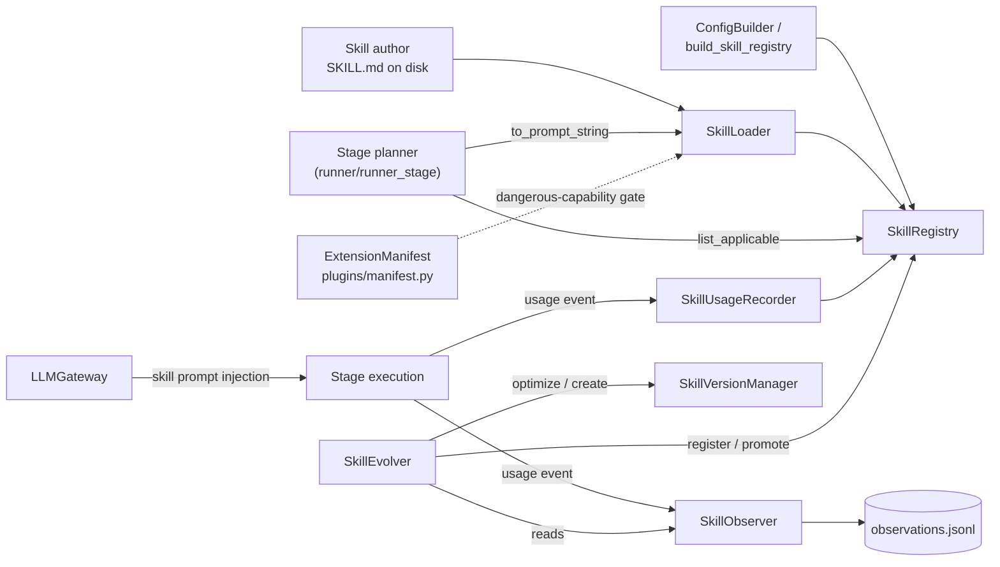
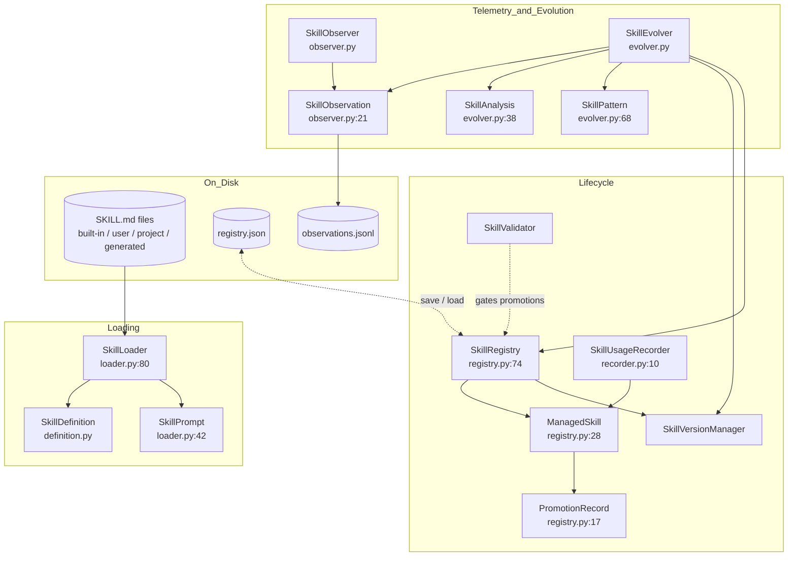
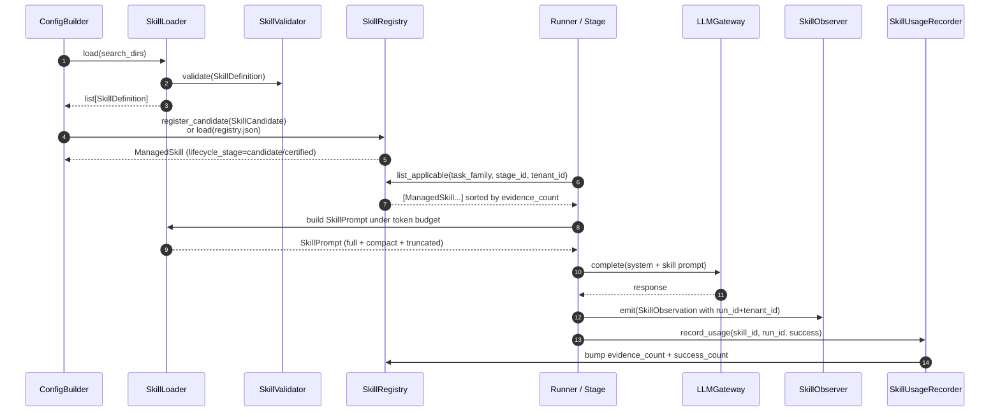

# Skill — Architecture

> **Last refreshed:** 2026-05-06 (W35 corrective close + W36 plans). HEAD `276917d8`.
> **Audience:** platform engineers + capability owners.
> **Status:** authoritative.

## 1. Purpose & Responsibilities

`hi_agent/skill/` owns the platform's first-class **skill** capability layer. A skill is a packaged prompt fragment plus applicability scope plus lifecycle metadata, stored as a `SKILL.md` file with YAML frontmatter and markdown body. Skills are loaded from the filesystem, registered with lifecycle metadata, observed during execution, and evolved over time.

Concrete responsibilities:

1. Parse and validate skill definitions from disk (`SkillDefinition`, `SkillLoader`, `SkillValidator`).
2. Maintain a per-tenant lifecycle store: `SkillRegistry` keyed by `skill_id` and scoped by `tenant_id` under research/prod posture (`registry.py:74`); `ManagedSkill` records track `Candidate → Provisional → Certified → Deprecated → Retired` (`registry.py:28`).
3. Capture every skill execution as a `SkillObservation` JSONL line without blocking the runtime (`observer.py:21`).
4. Drive skill evolution: optimize an existing prompt or create a new skill from observed patterns (`evolver.py`).
5. Feed run outcomes back to the registry's evidence counts (`SkillUsageRecorder`, `recorder.py:10`).
6. Match skills to a stage / task family (`SkillMatcher`).
7. Manage champion / challenger versioning for A/B testing (`SkillVersionManager`, `version.py`).
8. Enforce Rule 12 spine on `ManagedSkill`, `SkillObservation`, `SkillAnalysis`: `tenant_id` is a fail-closed required field under strict posture; missing `run_id`/`tenant_id` raises `SpineCompletenessError` (`observer.py:69`).
9. Gate skill enablement against the **extension manifest** dangerous-capability check (W35 corrective close H1; see ADR-S-3) — a skill that would invoke a manifest-flagged dangerous capability is rejected at load.

The package does **not** own:

- The LLM call that consumes the skill prompt (delegated to `hi_agent/llm/`).
- Capability execution (delegated to `hi_agent/capability/`).
- HTTP routes that surface skills (delegated to `hi_agent/server/`).
- Skill-related run-event recording for the wider event store (delegated to `hi_agent/server/event_store.py` — see ADR-S-2 for the recorder/event_store distinction).

## 2. Context & Scope

```mermaid
flowchart LR
    AUTHOR["Skill author<br/>SKILL.md on disk"] --> SL[SkillLoader]
    BUILD["ConfigBuilder /<br/>build_skill_registry"] --> SR[SkillRegistry]
    SL --> SR
    PLAN["Stage planner<br/>(runner/runner_stage)"] -->|list_applicable| SR
    PLAN -->|to_prompt_string| SL
    LLM["LLMGateway"] -->|skill prompt injection| ENG[Stage execution]
    ENG -->|usage event| SO[SkillObserver]
    ENG -->|usage event| SUR[SkillUsageRecorder]
    SO --> JSONL[(observations.jsonl)]
    SUR --> SR
    EVO[SkillEvolver] -->|reads| SO
    EVO -->|optimize / create| SVR[SkillVersionManager]
    EVO -->|register / promote| SR
    EXT[ExtensionManifest<br/>plugins/manifest.py] -.dangerous-capability gate.-> SL
```

**In scope:** definition parsing, lifecycle persistence (JSON `registry.json`), observation telemetry, evolution loop, version management, applicability matching.

**Out of scope:** business-skill packaging (kept on the research-team side), distributed registry (single-process JSON store; team-wide sharing is a research proposal).

## 3. Module Boundary & Dependencies

| Inbound (callers) | Reason |
|---|---|
| `hi_agent/runner.py`, `hi_agent/runner_stage.py` | Apply skills at stage selection time |
| `hi_agent/llm/*` | Consume `SkillPrompt.to_prompt_string()` for system prompt injection |
| `hi_agent/server/event_store.py` | Skill-related event facets (ID + lifecycle stage) |
| `hi_agent/evolve/*` | Promotes `SkillCandidate` → `ManagedSkill` via `SkillRegistry.register_candidate` (`registry.py:87`) |

| Outbound (dependencies) | Reason |
|---|---|
| `hi_agent/config/posture.py` | `Posture.from_env()` for strict-mode tenant enforcement |
| `hi_agent/contracts/reasoning.py` | `SpineCompletenessError` raised by `SkillObservation.__post_init__` |
| `hi_agent/evolve/skill_extractor.py` | `SkillCandidate` source type |
| `hi_agent/llm/protocol.py` | `LLMGateway` for `SkillEvolver` calls |
| `hi_agent/failures/taxonomy.py` | `is_budget_exhausted_failure_code` for evolver heuristics |
| `hi_agent/plugins/manifest.py` | `ExtensionManifest.dangerous_capabilities` (`plugins/manifest.py:60`) — load-time gate |

**Not allowed:** importing `hi_agent/server/` or `hi_agent/runtime/` from inside this package — skills are a leaf module.

## 4. Building Blocks

```mermaid
flowchart TB
    subgraph On_Disk
        FS[(SKILL.md files<br/>built-in / user / project / generated)]
        REG_JSON[(registry.json)]
        OBS_JSONL[(observations.jsonl)]
    end
    subgraph Loading
        SDEF[SkillDefinition<br/>definition.py]
        SL[SkillLoader<br/>loader.py:80]
        SP[SkillPrompt<br/>loader.py:42]
    end
    subgraph Lifecycle
        SR[SkillRegistry<br/>registry.py:74]
        MS[ManagedSkill<br/>registry.py:28]
        PR[PromotionRecord<br/>registry.py:17]
        SV[SkillValidator]
        SVR[SkillVersionManager]
        SUR[SkillUsageRecorder<br/>recorder.py:10]
    end
    subgraph Telemetry_and_Evolution
        SO[SkillObserver<br/>observer.py]
        SOBS[SkillObservation<br/>observer.py:21]
        SE[SkillEvolver<br/>evolver.py]
        SA[SkillAnalysis<br/>evolver.py:38]
        SP2[SkillPattern<br/>evolver.py:68]
    end
    FS --> SL
    SL --> SDEF
    SL --> SP
    SR --> MS
    MS --> PR
    SV -.gates promotions.-> SR
    REG_JSON <-.save / load.-> SR
    SR --> SVR
    SO --> SOBS
    SOBS --> OBS_JSONL
    SUR --> MS
    SE --> SOBS
    SE --> SA
    SE --> SP2
    SE --> SVR
    SE --> SR
```

Key types and citations:

- `SkillDefinition` — `definition.py` (parsed from YAML frontmatter + body; carries `tenant_id` spine field).
- `SkillLoader(search_dirs, max_skills_in_prompt, max_prompt_tokens)` — `loader.py:80`.
- `SkillPrompt` (`# scope: process-internal`) — `loader.py:42`.
- `SkillRegistry(storage_dir)` — `registry.py:74`. Public methods: `register_candidate`, `promote`, `deprecate`, `retire`, `get`, `list_by_stage`, `list_certified`, `list_applicable`, `save`, `load`. Strict posture requires `tenant_id` on every read (`_enforce_tenant_scope`, `registry.py:307`).
- `ManagedSkill` — `registry.py:28`. Spine field: `tenant_id` (`registry.py:55`); fail-closed under strict posture in `__post_init__`.
- `PromotionRecord` (`# scope: process-internal`) — `registry.py:17`. Embedded inside `ManagedSkill.promotion_history`. Retention plan: keep last N=20 (`docs/governance/retention-roadmap.md` Tier 2 #14).
- `SkillObservation` — `observer.py:21`. Spine fields: `run_id`, `tenant_id`, `user_id`, `session_id`, `project_id`. Constructor enforces Rule 12 — missing `run_id` or `tenant_id` under strict posture raises `SpineCompletenessError` (`observer.py:69`).
- `SkillEvolver` / `SkillAnalysis` / `SkillPattern` — `evolver.py:38, 68`. Modes: `OPTIMIZE` (textual-gradient prompt patch on failure analysis) and `CREATE` (mine recurring patterns from observations).

## 5. Runtime View — Key Scenarios

### 5.1 Skill registration → applicable lookup → invocation

```mermaid
sequenceDiagram
    autonumber
    participant CB as ConfigBuilder
    participant SL as SkillLoader
    participant SV as SkillValidator
    participant SR as SkillRegistry
    participant Run as Runner / Stage
    participant LLM as LLMGateway
    participant SO as SkillObserver
    participant SUR as SkillUsageRecorder
    CB->>SL: load(search_dirs)
    SL->>SV: validate(SkillDefinition)
    SL-->>CB: list[SkillDefinition]
    CB->>SR: register_candidate(SkillCandidate)<br/>or load(registry.json)
    SR-->>CB: ManagedSkill (lifecycle_stage=candidate/certified)
    Run->>SR: list_applicable(task_family, stage_id, tenant_id)
    SR-->>Run: [ManagedSkill...] sorted by evidence_count
    Run->>SL: build SkillPrompt under token budget
    SL-->>Run: SkillPrompt (full + compact + truncated)
    Run->>LLM: complete(system + skill prompt)
    LLM-->>Run: response
    Run->>SO: emit(SkillObservation with run_id+tenant_id)
    Run->>SUR: record_usage(skill_id, run_id, success)
    SUR->>SR: bump evidence_count + success_count
```

### 5.2 Promotion gated by validator

`SkillRegistry.promote(skill_id, to_stage, evidence)` (`registry.py:124`):

1. `SkillValidator.can_promote(skill, to_stage)` returns `(allowed, reason)`. If not allowed, raises `ValueError(...)`.
2. Append `PromotionRecord(from_stage, to_stage, evidence, timestamp)` to `skill.promotion_history` (capped at last N=20 per retention plan; older records archived to `registry.history.<wave>.json`).
3. Update `skill.lifecycle_stage` and `updated_at`.

### 5.3 Dangerous-capability dev-side gate (W35 corrective close H1)

`ExtensionManifest.dangerous_capabilities` (`hi_agent/plugins/manifest.py:60`) lists capabilities that require explicit admin approval (e.g. `shell_exec`). At skill load time, `SkillLoader` cross-references `SkillDefinition.allowed_tools` against the active `ExtensionManifest`; any overlap with `dangerous_capabilities` causes the skill to be rejected (or kept at `lifecycle_stage=candidate` and never promoted to `certified`) under research/prod posture. The W35 corrective work added the dev-side test that proves the gate fires before the runner can ever load the skill.

## 6. Cross-cutting Concerns

| Concern | Mechanism |
|---|---|
| **Rule 11 — posture-aware defaults** | `SkillRegistry._enforce_tenant_scope` raises under strict posture when `tenant_id` is `None` (`registry.py:307`); under dev, logs a WARNING and proceeds. |
| **Rule 12 — contract spine** | `ManagedSkill.tenant_id`, `SkillObservation.{run_id,tenant_id,user_id,session_id,project_id}`, `SkillAnalysis.tenant_id` are spine-required (`evolver.py:48`). |
| **Rule 13 — capability maturity** | Skills traverse the L0–L4 ladder via lifecycle stages; promotion to `certified` requires evidence and validator approval. The `applicability_scope` field plus `evidence_count` together encode the L-level signal. |
| **Rule 17 — allowlist discipline** | Dangerous-capability schema gate is not an allowlist exception — it is a hard fail. (Allowlist of unsafe `noqa` is tracked in `docs/governance/allowlists.yaml`.) |
| **Tenant scoping on every read** | All `SkillRegistry` query methods (`get`, `list_by_stage`, `list_certified`, `list_applicable`) accept `tenant_id` and either filter by it (dev) or require it (strict). |
| **Telemetry non-blocking** | `SkillObserver` writes JSONL inside a `threading.Lock` but never on the request path's hot loop; the registry's persistence (`SkillRegistry.save`) is explicit, not autosave. |
| **Test honesty** | `SkillObservation` cannot be constructed with empty spine fields under strict posture even in tests — tests must supply real IDs. |

## 7. Architecture Decisions

### ADR-S-1: JSON-backed registry, not a DB

`SkillRegistry.save/load` writes a single `registry.json` (`registry.py:333`). Reason: skills are a per-profile asset, the read pattern is "load once at boot, occasional promote", and the working set is small (hundreds of skills). A SQL store would add a build dependency without any access-pattern win. SQLite remains an option if a future workload demands per-row access concurrency from multiple processes.

### ADR-S-2: SkillUsageRecorder is **not** the event store

`SkillUsageRecorder` (`recorder.py:10`) updates registry counters synchronously inside the run thread; it is concerned with **lifecycle evidence**. The wider per-run event log (`hi_agent/server/event_store.py`) carries every run event for replay, audit, and cross-run analysis. A skill usage produces both — a registry counter bump (recorder) and a structured event (event_store). Conflating them was a recurring confusion before W22; this ADR keeps them separate.

### ADR-S-3: Dangerous-capability gate at the schema layer (W35 H1)

Before W35, the dangerous-capability gate lived only inside the runner's tool-dispatch code path. A skill author could ship a `SKILL.md` that looked harmless until the runner happened to invoke its tool. W35 corrective close H1 adds the gate at **skill load time** (in `SkillLoader`) so that a skill referencing a `dangerous_capability` from the active extension manifest is rejected before the runner ever sees it. The W35 dev-side test pins this behaviour. Rationale: Rule 1 strongest-interpretation defaults — "gate" means blocking, not notification.

### ADR-S-4: Promotion-history retention bounded

`promotion_history` is a `list[PromotionRecord]` with no built-in trim. Retention plan in `docs/governance/retention-roadmap.md` Tier 2 #14: keep last N=20 events per skill; older entries archived to `registry.history.<wave>.json` and rotated quarterly. Implementation lives in W37+ (Tier 2 priority).

## 8. Quality Attributes

| Attribute | Target | Mechanism |
|---|---|---|
| Skill load latency | <100ms for ≤100 skills | `SkillLoader` walks four search dirs once at boot; binary-search budget fitter for `SkillPrompt`. |
| Registry persistence | Atomic save | `json.dump(...)` to a single file; no partial writes (small payload). |
| Observation throughput | Non-blocking on hot path | `threading.Lock` only around the JSONL append; the run thread is not woken up by observer writers. |
| Cross-tenant isolation | Hard fail under strict posture | `SkillRegistry._enforce_tenant_scope`; `ManagedSkill.__post_init__` raises if `tenant_id` empty (`registry.py:62`). |
| Schema drift safety | All YAML frontmatter validated by `SkillValidator` | Definitions whose required fields are missing fail at load, not at invocation. |

## 9. Risks & Technical Debt

| Risk | Severity | Mitigation / Plan |
|---|---|---|
| Registry file growth | Medium | Tier 2 #14 in retention roadmap (last N=20 promotion events; quarterly archive rotation). Action lands W37+. |
| Skill version drift across waves | Medium | `SkillVersionManager` (champion/challenger) tracks running variants; `SkillEvolver.OPTIMIZE` mode produces a new version rather than mutating the live one. |
| `SkillEvolver` LLM call cost | Low–Medium | Evolution runs out-of-band (not on the request path); driven by a scheduled job that consumes observation history. |
| Multi-process registry contention | Low | JSON file is loaded once at boot; concurrent writes from two workers are not currently coordinated. SQLite migration is the planned escape if the pattern turns out to need it. |
| Dangerous-capability list staleness | Medium | The list is part of the extension manifest, which is part of the wave deliverable; manifest-rewrite-budget gate (Rule 14, W17/B19) keeps it auditable. |

## 10. References

- Source: `hi_agent/skill/registry.py`, `hi_agent/skill/loader.py`, `hi_agent/skill/observer.py`, `hi_agent/skill/recorder.py`, `hi_agent/skill/evolver.py`, `hi_agent/skill/version.py`, `hi_agent/skill/validator.py`, `hi_agent/plugins/manifest.py`.
- Rules: `CLAUDE.md` Rule 7 (resilience signals), Rule 11 (posture-aware defaults), Rule 12 (contract spine), Rule 13 (capability maturity), Rule 17 (allowlist discipline).
- Retention: `docs/governance/retention-roadmap.md` Tier 2 #14.
- Sibling docs: `hi_agent/capability/ARCHITECTURE.md` (the registry that backs `SkillDefinition.allowed_tools`), `hi_agent/knowledge/ARCHITECTURE.md` (knowledge consumed by skill prompts), `hi_agent/memory/ARCHITECTURE.md` (the memory that observations enrich).
